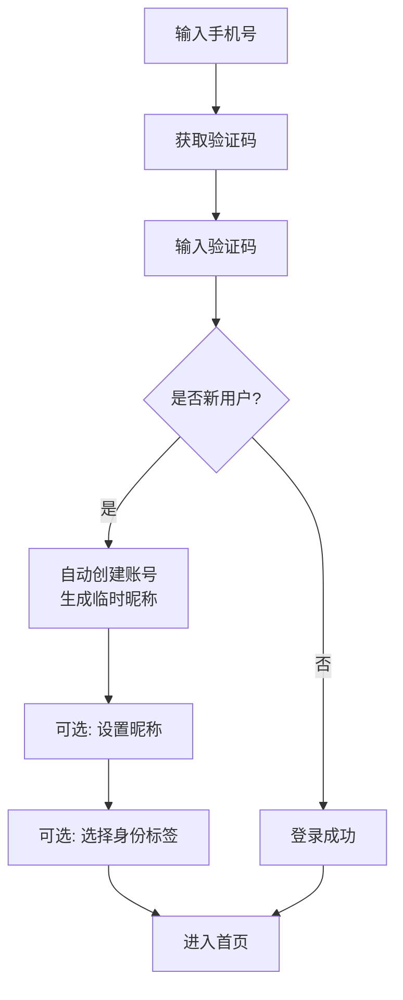

## 文档信息
- 版本：v1.5（与 2026-04-25 设计稿对齐）
- 日期：2026-04-25
- 变更：对齐六份优先准则文档（规则配方、设计令牌、设计系统、首页视觉修正、附录Q、SVG图标）

---
## 关键约束（防止幻觉）

1. **架构**: 纯 Web + PWA，无 Electron，无原生 APP，无小程序
2. **移动端**: 仅文字团，无语音，无视频，锁屏断线可接受
3. **V1.0 范围**: 仅招募/求组板（模式 B），无实时发车，无 AI 主持人
4. **规则引擎**: Recipe 配方源 + 编译产物（atoms/connections）双层模型，无可视化原子画布，无工业级 PLC
5. **地图**: 2D 网格，单层，无迷雾，无 3D，V1.0 极简
6. **实时通信**: Socket.IO + HTTP，无 WebRTC，无直播
7. **数据库**: 单库 + Redis，4GB 内存，无分库分表，无 ES
8. **AI 功能**: 仅规划中，V1.0 不做任何 AI 功能
9. **社交**: 无公会，无战队，无排行榜，仅简单圈子和关注
10. **经济**: 无 C2C 交易，无拍卖行，仅创作者-玩家单向购买
11. 无emoji
12. **房间发现**: 无独立的“房间大厅”或“公开房间列表”。所有公开招募均通过社区-招募板的帖子进行，成团后房间仅出现在参与者“我的房间”中。

若以上约束与文档内容冲突，以本约束为准。

## 0.1 2026-04-25 对齐声明（新增）

本文件遵循 `docs/文档对齐治理.md` 中定义的统一优先级与冲突处理规则。

本文额外约束如下：

- 规则工坊采用 Recipe 类型体系（`threshold_check`、`opposed_check`、`resource_modify`、`random_table`、`initiative`、`growth_check`、`accumulation`、`chain`、`raw`），历史文段中出现的“L3 可视化原子画布”视为已下线方案。
- 存储模型以“Recipe 源码 + compiled graph（atoms + connections）”为准；执行器持续只消费编译产物。
- 指令绑定入口由 `entry_atom` 语义迁移为 `recipe_id` + `runtime_modifiers` 注入。
- 视觉规范统一以附录 B / 附录 D 为准，旧有 `--tp-*` 等前缀命名全部视为废弃。
- 图标与空状态插画资产以 `docs/SVG设计图标.html` 和首页交付包的交付清单为准。
- 文中出现的 Emoji、字符图标和纯文字占位仅用于示意信息结构，实际实现必须替换为 SVG 资产体系。


## 1. 术语定义与核心概念

### 1.1 基础术语

| 术语                      | 说明                                     | 示例                     |
| ----------------------- | -------------------------------------- | ---------------------- |
| **团（Campaign）**         | GM创建的顶层容器，包含剧情时间标签记录、所有场、成员列表、角色卡绑定      | "黑暗边缘团"                |
| **场（Scene）**            | 团内的子空间，分为剧情场、私密场、公共场三种类型               | "酒馆"、"刺客小队密谈"          |
| **剧情场（Spatial）**        | 真实叙事位置，玩家可移动至此，参与位置矩阵                  | "废弃教堂"、"警局档案室"         |
| **私密场（Virtual）**        | 秘密对话空间，不记录位置但记录时间线                     | "刺客小队"、"GM-张三密谈"       |
| **公共场（Lobby）**          | 非剧情闲聊空间，不参与时间同步                        | "银光酒馆大厅"               |
| **助理台（Assistant Desk）** | 固定置顶的个人沙盒面板，不视为场，测试掷骰不进log，GM暗骰记录仅自己可见 | 指令大全、暗骰记录（仅GM）         |
| **剧情时间标签**              | GM在聊天流中手动宣布的时间标记，格式 `HH:MM`（仅时、分）    | "08:30"            |
| **个人剧情时间**              | 角色进出场景时GM可选填的剧情时间，仅用于轨迹矩阵与日志记录       | 角色A到达教堂时GM标记"08:30" |
| **轨迹矩阵**                | 可视化展示所有角色在各剧情场的时间分布图                   | 灰白分区表格                 |
| **写扩散**                | 消息发送时预计算可见角色列表并存储，避免查询时 JOIN 参与时间段表。                   | 灰白分区表格                 |
| **雪花 ID**                | 分布式唯一 ID 生成算法，保证消息 ID 全局单调递增，用于排序。                   | 灰白分区表格                 |

### 1.2 角色卡术语

| 术语 | 说明 |
|------|------|
| **角色卡（Character Sheet）** | 玩家创建的虚拟角色数据，包含属性、技能、资源 |
| **规则包（Ruleset）** | 定义角色卡结构、检定公式、派生计算的逻辑包 |
| **职业（Occupation/Class）** | 规则包定义的角色模板，影响属性成长和技能 |
| **派生值（Derived）** | 由基础属性自动计算的值（如HP、SAN、熟练加值） |

---

## 2. 规则工坊

*规则工坊是平台的底层基础设施，提供规则定义能力，支撑上层模组、跑团房间的一切规则运算。*

### 2.1 功能清单

| 序号  | 功能名称            | 功能描述                                                                                    | 验收标准                                                                                                                                 | 技术预留                                                                                      |
| --- | --------------- | --------------------------------------------------------------------------------------- | ------------------------------------------------------------------------------------------------------------------------------------ | ----------------------------------------------------------------------------------------- |
| 1   | 规则模板表单  | 创作者通过结构化表单定义规则模板，涵盖属性定义、技能列表、检定公式、成功等级等基本要素                                             | ① 创作者可新建/编辑/删除规则模板；② 表单包含属性、技能、检定公式、成功等级四个核心区块；③ 保存后可在模组编辑器中引用；④ 保存时自动编译出标准 `{ atoms: [], connections: [] }` 产物                        | 表单数据持久化以 Recipe 为源，编译产物单独缓存，不再保留对画布迁移的依赖                                                      |
| 2   | 骰子公式 DSL        | 提供骰子公式领域特定语言，支持 d100、3d6、d20+5、2d6kh1（保留最高）等标准语法，以及条件判定（成功/失败/大成功/大失败）                  | ① 支持标准骰子表达式解析与求值；② 支持 keep highest/lowest 语法；③ 支持自定义成功阈值判定；④ DSL 解析器有明确的语法错误提示                                                       | DSL 解析器设计为独立模块，支持后续扩展自定义函数与变量引用；解析结果可序列化为 JSON AST，便于规则引擎沙箱执行                             |
| 3   | 规则定义双层模型        | 规则定义分为两层：**Recipe 配方源**（模板+表单+DSL）与 **编译产物图**（atoms+connections）。保存时自动编译，运行时只消费编译产物 | ① 创作者可通过模板/表单创建配方；② 支持 DSL 扩展复杂条件；③ 保存后自动产出并持久化 `{atoms:[], connections:[]}`                                    | 编译器采用策略模式，按 Recipe 类型注册编译函数；支持热加载后自动重编译                                   |
| 4   | 原子库（六大类 50+ 原子） | 提供属性、技能、检定、效果、条件、资源六大类预置原子，共 50+ 种基础构建单元，作为 Recipe 编译产物的标准执行单元                                  | ① 提供六大类、每类不少于 5 个预置原子；② 每个原子有明确的输入/输出端口定义；③ 原子可被搜索和分类筛选；④ 原子总数达到 50+                                                                 | 原子定义采用 JSON Schema 描述输入输出端口，预留`category`、`version`、`is_custom`字段；支持用户自定义原子注册              |
| 5   | Recipe 编辑器          | 提供「模板选择 + 参数表单 + DSL 扩展 + 结果预览」的规则编辑环境，支持实时校验与编译预览                      | ① 支持 9 类 Recipe（含 raw 兼容类型）；② 参数合法性实时校验；③ 支持预览编译结果与执行路径；④ 支持导入/导出 JSON 配方；⑤ 预览区显示规则效果                                                 | 编辑器输出统一进入 Recipe 编译管线，产物序列化为`{ atoms: [], connections: [] }`格式                      |
| 6   | 版本控制            | 规则模板支持版本历史回溯与分支管理，创作者可查看变更记录、回滚到任意历史版本、创建分支进行实验性修改                                      | ① 每次保存自动生成版本快照；② 可查看版本历史列表（时间、摘要、作者）；③ 可回滚到任意历史版本；④ 支持从任意版本创建分支                                                                      | 版本数据采用 diff 存储节省空间；版本表包含`branch_id`、`parent_version_id`字段支持分支树                            |
| 7   | 版本与衍生体系         | 规则模板区分官方版、作者版、社区版、魔改版、村规版五种衍生类型，支持溯源与标注                                                 | ① 每个规则模板标注衍生类型；② 可溯源至原始模板；③ 衍生模板需标注修改说明；④ 搜索与筛选支持按衍生类型过滤                                                                             | 规则模板表包含`derive_type`枚举字段（official/author/community/mod/house_rule）和`source_template_id`外键 |
| 8   | 规则模板市场          | 提供免费和付费规则模板的浏览、引用与购买。创作者可设置免费/一次性付费/订阅三种定价模式                                            | ① 模板列表可浏览、搜索、按分类筛选；② 付费模板展示价格，支持购买流程；③ 购买后自动授权创作者使用                                                                                  | 订单表预留`platform_fee`、`creator_income`字段；规则包表包含`price`、`pricing_type`、`license_type`字段      |
| 9   | 自定义配方模板复用   | 创作者可将常用 Recipe 参数结构沉淀为模板，设置输入输出契约后发布供复用                                              | ① 可将配方保存为模板；② 模板有独立输入/输出定义；③ 模板可发布到市场；④ 其他创作者可基于模板快速生成配方                                                               | 模板持久化以 Recipe 为源，编译后仍统一产出`{ atoms: [], connections: [] }`格式                       |
| 10  | 创作者/玩家视图分离      | 规则编辑器提供"创作者模式"和"玩家预览模式"切换。创作者模式显示完整的技术端口（port_id、类型、必填）；玩家预览模式只显示自然语言标签和业务控件，隐藏所有技术细节   | ① 编辑器顶部有模式切换按钮；② 切换后界面字段和标签自动变化；③ 玩家模式下的字段标签由规则作者配置的自然语言决定                                                                           | 每个组件的 L2 契约中增加`l2`字段（包含`label`、`widget`、`options`等）；前端根据模式渲染不同视图                          |
| 11  | 指令映射表配置         | 规则包创作者可定义一套自然语言/符号指令，绑定到 Recipe。每个指令包含触发词、参数模板、`recipe_id`、输入映射、运行时修饰符注入策略                          | ① 规则包 YAML 中包含 `commands` 数组；② 每个指令至少包含 `trigger`（正则/模板）、`recipe_id`、`input_mapping`；③ 支持参数提取（如 `{skill}`、`{value}`）；④ 同一规则包内指令无歧义冲突 | `commands` 结构由 JSON Schema 校验；执行前完成 runtime_modifiers 注入；助理台动态渲染指令列表                                 |


> **设计原则提示**：规则创作者在定义「战斗轮次」「先攻排序」等功能时，请使用引擎提供的 ENG-003 动作调度器的抽象能力（排序、指针、钩子），而非请求引擎内置特定规则逻辑。引擎不提供「DND 回合制」或「COC 追逐轮」的默认实现，这些应通过规则包的组件组合实现。
> 


### 2.1.3 指令系统设计
#### 设计原则
- **指令名统一**：`ra` 在所有规则下都表示「检定」，用户只需学习一套指令。
- **行为参数化**：骰子公式、成功方向、难度计算等由规则包配置覆盖，引擎只执行参数。
- **平台预置模板**：平台内置所有常见指令的默认配置（以 COC 7th 风格为基准）。
- **规则包声明支持 + 参数覆盖**：规则包只需声明支持哪些指令，并覆盖差异参数。
#### 指令分层
| 层级 | 指令示例 | 归属 | 规则包是否需要声明 |
|------|----------|------|-------------------|
| **通用指令** | `r`、`rh`、`nn`、`jrrp`、`draw`、`log`、`ob` | 平台内置，所有规则包默认可用 | ❌ 不需要 |
| **检定模板** | `ra`、`rc` | 平台预置模板（默认 COC 风格），规则包可选择覆盖参数 | ✅ 需要（在 `supported_commands` 中声明） |
| **规则专属指令** | `sc`、`en`、`ti`、`li`（COC）；`init`、`ds`（DND） | 平台预置模板，仅当规则包声明时才可用 | ✅ 需要（声明后才可用） |
#### 平台预置指令默认配置（以 COC 7th 为基准）
```yaml
# 平台内置默认配置
command_defaults:
  ra:                         # 通用检定指令
    component: "threshold_check_generic"
    dice_expression: "1d100"
    success_direction: "lte"
    difficulty_divisors: [1, 2, 5]   # 常规/困难/极难
    auto_fetch_skill: true
  rc:                         # 标准检定（与 ra 语义相同，可独立覆盖）
    extends: "ra"             # 默认继承 ra 的配置
  sc:                         # COC 理智检定
    component: "chain_resolver"
    chain_id: "san_check"
    dice_expression: "1d100"
  en:                         # COC 技能成长
    component: "skill_growth_roll"
    dice_expression: "1d10"
    max_value: 99
  ti:                         # 临时疯狂
    component: "random_table"
    table_id: "temporary_insanity"
  li:                         # 总结疯狂
    component: "random_table"
    table_id: "lingering_insanity"
  init:                       # DND 先攻
    component: "initiative_roll"
    dice_expression: "1d20 + dex_mod"
    sort_order: "desc"
  ds:                         # DND 死亡豁免
    component: "death_save"
    dice_expression: "1d20"
    success_threshold: 10
```

#### 规则包声明方式（统一接口定义，同附录F）

规则包通过 `RulesetCommands` 接口声明指令支持，包含三个字段：

```typescript
interface RulesetCommands {
  supported_commands: string[];           // 平台预置指令中本规则包支持的列表
  command_overrides?: Record<string, CommandOverride>;  // 覆盖预置指令的参数
  custom_commands?: CustomCommand[];      // 规则包自定义的全新指令
}

# COC7 规则包示例
supported_commands:
  - ra
  - rc
  - sc
  - en
  - ti
  - li
command_overrides:
  sc:
    component: "chain_resolver"
    chain_id: "coc7_san_check"   # 仅覆盖链 ID
  en:
    component: "skill_growth_roll"
    max_value: 99
custom_commands: []  # COC7无自定义指令

yaml

# DND5e 规则包示例
supported_commands:
  - ra
  - init
  - ds
command_overrides:
  ra:
    dice_expression: "1d20"
    success_direction: "gte"
    difficulty_divisors: [1]      # DND 无难度分级，用优势/劣势替代
    advantage_system: true        # 启用优势/劣势
  init:
    dice_expression: "1d20 + dex_mod"
    sort_order: "desc"
  ds:
    success_threshold: 10
```
完整接口定义见附录F第1.1节 `RulesetCommands`。
#### 助理台指令速查

指令速查展示 **平台预置指令库** 与 **当前规则包 `supported_commands`** 的交集，通用指令始终显示。

typescript

function getAvailableCommands(ruleset: Ruleset): CommandInfo[] {
  const universal = ['r', 'rh', 'nn', 'jrrp', 'draw', 'log', 'ob'];
  const supported = ruleset.supported_commands || [];
  const allCommands = [...universal, ...supported];
  return allCommands.map(cmd => {
    const defaultConfig = commandDefaults[cmd];
    const override = ruleset.command_overrides?.[cmd] || {};
    return {
      name: cmd,
      config: deepMerge(defaultConfig, override),
      description: override.description || defaultConfig.description
    };
  });
}

#### 引擎解析流程

1. 用户输入 `ra 侦查 50`。
    
2. 意图解析器匹配平台预置指令 `ra`。
    
3. 检查当前规则包的 `supported_commands` 是否包含 `ra`，若不包含，返回“当前规则包不支持该指令”。
    
4. 获取合并后的指令配置（平台默认 + 规则包覆盖）。
    
5. 根据配置调用对应组件（如 `threshold_check_generic`），传入参数。
    
6. 组件执行，返回结果。
    

#### 高级扩展：自定义指令

如果创作者需要添加平台未预置的指令，可通过 Recipe 模板/DSL 定义自定义组件，并在规则包中声明 custom_commands：

custom_commands:
  - trigger: "flip {coin}"           # 支持参数模板
    description: "硬币判定，正反面"
    component: "coin_flip_check"
    input_mapping:
      result: "{coin}"
  - trigger: "^暗骰 (\d+)$"          # 支持正则表达式
    description: "GM 暗骰"
    component: "secret_roll"
    gm_only: true

**优先级规则**：
1. 引擎意图解析器优先匹配 `custom_commands`（按声明顺序）
2. 若未匹配，再匹配平台预置指令（需 `supported_commands` 声明）
3. 自定义指令不需要在 `supported_commands` 中重复声明

该功能面向高级用户，平台不限制但也不提供预置支持。

---

### 2.2 规则包数据结构

```typescript
interface RulesetPackage {
  id: string;                    // 规则包唯一标识
  name: string;                  // 显示名称
  version: string;               // 语义化版本
  parent_ruleset?: string;       // 继承的父规则包ID
  description: string;           // 描述
  author_id: string;             // 创作者ID
  license_type: 'free' | 'commission';  // 授权模式：完全免费 / 商业分成
  commission_rate?: number;      // 分成比例（仅 license_type=commission 时有效，单位 %）
  official: boolean;             // 是否官方预置
  status: 'draft' | 'review' | 'published' | 'suspended';
  published_at?: Date;
  
  // 规则定义核心
  atoms: AtomDefinition[];       // 原子节点定义（Recipe 编译产物存储）
  connections: Connection[];     // 节点间的连接关系
  
  // 角色卡模板定义
  character_card_schema: {
    sections: Array<{
      id: string;
      name: string;
      fields: string[];
      mobile_behavior?: 'tab' | 'collapsed' | 'hidden';
    }>;
    attributes: AttributeDef[];  // 基础属性定义
    skills: SkillDef[];          // 技能定义
    derived_values: DerivedDef[]; // 派生值计算公式
    resources: ResourceDef[];    // 资源定义（HP/MP等）
  };
  
  // 检定与动作定义
  checks: CheckDefinition[];     // 检定类型定义
  actions: ActionDefinition[];   // 动作经济定义
  
  // ========== 指令系统（三层模型）==========
  // [MODIFIED] 以下三个字段共同构成完整的指令定义
  
  // 1. 平台预置指令中，本规则包支持哪些（如 ["ra", "sc", "en", "init"]）
  supported_commands: string[];
  
  // 2. 覆盖平台预置指令的参数（仅对 supported_commands 中的指令有效）
  command_overrides?: Record<string, {
    component?: string;
    dice_expression?: string;
    success_direction?: 'lte' | 'gte';
    difficulty_divisors?: number[];
    chain_id?: string;
    max_value?: number;
    description?: string;
    [key: string]: any;
  }>;
  
  // 3. [ADDED] 规则包自定义的全新指令（平台未预置，优先匹配）
  custom_commands?: CustomCommand[];
  // ========================================
  
  // 扩展
  extras: Record<string, any>;
}

// [ADDED] 自定义指令的定义（原文档中残留的 CommandMapping 已删除，改用此结构）
interface CustomCommand {
  trigger: string;                    // 触发模式：支持精确字符串、模板（如 "flip {coin}"）、正则表达式
  description: string;                // 人类可读描述，展示在助理台
  component: string;                  // 目标组件 ID
  dice_expression?: string;           // 可选，覆盖默认骰子表达式
  input_mapping: Record<string, string | any>;  // 如何将用户输入映射到组件输入端口
  output_format?: string;             // 可选，自定义输出文本模板
  gm_only?: boolean;                  // 是否仅 GM 可用
  visible_in_assistant?: boolean;     // 是否在助理台显示（默认 true）
}
````

### 2.3 职业解析器（ENG-013）

职业解析器作为规则引擎的子组件，负责职业模板的加载与验证、职业与角色卡的绑定、职业能力的注册与注销、等级成长（升级/兼职）的逻辑处理。

**职业模板数据结构**：

TypeScript

复制

```typescript
interface OccupationTemplate {
  id: string;
  ruleset_id: string;
  name: string;
  description: string;
  // 属性成长
  attribute_growth?: Record<string, string>; // 如 { "STR": "1d4", "HP": "1d8" }
  // 技能点公式（COC风格）
  skill_point_formula?: string; // 如 "EDU*2+APP*2"
  credit_rating?: { min: number; max: number }; // 信用评级范围
  // 本职技能列表（COC）
  occupation_skills?: string[];
  // 等级成长表（DND风格）
  progression_table?: Record<number, LevelFeatures>;
  // 特性节点图（可视化扩展）
  feature_graph?: {
    atoms: AtomDefinition[];
    connections: Connection[];
  };
  // 默认装备/物品
  starting_equipment?: string[];
}
```

**职业解析器行为**：

- 当`feature_graph`存在时，在`registerFeatures`时将该节点图动态注册到效果解析器
    
- 支持 COC 静态职业模板（职业一次性应用，无等级成长）和 DND 等级制职业系统（含升级、兼职、特性自动获得）
    
- 创作者在规则工坊中定义职业时，职业数据通过职业解析器加载、校验并注册到角色卡引擎
    

---

## 3. 模组编辑器

_模组编辑器采用**文档式块编辑器**方案，是一个富文本编辑器，支持在自由文本中插入**预定义的 TRPG 专属结构化块**（场景、NPC、怪物、事件、线索、检定、道具），兼顾创作者的写作流畅性和平台对结构化数据的提取需求。_

### 3.1 编辑器布局与块类型

**编辑器布局示例**：

plain

复制

```plain
[模组标题]
[封面图片]
---
## 简介（创作者自由书写，支持Markdown/富文本）
... 模组背景、题材、适用人群、创作说明 ...
---
## 玩家须知（PL可见，自由书写+固定提示）
... 无剧透的规则提示、时代背景、初始任务 ...
---
【场景块】▷ 可折叠/展开
  场景名称：________
  场景类型：剧情场/私密场/公共场（与跑团房间场类型对应）
  初始开放时间：________（剧情时间，如"第1日 08:00"）
  场景氛围/环境：________（富文本）
  场景描述：________（富文本，支持图片/表格）
  关联对象：________（可关联已创建的NPC/怪物/线索/道具）
  可选检定：________（引用规则包中定义的检定类型）
  附图/地图：________（图片/附件）
  补充说明：________（GM扮演提示、隐藏互动点等）
---
【NPC块】▷ 可折叠/展开
  NPC名称：________
  基础信息（可选）：________（年龄、种族、阵营等，字段由规则包动态提供）
  立绘：[图片]
  形象描述：________（富文本）
  性格特质/扮演要点：________（自由文本）
  核心背景（GM专属）：________（富文本）
  属性面板：________（字段由规则包动态生成）
  战斗数据：________（字段由规则包动态生成）
  技能列表：________（字段由规则包动态生成）
  初始位置：________（关联场景块，决定NPC初始所在剧情场）
  关联对象：________（可关联场景/事件/线索）
---
【事件块】▷ 可折叠/展开
  事件名称：________
  触发条件：________（如进入某场景/与某NPC对话/检定成功/全局时间到达）
  事件难度/门槛：________（可选）
  事件描述：________（富文本，事件发生过程）
  关联检定：________（引用规则包中的检定类型）
  强制移动：________（如触发后强制移动玩家至某场景）
  时间影响：________（如推进全局时间30分钟）
  事件结果：
    - 成功：________
    - 失败：________
    - 分支选项：________（可选）
  后续跳转：________（可链接到其他块）
---
【线索块】▷ 可折叠/展开
  线索名称：________
  线索类型：________（实物/信息/人物等）
  线索内容：________（富文本，关键信息可标红）
  解锁条件：________（如进入某场景/检定成功/GM手动/全局时间到达）
  揭示方式：________（检定成功后自动揭示 / GM手动揭示）
  关联场景：________（线索所在的剧情场）
  关联对象：________
---
【检定块】▷ 可折叠/展开（独立块，可在多个场景/事件中引用）
  检定名称：________
  绑定规则：________（默认继承模组规则包，也可单独指定）
  检定公式：________（由规则包动态生成）
  难度分级：________（由规则包定义）
  场景修正：________（如"夜间-20%"）
  检定结果映射：________（规则包定义）
```

场景块对应场景类型：剧情场
### 3.2 功能清单

表格

| #   | 功能名称                   | 功能描述                                                            | 验收标准                                                                                    | 技术预留                                                                                                  |
| :-- | :--------------------- | :-------------------------------------------------------------- | :-------------------------------------------------------------------------------------- | :---------------------------------------------------------------------------------------------------- |
| 1   | 文档式块编辑器                | 创作者通过类 Notion/飞书的富文本编辑器创作模组，支持在文档中插入预定义的结构化块                    | ① 编辑器支持富文本编辑；② 支持插入场景/NPC/事件/线索/检定/对话六类结构化块；③ 每类块有固定字段表单；④ 块可折叠/展开、拖拽排序；⑤ 内容自动保存：桌面端≤3秒、移动端≤1.5秒；点击“完成”、路由离开、切后台任一触发时强制保存一次 | 前端采用 TipTap 2（ProseMirror 内核），自定义块类型渲染；模组存储为 JSON 对象（metadata + content 块数组）                          |
| 2   | 模组与规则绑定                | 模组创建时必须绑定一个规则模板，模组中的检定、技能、属性等引用规则模板定义，支持在模组级别覆盖部分规则             | ① 新建模组时必须选择规则模板；② 模组内检定自动引用绑定规则的公式与阈值；③ 支持在模组级别覆盖技能修正、成功等级                              | 绑定关系表包含 rule_template_id 外键和 override_config JSON 字段；override_config 结构预留完整的规则覆盖路径                    |
| 3   | 场景与场类型映射               | 模组中的场景块在创建团时可选择是否自动生成为剧情场                                       | ① 创建团时检测模组中的场景块；② 提供勾选批量创建剧情场；③ 可修改生成的场名称                                               | 场景块包含`scene_type`字段（默认spatial），`initial_open_time`字段存储初始剧情时间                                          |
| 4   | 发布与公示期                 | 模组发布前进入 7 天公示期，公示期间社区可查看摘要信息并提出版权异议，无异议后自动上架                    | ① 提交发布后进入「公示中」状态，持续 7 天；② 公示期间展示模组摘要、作者信息、规则模板来源；③ 任何用户可在公示期内提交异议                       | 模组表包含 status 枚举（draft/reviewing/public_notice/published/suspended/removed）和 public_notice_end_at 时间字段 |
| 5   | 导入功能（Word/TXT + AI 辅助） | 支持将 Word/TXT 格式的已有模组文档导入平台，AI 辅助识别场景、NPC、线索、事件等结构化元素并自动填充到编辑器块中 | ① 支持 .docx 和 .txt 文件上传；② AI 自动识别并标注文档中的场景、NPC、线索、事件段落；③ 识别结果可人工审核和修正；④ 确认后自动填充到结构化块中    | AI 导入请求通过 Redis 异步队列处理；导入任务表预留 ai_model_version、parse_confidence 字段                                   |
| 6   | PDF 导出                 | 支持导出模组为 PDF 格式，分为基础版（免费）和美化版（付费/会员）                             | ① 基础版导出黑白/灰底功能性文档；② 美化版支持全彩、主题模板、图文混排；③ 支持模板市场                                          | PDF 生成采用 Puppeteer 渲染 HTML 转 PDF；模板市场预留 marketplace_id 关联                                             |

---

**移动端创作边界（模组编辑器）**：
- 可编辑元信息（标题、描述、标签、状态）。
- 可编辑纯文本段落与标题层级（H1/H2/H3）。
- 复杂组件块（NPC 卡/线索卡/场景属性/骰子指令）只读，不开放增删改。
- 图片/音频内容仅查看，不开放插入与替换。
- 保存后通过资源级频道推送给桌面端（`/modules/{module_id}/changes`，规则包预留 `/rulesets/{ruleset_id}/changes`）。

---

## 4. 跑团房间（重构版：基于多场景时间同步）

_跑团房间是平台的核心体验场景，采用**团（Campaign）-场（Scene）**双层架构，支持多场景时间同步、角色卡状态实时绑定、以及复杂的轨迹追踪。_

团与规则包、模组的关系

- **规则包**：每个团在创建时必须绑定一个规则包，决定检定逻辑、角色卡结构等。一经选定不可更改。
- **模组**：可选绑定。绑定后自动导入模组中的场景、NPC、线索等预设内容。若不绑定，GM 可在房间内从零创建所有内容。
### 4.1 核心概念与架构

#### 4.1.1 团（Campaign）

GM创建的顶层容器，包含：

- **剧情时间标签**：GM在聊天流中手动宣布的时间标记（`HH:MM` 格式），后端记录于 `campaigns.global_story_time` 供参考
    
- **场（Scene）集合**：剧情场、私密场、公共场的集合
    
- **成员与角色卡绑定**：玩家加入时需绑定角色卡（Character Sheet）
    
- **轨迹矩阵数据**：所有角色在各场的位置历史
    

#### 4.1.2 场（Scene）的三层分类

表格

| 类型      | 英文名            | 定位        | 创建权限       | 剧情Log     | 时间同步          | 角色卡状态                   |
| :------ | :------------- | :-------- | :--------- | :-------- | :------------ | :---------------------- |
| **剧情场** | Spatial Scene  | 真实叙事位置    | 仅GM        | ✅ 计入全局Log | 参与全局时间矩阵      | 角色在场内有位置状态              |
| **私密场** | Virtual Scene  | 秘密对话空间    | 玩家或GM      | ✅ 计入独立Log | 关联全局时间但不显示在矩阵 | 角色身份可见，但位置不变（保持在原剧情场）   |
| **公共场** | Lobby          | 非剧情闲聊/等待区 | 固定存在（可重命名） | ❌ 不计入     | 不参与剧情时间       | **默认公共场：全员；新建公共场：指定成员** |
| **助理台** | Assistant Desk | 个人沙盒/测试面板 | 系统自动       | ❌ 不计入     | 无             | 可测试角色卡指令                |

> **公共场说明**：
> - 每个团创建时**自动生成一个默认公共场**，所有团员（含OB）均可进入，用于群聊和等待。
> - GM可**创建额外的公共场**，并指定成员范围（类似Discord的频道），用于特定话题闲聊。
> - 公共场不参与剧情时间，消息不计入剧情Log，仅用于社交闲聊。
> - 公共场中的身份可在“平台昵称”和“已绑定角色卡”之间切换。


#### 4.1.2.1 私密场参与者存储与消息可见性

**参与者存储**：
- 使用关联表 `scene_participations` 记录角色进出私密场的时间段，不再使用 JSON 冗余字段。
- 每次角色加入私密场（GM 添加或申请通过）插入一条记录，`joined_at = 当前时间`，`left_at = NULL`。
- 角色离开私密场（主动退出或被踢出）时，更新 `left_at = 当前时间`。
- 角色退出整个团时，将所有 `left_at = NULL` 的记录更新为退出时间（不删除历史）。

**消息可见性规则**：

| 场类型 | 新成员加入时可见历史 | 默认可见条数 | GM 是否可配置 |
| --- | --- | --- | --- |
| 剧情场 | ❌ 不可见 | 0 | 否（固定规则：`history_visibility = 'none'`） |
| 私密场 | ✅ 当前仍在参与者列表时可见全部历史；退出后完全不可见 | 全部 | 否（固定规则） |
| 公共场 | ❌ 不可见（默认关闭） | 0 | 是（GM 可开启"可见最近 N 条"，默认 50 条；可在 10-200 条间调整；允许关闭历史显示） |

**技术实现（写扩散）**：
- 为每条消息预计算可见用户列表，存储在 `chat_messages.visible_to` JSON 字段中。
- 剧情场：消息对发送时处于该场的角色对应用户可见；历史查询时继续按角色在场区间过滤，防止玩家回场后补看离场期间的内容。
- 私密场：消息仅对 `scene_participations` 中 `left_at IS NULL` 的角色对应用户可见；角色退出后立即失去该私密场全部历史的查看权限。
- 公共场：消息对团内所有活跃成员可见。
- GM 查询消息时不使用 `visible_to` 过滤，确保全量可见。
- OB（旁观者）查询消息时不使用 `visible_to` 过滤，可看全部消息（但 OB 不可导出日志）。
- `visible_to` 是技术层的权限兜底机制，不是产品层的"悄悄话"功能。产品层的私密沟通通过创建私密场（Virtual Scene）实现。

**剧情场历史消息过滤规则**：

当玩家查看剧情场历史消息时，系统基于该角色在该剧情场的在场状态进行过滤：

1. 查询该角色在该剧情场的所有在场区间，数据来源以 `position_history` 为准。
2. 仅返回落在任一在场区间内的消息；角色离场后产生的对话、掷骰、线索揭示等内容，对该玩家不可见。
3. 若角色多次进出同一剧情场（如 14:00-15:00 和 17:00-18:00 两次在场），返回两个时间段内的消息并集；离场期间的内容即使后来回场也不可补看。
4. **系统级豁免**：`message_type` 为 `system` 的进出场、时间推进等系统事件可在时间点快照中显示，用于解释角色移动；不因此放开普通对话内容。
5. **`visible_to` 叠加**：在场状态过滤和 `visible_to` 取交集。消息必须同时满足"该玩家在消息产生时处于场内"且"你在 `visible_to` 列表中（或 `visible_to` 为 null）"才可见；当 `visible_to = []` 时，视为对所有角色不可见（仅系统内部占位）。
6. **时间基准**：实现查询优先使用 `messages.story_time` 与 `position_history.story_time_entered/story_time_left` 判断在场状态；若该条消息或移动记录缺少剧情时间，再回退到真实时间顺序。

**私密场历史规则（QQ 群模式）**：

1. 当前仍在 `scene_participations` 参与者列表中的角色，可查看该私密场从创建到现在的全部历史。
2. 已退出私密场的角色，对该私密场立即变为完全不可见；既不能看新消息，也不能回看历史。
3. 从未加入过该私密场的角色，始终不可见。
4. GM 默认拥有全部私密场访问权；玩家侧不提供"退出后保留历史"的例外。

**各角色视角的时序裁剪行为**：

| 角色  | 时序裁剪                      | 说明                 |
| --- | ------------------------- | ------------------ |
| GM  | 不裁剪                       | GM 在所有模式下看到场景的全部消息 |
| OB  | 不裁剪                       | OB 可看全部消息（但不可导出日志） |
| 玩家（剧情场）  | 按在场状态裁剪                  | 仅看自己在场期间产生的消息 |
| 玩家（私密场）  | 按当前参与者身份过滤               | 当前在群内可看全部历史，退出即完全不可见 |

**与"我的剧本"导出的关系**：
- 玩家导出日志时，系统根据上述时序裁剪规则，仅导出该角色有权限看到的消息片段。
- 玩家不会看到自己离开剧情场期间的消息；私密场则仅在当前仍为参与者时允许导出全部历史，退出后不可导出任何内容。


**技术实现（写扩散）**：
- 为每条消息预计算可见角色列表，存储在 `chat_messages.visible_to` JSON 字段中。
- 剧情场：消息对当前位于该场的所有角色可见（从 `campaign_character_instances.current_spatial_scene_id` 获取）。
- 私密场：消息对 `scene_participations` 中 `left_at IS NULL` 的角色可见。
- 公共场：消息对团内所有活跃角色可见。
- GM 查询消息时不使用 `visible_to` 过滤，确保全量可见。

**实现逻辑**：
- 剧情场/私密场：角色只能看到 `joined_at` 之后产生的消息（即使该角色曾经参与过又退出再重新加入，也只从最新 `joined_at` 开始看）。
- 公共场：若 `history_visibility = 'recent'`，则新加入时可以看到最近 `visible_history_count` 条消息（无论发送时间），超过该数量的早期消息不可见。
- 服务器全量保留所有消息，导出时按上述规则过滤。

**与“我的剧本”导出的关系**：
- 玩家导出日志时，系统根据上述可见性规则，仅导出该角色有权限看到的消息片段。
- 玩家不会看到自己离开期间的消息，也不会看到新加入前的剧情场/私密场消息。
#### 私密场权限细则

**玩家创建的私密场**：
- 任何玩家可在任何时间创建私密场
- 创建者自动成为该私密场的“主持人”（非 GM）
- 主持人可邀请其他玩家加入（邀请时自动包含 GM）
- 主持人可解散自己创建的私密场
- 主持人不可踢人（如需移除玩家，只能解散后重建）

**GM 创建的私密场**：
- GM 可创建私密场并直接指定参与者
- GM 可随时进入任何私密场，默认以“旁听”进入，并可在场内一键切换为“参与”。
- GM 可解散任意私密场（无论创建者是谁）

**系统自动创建**：
- 开团时若勾选“为每位玩家自动创建私密场”
- 系统为每个玩家创建一个包含「该玩家 + GM」的私密场

#### 4.1.2.2 场景连通关系与移动耗时预设（高阶功能）

对于强调时间逻辑和推理的团，GM 可在场景管理界面定义剧情场之间的**连通关系**以及不同交通方式（步行、骑行、驾车）的移动耗时。系统将利用这些数据为角色移动提供最短路径和参考耗时建议，供GM在审批移动时参考填写剧情到达时间。

该功能默认关闭，需在团创建时于「高级设置」中勾选“启用场景连通与自动移动调度”（会员专享）。
#### 4.1.3 左侧导航栏结构

左侧导航栏采用**精简常驻**设计，宽度 240px，玻璃卡片样式，不随页面滚动。结构如下：

📌 当前场景  
└─ 波士顿公共图书馆

📅 路线图
├─ 14:00 酒馆
├─ 15:00 警局
└─ 15:30 图书馆 ← 当前位置

👥 在场角色  
├─ 调查员A（在线）  
├─ 调查员B（在线）  
└─ 威尔逊（NPC · GM扮演）

text

**功能说明**：
- **当前场景卡片**：展示当前激活的剧情场名称、场景氛围简述。
- **路线图**：以纯文本列表形式显示角色最近经历的场景切换记录（过去 2-3 个时间节点）。当前所在场景高亮显示，未来即将前往的场景以虚线框标示（预约移动预览）。点击节点时按权限分流：若该玩家在该时点对该场有查看权限，则切换并定位到对应时间点；若无权限，则不切换聊天区，仅弹出“时间点快照”。
- **在场角色列表**：显示当前剧情场内的所有角色（头像、名字、状态圆点）。GM 可右键角色进行“强制移动”“查看角色卡”等操作。
- **场景切换**：点击左侧导航中的其他剧情场（若存在），中间聊天区立即切换为该场的消息流。当前激活的场在列表中高亮。
> **注意**：左侧导航不包含“私密场”和“公共场”列表（它们通过顶部标签页切换）。轨迹矩阵精简版默认显示，完整版轨迹矩阵仅在 GM 控制台展开后可见（会员功能）。

**关于房间发现**：平台不设独立的“房间大厅”或“公开房间列表”。所有公开招募性质的团，均通过 **社区-招募板** 发布招募帖进行。玩家通过招募帖申请加入，成团后房间自动出现在双方“我的团-我的房间”列表中。“我的团”页面仅为用户个人参与的房间管理后台。

#### 4.1.4 高级设置（开团时可选项）

GM 在创建或编辑团时，可在「高级设置」面板中勾选以下可选模块（默认全部关闭）：

- ☐ 启用轨迹矩阵（记录角色位置历史，会员功能）
- ☐ 启用网格地图（用于 战术移动，会员功能）

这些选项一旦保存，不可随意更改（若中途关闭，历史数据将被保留但不再更新，前端入口隐藏）。


### 4.2 时间系统与移动机制

#### 4.2.1 时间架构

- **本地时间**：真实时间戳，用于消息排序（雪花ID）和技术日志；每条消息不向用户显示时间戳，用户可通过**长按（移动端）/右键（PC端）**查看精确到秒的发送时间。
    
- **剧情时间标签**：GM手动宣布，系统在当前场景的聊天流末尾插入一条 `message_type = 'time_tag'` 的特殊消息，内容格式为 `HH:MM`（仅时、分，不含日期）。标签只出现在聊天流中，不固定显示于顶部栏或任何 UI 组件。
    
- **时间记录**：后端在 `campaigns.global_story_time` 存储最新已宣布时间（供查询用）；`position_history.story_time_entered/left` 存储 GM 审批移动时**可选填**的剧情到达时间（精确到分钟，不填则为 `null`）。
    
- **无自动推进**：系统永不自动推进时间，也不自动插入任何时间标签。时间的唯一来源是 GM 手动操作。公共场不使用时间标签，消息 `story_time` 字段始终为 `null`。

- **时间单调递增**：GM 宣布的剧情时间必须 ≥ 当前 `global_story_time`，系统拒绝时间回退操作。若 GM 需要修正时间错误，应通过强制移动等操作修正结果，而非回退时间本身。

- **大幅推进确认**：当 GM 设定的新时间与当前时间差 > 2 小时时，前端弹出二次确认弹窗："确定将时间从 {当前时间} 推进到 {新时间} 吗？这将触发期间所有预约移动，且不可撤销。"小幅调整（≤ 2 小时）不弹窗。

- **预约移动自动触发**：GM 宣布时间推进后，系统自动检查所有 `status = 'pending'` 且 `execute_at_story ≤ 新时间` 的预约移动，按预约时间从早到晚逐个执行（见 4.2.5 自动调度规则）。


#### 4.2.2 移动审批机制（核心玩法）

```plain
流程：
玩家申请移动（选择目标剧情场） 
  → GM审批弹窗（批准/拒绝 + 可选填写"剧情到达时间 HH:MM"） 
  → GM点击批准 → 系统立即执行移动（原子操作） 
  → 更新角色位置 
  → 若填写了剧情到达时间，写入 position_history.story_time_entered
  → 聊天流插入过渡消息："张三 离开酒馆，前往教堂"（不显示耗时）
  → 轨迹矩阵更新（会员可见）
```

**约束与规则**：

- **数量限制**：每个角色同时最多存在 **1条** 待审批的移动申请

- **位置唯一性**：每个角色同时只能处于一个剧情场（参与私密场不改变位置）

- **两种执行模式**：
  - **即时执行**：GM 审批时不填写预约时间 → 批准后立即执行移动
  - **预约执行**：GM 审批时填写剧情到达时间（HH:MM）→ 批准后等待剧情时间到达自动执行（见 4.2.5）

- **预约语义**：预约的含义是"在某时间到达目标场景"，不绑定出发地。若角色在等待期间被 GM 强制移动到其他场景，预约仍然有效。

- **玩家可取消**：玩家可自行取消自己处于 `pending` 状态的预约移动（"改主意了"），无需 GM 操作。

    
**移动执行的事务原子性**：
- GM 点击批准时，服务端开启数据库事务，执行以下操作（按顺序）：
  1. 校验目标场存在且为剧情场；若无效则返回错误。
  2. 更新 `campaign_character_instances` 中的 `current_spatial_scene_id`。
  3. 若GM填写了剧情到达时间：
     - 更新 `position_history` 中该角色的旧记录（将 `story_time_left` 设为到达时间）；
     - 插入新记录（`story_time_entered = 到达时间`, `story_time_left = NULL`）；
     - 更新 `campaign_character_instances.personal_story_time`；
     - 更新 `campaigns.global_story_time`（供后续查询参考）。
  4. 若GM未填写时间：仅更新位置，不写入时间字段（`story_time_entered = NULL`）。
  5. 将移动申请状态改为 `executed`。
  6. 提交事务。
- 若事务中任何步骤失败，整体回滚，并向 GM 返回错误。

**系统过渡消息**：
- 移动执行后，系统在聊天流插入：`{角色名} 离开 {源场景}，前往 {目标场景}`（不显示耗时、时间信息）。

**场景连通与路径规划**（高阶功能，需启用）：
- GM 可预先配置剧情场之间的连通关系及不同交通方式（步行、骑行、驾车）的参考耗时，数据存储于 `scene_connections` 表。
- 玩家申请移动时，系统根据所选交通方式自动计算最短路径和参考耗时，供GM参考填写剧情到达时间。
- GM 审批时可查看系统建议，并允许手动覆盖（如修改时间）。
- 支持碰撞检测查询（仅会员）：GM 可在轨迹矩阵中查询指定角色的时空交集。

> 注：该功能对推理本尤其重要，能够精确记录每个角色的时空轨迹，提供不在场证明分析。

**可见性总结**：
- **完整版轨迹矩阵为 GM 专属会员功能**，玩家不可见。
- **玩家仅通过左侧导航的"路线图"纯文本列表及聊天区系统消息感知移动事件**，且不知道其他角色的具体目标场景。
- 系统过渡消息格式统一为：`{角色名} 离开 {源场景}，前往 {目标场景}`（不含耗时、时间信息）。
#### 4.2.3 强制移动（GM特权）

GM可右键角色选择"强制移动"：

- 立即执行，取消该角色所有未执行预约
    
- 计入位置历史表（`move_type = 'force_move'`）
    
- 在剧情Log中标记 `[GM强制]`
    
- 助理台显示系统提示："🔨强制移动：玩家A 从 图书馆 移动至 密室"
    
**强制移动特性**：
- 立即执行：角色瞬间传送到目标场景，不经过玩家申请环节。
- GM可在弹窗中选填剧情到达时间（可选），写入 `position_history`。

#### 4.2.4 场景生命周期管理

**场景状态**：

| 状态 | 含义 | 可进入 | 消息保留 | 玩家可见 |
|------|------|:------:|:------:|:------:|
| `active` | 活跃场景 | 是 | 是 | 是 |
| `archived` | 已归档（历史保留，不可进入） | 否 | 是 | 否（GM 视角可展开查看） |
| `hidden` | GM 预准备中 | 仅 GM | 是 | 否 |

**状态转换**：
- `active` → `archived`：GM 归档场景，已有数据保留，角色不可再进入
- `archived` → `active`：GM 恢复归档场景
- `active` → `hidden`：GM 隐藏场景（用于预准备下一幕场景）
- `hidden` → `active`：GM 公开隐藏场景

**物理删除保护**：

场景仅在同时满足以下四个条件时才允许物理删除：

| 条件 | 校验 |
|------|------|
| 消息数 = 0 | `chat_messages` 中该 `scene_id` 计数为 0 |
| 轨迹数 = 0 | `position_history` 中该 `scene_id` 计数为 0 |
| 从未被进入 | `scene_participations` 中该 `scene_id` 计数为 0 |
| 创建时间 < 24 小时 | `created_at > NOW() - INTERVAL 24 HOUR` |

**不满足任一条件 → 仅提供"归档"操作，不提供删除按钮。**

**场景分组**：GM 可创建分组（幕 / Act），将场景拖入分组中组织管理。分组为纯视图层，不影响场景本身的数据和行为。

#### 4.2.5 预约移动自动调度

当 GM 宣布时间推进（`announceTime`）后，系统自动检查并执行所有到期的预约移动。

**触发规则**：
- **精度**：分钟级。只要 `新宣布时间 ≥ 预约时间（execute_at_story）` 即触发。
- **顺序**：多个预约按 `execute_at_story` 从早到晚逐个执行，保证因果链正确（角色 A 12:00 去图书馆，16:00 从图书馆去警局，两个预约必须按序执行）。
- **不合并**：每次移动独立生成 `scene_event` 消息，保持事件颗粒度。

**冲突处理**：

| 冲突场景 | 处理方式 |
|---------|---------|
| 目标场景 `status ≠ active`（已归档或隐藏） | 预约状态改为 `cancelled`，向玩家发送系统消息："{角色名} 前往 {场景名} 的预约已取消（目标场景已关闭）" |
| 角色已不在战役中（被移除或退出） | 静默取消预约（状态改为 `cancelled`），不发通知 |
| 角色状态为 `dead` | 静默取消预约，不发通知 |
| 等待期间角色被 GM 强制移动到其他场景 | **预约仍然有效**。预约语义是"到达目标"而非"从某地出发" |

**预约移动状态机**：
```plain
                  ┌──────────┐
                  │ pending  │
                  └────┬─────┘
                       │
          ┌────────────┼────────────┐
          ↓            ↓            ↓
   (GM 审批通过    (玩家取消)    (自动取消)
    + 时间到达)        │            │
          │            ↓            ↓
          ↓        [cancelled]  [cancelled]
     [executed]                     │
                        ┌───────────┴───────────┐
                        │                       │
                  目标场景非 active          角色非 active
                  → 通知玩家               → 静默取消
```

**前端交互**：
- **玩家侧**：角色面板显示当前 pending 预约列表（目标场景 + 预约时间 + [取消] 按钮）
- **GM 侧**：导演台"此刻"仪表盘显示即将自动执行的预约移动时间线

### 4.3 轨迹矩阵（GM控制台可视化）
> **可选模块**：轨迹矩阵是一个高级功能，默认不启用。GM 在创建团时可在「高级设置」中勾选“启用轨迹矩阵”。启用后，系统开始记录角色位置历史，并在 GM 控制台显示矩阵视图。该功能属于 **会员专享**。

> **⚠️ 只读约束**：本矩阵为系统自动记录的权威数据源，**所有 GM 只能查看，禁止手动编辑单元格**。角色位置和剧情时间的修正必须通过系统功能（强制移动、移动审批、时间标签插入等）完成，不可直接修改表格。多 GM 打开控制台时，看到的是同一份只读数据，保证状态一致。
**视觉设计**：

- **横轴**：剧情场列表（按创建顺序）
    
- **纵轴**：时间轴（固定按 `position_history.story_time_entered` 排序，支持加载更多）
    
- **灰白分区**：
    
    - **灰色单元格**：已发生的时间点，显示角色历史位置（头像缩略图）
        
    - **红色竖线**：当前最近已宣布时间点
        
    - **白色单元格**：未来时间点，显示虚线框"将移动至X"（预约移动预览）
        

**交互功能**：

- 点击单元格查看该时刻该场的角色卡状态快照
    
- 支持批量选择时间范围导出剧情回顾
    
- 拖拽调整预约移动的时间（需重新审批）
    
**只读约束**（重申）：
- 轨迹矩阵为系统自动生成的只读数据，GM 不可直接编辑单元格。
- 如需修正角色位置，请使用强制移动功能；如需修正角色名称，请编辑角色卡。

**辅助操作**：
- 右键单元格 → “移动此角色到此场” → 自动创建强制移动（立即执行）。
- 支持多选单元格（Ctrl+单击）进行批量强制移动。
- 单元格内容可选中并复制（但不可修改）。

**移动可视化**（当启用场景连通功能时）：
- 对于处于“在途”状态的角色，轨迹矩阵中对应时间切片不显示头像，而是在时间轴左侧或单元格背景显示移动图标；图标映射固定为：步行=🚶、骑行=🚲、载具=🚗，未知方式统一回退为 🚶。
- 鼠标悬停图标显示详细提示：“角色A 正在从酒馆步行前往图书馆，剩余12分钟，路径：酒馆→走廊→图书馆”。
- 单击图标可查看该移动的完整路径及历史记录。

### 4.4 助理台（Assistant Desk）

***定位**：个人沙盒环境，**不产生剧情log**，仅当前用户可见，不广播。  
**UI 形式**：默认隐藏在**右侧**，点击顶部栏「助理台」按钮从右侧滑出（宽度 320px），再次点击或点击外部关闭。

**功能模块**：

| 模块 | 说明 | GM | 玩家 | 与角色卡关联 |
|------|------|----|----|--------------|
| **角色卡区域** | 固定置顶。未绑定：显示默认头像 + “未绑定角色卡”，提供「+ 创建角色卡」「选择已有角色卡」按钮。已绑定：显示角色头像、姓名、当前HP/最大HP（进度条），点击展开完整角色卡编辑模态框。 | ✅ | ✅ | 直接操作当前绑定角色卡 |
| **指令速查** | 展示平台通用指令 + 当前规则包支持的指令（从 `supported_commands` 读取）。每条指令带「使用」按钮，点击自动填入聊天输入框。 | ✅ | ✅ | 指令中的 `{skill}` 参数自动读取角色卡对应技能值 |
| **投骰历史** | 展示本次团中当前玩家自己发起的所有检定记录，支持按技能名、指令类型、结果（成功/失败）筛选。筛选选项从当前数据动态生成。 | ✅ | ✅ | 展示检定详情时可关联到角色卡技能名 |
| **暗骰记录** | GM 执行暗骰后的结果记录。支持通用暗骰（`/rh 1d100`）以及规则包自定义暗骰指令。结果仅 GM 可见，带锁图标。 | ✅ | ❌ | 无 |
| **快速广播** | 一个输入框 + 发送按钮，GM 输入内容后一键广播到所有场（剧情场+私密场+公共场）。自动添加 `[GM公告]` 前缀，防刷屏（1分钟1次）。 | ✅ | ❌ | 无 |
| **系统轻提示** | 预约移动提醒、强制移动反馈等，实时推送，不持久化。 | ✅ | ✅ | 移动发生时提示角色状态变化 |

**详细设计**：

- **角色卡区域**：完整支持房间内车卡（规则包自动锁定、创建/选择/编辑、绑定到当前团），详见第 5.7 节。
- **指令速查**：数据来源为平台预置指令库 ∩ 当前规则包的 `supported_commands`（通用指令始终显示）。描述文本优先使用规则包 `command_overrides` 中的 `description`。
- **投骰历史**：数据来源于 `chat_messages` 表（`message_type='dice'`，`sender_user_id=当前用户`）。不绑定规则包，任何规则包的掷骰均可记录。
- **暗骰记录**：数据来源于 `gm_secret_rolls` 表。平台不预设任何特定规则的暗骰（如“心理学暗骰”），所有暗骰行为由规则包定义。。暗骰结果不写入 `chat_messages`，因此不受 `visible_to` 机制影响，仅 GM 可见。
- **GM 私密信息面板**（原暗骰记录模块扩展）：除暗骰外，GM 可在助理台手动添加文本记录（如“教堂密室密码是1438”），持久化到 `gm_private_notes` 表，支持导出 CSV。

> **布局说明**：助理台滑出时覆盖在聊天区右侧，不挤压主内容区。移动端改为底部抽屉（从下往上滑出）。

**指令速查数据来源**：

- 通用指令（平台内置）：`['r', 'rh', 'nn', 'jrrp', 'draw', 'log', 'ob']`，始终显示。    
- 规则包支持的预置指令：从 `supported_commands` 读取，显示合并 `command_overrides` 后的描述和配置。    
- 规则包自定义指令：从 `custom_commands` 读取，按声明顺序展示。
    

助理台展示的指令列表为以上三者的并集。当自定义指令与预置指令同名时，自定义指令优先（规则包作者应避免冲突）。


## 4.4.1 投骰历史面板（Dice History）

**数据来源**：`chat_messages` 表，`message_type = 'dice'`，`sender_user_id = 当前用户`，仅当前团。

**展示字段**：现实时间、指令、技能/属性、骰子表达式、结果、目标值、判定、场景。

**交互**：列表展示，支持按技能名、指令类型、结果、场景动态筛选（选项从现有数据生成），点击可展开详情。

**不绑定规则**：任何规则包的掷骰均可记录，玩家自行查看历史后手动执行后续操作（如 `en`）。

**技术实现**：复用 `chat_messages` 表，`metadata.dice_result` 存储结构化结果。

### 4.5 聊天室与消息系统

#### 4.5.1 消息分类存储

TypeScript

复制

```typescript
// 统一消息结构（剧情场、私密场、公共场共用）
interface ChatMessage {
  id: string;                      // 雪花 ID，全局单调递增
  scene_id: string;
  campaign_id: string;
  sender_user_id: string;
  sender_character_id?: string;    // 若为 GM 广播或系统消息可为空
  content: string;
  message_type: MessageType;
  story_time: StoryTime | null;    // 公共场为 null；time_tag 类型消息的 content 即为时间字符串
  visible_to: string[];            // 可见的用户 ID 列表（写扩散）
  client_timestamp?: number;       // 客户端本地时间戳（辅助排序）
  created_at: Timestamp;           // 服务端接收时间
  metadata?: {
    dice_result?: DiceResult;
    character_snapshot?: object;
    clue_id?: string;
  };
}

// 消息类型枚举（V2.1 修订：从原 system 中拆分出 scene_event 和 gm_ledger）
type MessageType =
  | 'narrative'       // 角色剧情对话/叙事
  | 'dice'            // 骰子检定结果
  | 'ooc'             // 场外闲聊（导出日志时默认不包含）
  | 'clue_card'       // 线索卡
  | 'scene_event'     // 场景事件：角色进出场景的提示消息，受时序裁剪，仅场景内在场玩家可见
  | 'time_tag'        // 时间标签：GM 宣布剧情时间推进，豁免时序裁剪
  | 'announcement'    // GM 公告：面向全体的通知，豁免时序裁剪
  | 'system'          // 系统通知：技术性全局通知（如玩家掉线），豁免时序裁剪
  | 'gm_ledger';      // GM 台账：不进入聊天流，仅写入 GM 助理台（如完整移动路径记录）

// 消息类型可见性规则速查表：
// ┌──────────────┬──────────┬─────────────────────────────────────┐
// │ 类型          │ 时序裁剪  │ 说明                                 │
// ├──────────────┼──────────┼─────────────────────────────────────┤
// │ narrative    │ 受裁剪    │ 仅在场期间可见                         │
// │ dice         │ 受裁剪    │ 仅在场期间可见                         │
// │ ooc          │ 受裁剪    │ 仅在场期间可见                         │
// │ clue_card    │ 受裁剪    │ 仅在场期间可见                         │
// │ scene_event  │ 受裁剪    │ 角色进出提示，仅场景内在场玩家可见          │
// │ time_tag     │ 豁免      │ 历史查询时始终返回                      │
// │ announcement │ 豁免      │ 历史查询时始终返回                      │
// │ system       │ 豁免      │ 历史查询时始终返回                      │
// │ gm_ledger    │ 不适用    │ 不进入 chat_messages 聊天流             │
// └──────────────┴──────────┴─────────────────────────────────────┘


// 全局公告（特殊类型）
interface GlobalAnnouncement {
  id: string;
  campaign_id: string;
  content: string;
  story_time: StoryTime;
  sender_gm_id: string;
  target_scenes: ('spatial' | 'virtual' | 'lobby')[]; // 广播范围
}
```


**消息排序规则**：
- 统一按 `id` 升序排列（雪花 ID 单调递增，反映服务端接收顺序）。
- 不依赖 `story_time` 排序——剧情时间仅用于轨迹矩阵（会员）和日志导出，不影响聊天流展示顺序。

**数据库表说明**

- `story_time` 以 JSON 格式存储，无需拆分为独立列。
    
- 排序在应用层完成，不依赖数据库索引优化。

#### 4.5.2 与角色卡的深度集成

表格

| 功能          | 角色卡数据调用                           |
| :---------- | :-------------------------------- |
| **聊天身份**    | 发送消息时显示角色头像、名称（从character_card读取） |
| **快捷掷骰**    | 根据角色卡技能列表生成快捷按钮（如"侦查检定"自动调用角色侦查值） |
| **属性展示**    | 鼠标悬停角色名弹出迷你卡（HP/MP/关键属性）          |
| **检定自动关联**  | 在剧情场发起检定时，自动带入该场的场景修正（如夜间-20%）    |
| **消息可见性自动计算**：发送消息时，系统根据消息所在场的类型和当前在场角色，自动填充 `visible_to` 字段，无需 GM 或玩家手动设置。|
| **剧情Log导出** | 可选择性嵌入角色卡状态快照（导出时某时刻的角色属性）        |
### 4.5.3 公共场的特殊规则
 
> - 公共场**不使用剧情时间**，因此聊天消息的 `story_time` 字段为 `null`，仅使用 `created_at` 本地时间排序。
>     
> - 公共场**支持掷骰和角色卡快捷指令**（如 `.r 侦查`），但掷骰结果不计入剧情log，仅作为玩家测试或闲聊使用。
>     
> - 公共场中的角色卡指令不会触发任何场景修正（因为无场景概念）。
>     
> - 用户可通过**长按（移动端）/右键（PC端）**消息，在弹出菜单中查看该消息的真实发送时间（精确到秒，来自服务端 `created_at`）。公共场和剧情场均适用此操作。
>     
> - 公共场支持导出聊天记录，导出格式与剧情场一致，但不包含时间轴信息。


**公共场身份展示规则**：

- **默认身份**：玩家首次进入公共场时，默认使用平台昵称（注册昵称）。
- **身份切换**：玩家可点击聊天输入框左侧的身份选择器，在「平台昵称」和「已绑定的角色卡」之间自由切换。切换后立即生效。
- **持久化**：玩家对每个团的公共场身份选择会保存在浏览器本地（`localStorage`）。下次进入同一公共场时，自动恢复上次使用的身份。
- **标签化展示**：当玩家使用角色卡身份发言时，昵称旁显示自定义矢量图标，提示“正在扮演角色”。
- **权限**：所有玩家均可自由切换，无需 GM 审批。GM 默认使用平台昵称，并可切换为扮演 NPC。

### 4.5.4 消息可靠性保障（弱网场景）

为保证弱网和断网场景下的消息顺序一致性及可靠性，系统在服务端雪花ID排序基础上，增加客户端侧的可靠性机制。

#### 排序规则（重申）

消息列表的最终排序严格遵循：

1. **剧情时间 `story_time`**（升序，公共场为 `null` 时排最后）
    
2. **服务端雪花ID `id`**（升序）
    

`client_timestamp` **仅用于调试和审计，不参与业务排序**。这保证了所有用户在同一时间看到的消息顺序完全一致，不受各设备本地时间差异或网络波动影响。

#### 弱网场景补充机制

|场景|问题描述|解决方案|
|---|---|---|
|**发送中网络断开**|消息未到达服务端，但用户已点击发送|客户端维护本地消息队列，未确认消息标记为 `pending`，网络恢复后自动重试|
|**服务端已处理但客户端未收到ACK**|消息实际已入库，但客户端因丢包未收到确认|客户端重连时携带本地最新消息ID，服务端返回断线期间消息列表，客户端根据雪花ID去重合并|
|**乱序到达（先发后至）**|因网络路径差异，后发送的消息可能先到达客户端|客户端对收到的消息进行缓冲区排序，检查序列号连续性，缺失时短暂等待（最多500ms）后再渲染，避免显示错乱|
|**消息重复推送**|重连时可能推送已接收过的消息|客户端维护已接收消息ID的LRU缓存（最多缓存500条），重复消息直接丢弃|

#### 客户端本地发送队列与重试策略

typescript

interface PendingMessage {
  local_id: string;               // 客户端生成的临时ID（UUID）
  scene_id: string;
  content: string;
  message_type: string;
  client_send_time: number;       // 毫秒时间戳（仅用于本地排序）
  retry_count: number;            // 已重试次数
  status: 'pending' | 'sent' | 'failed';
}
// 重试策略：指数退避
const RETRY_SCHEDULE = [1000, 3000, 7000]; // 1秒、3秒、7秒
async function sendMessageWithRetry(msg: PendingMessage) {
  while (msg.retry_count < RETRY_SCHEDULE.length) {
    try {
      const serverId = await socket.emitWithAck('chat_message', msg);
      // 收到服务端雪花ID，更新本地状态为sent，建立local_id -> server_id映射
      updateLocalMessageStatus(msg.local_id, 'sent', serverId);
      return;
    } catch (e) {
      msg.retry_count++;
      if (msg.retry_count === RETRY_SCHEDULE.length) {
        markAsFailed(msg.local_id); // 显示红色感叹号，允许用户手动重试
        return;
      }
      await sleep(RETRY_SCHEDULE[msg.retry_count - 1]);
    }
  }
}

#### 重连同步与去重流程

1. 客户端WebSocket重连成功后，发送 `join_room` 事件，携带 `last_event_id`（本地已接收的最大雪花ID）。
    
2. 服务端从消息环形缓冲区（Redis）中查询 `id > last_event_id` 且 `visible_to` 包含当前角色的消息，通过 `missed_messages` 事件批量下发。
    
3. 客户端收到后：
    
    - 遍历每条消息，检查本地LRU缓存中是否已存在该ID。
        
    - 若存在则跳过；若不存在则插入本地数据库并更新UI。
        
    - 同时检查序列号连续性：若发现ID缺口（如收到1005，但本地最大ID为1003），则向服务端主动拉取缺失的1004（通过 `/api/v1/messages/missing` 接口）。
        
4. 去重缓存最大保存500条ID，超出后按LRU淘汰。
    

#### 用户界面反馈

| 消息状态      | UI表现                     | 用户操作                    |
| --------- | ------------------------ | ----------------------- |
| `pending` | 消息气泡半透明，左侧显示转圈动画         | 不可操作，等待自动重试             |
| `sent`    | 正常气泡，右侧显示绿色对勾（可选）        | 无                       |
| `failed`  | 气泡变红色，右侧显示红色感叹号图标        | 点击感叹号弹出菜单：“重新发送” / “删除” |
| 重连中       | 顶部横幅：“网络不稳定，正在重连… (1/5)” | 无                       |
### 4.6 功能清单（跑团房间）

#### 4.6.1 基础团功能


| #   | 功能名称               | 功能描述                                                   | 验收标准                                                                                                          | 技术预留                                                                                         |
| :-- | :----------------- | :----------------------------------------------------- | :------------------------------------------------------------------------------------------------------------ | :------------------------------------------------------------------------------------------- |
| 1   | 团的创建与配置            |  GM创建团，**必须选择规则包**，可选择是否绑定模组。若不绑定模组，则创建空白团，GM需手动添加剧情场。 | ① 支持从模组批量创建剧情场；② 可选择是否为每位玩家自动创建私密场；③ 设置初始时间标签（可选）；④ **勾选“发布到招募板”后，团创建成功时自动在招募板生成关联招募帖。**                      | 团表 campaigns 包含 module_id 外键、global_story_time JSON字段                                        |
| 2   | 时间系统               | GM手动宣布剧情时间（聊天流插入时间标签），系统不自动推进时间                        | ① GM点击顶部栏`[⏱ 宣布时间]`插入`HH:MM`标签；② 审批移动时可选填剧情到达时间；③ 消息无时间戳（移动端长按、桌面端右键可查真实时间）                                         | `campaigns.global_story_time`存储最新已宣布时间；`position_history.story_time_entered`记录移动剧情时间（可为NULL） |
| 3   | 预约移动               | 玩家申请在剧情场间移动，GM审批后执行（默认预约，可勾选立即执行）                           | ① 玩家选择目标剧情场申请；② 默认预约执行，玩家可勾选“立即执行”；③ GM审批（可选填预约到达时间）；④ 未勾选“立即执行”时等待剧情时间到达自动执行；⑤ 每个角色最多1条未执行预约；⑥ 玩家可取消自己的pending预约；⑦ 目标场景非active时自动取消并通知 | 预约移动表 scheduled_moves 包含 execute_at_story JSON、status枚举；时间推进触发自动调度                           |
| 3.1 | 场景生命周期管理           | GM 可归档、隐藏、恢复场景，受保护场景不可物理删除                             | ① 场景三态切换（active/archived/hidden）；② 归档场景不可进入但保留数据；③ 隐藏场景玩家不可见；④ 物理删除需满足四条件（无消息/无轨迹/未被进入/24h内创建）                | scenes 表新增 status 字段；scene_groups 表用于分组管理                                                    |
| 4   | 轨迹矩阵               | 可视化展示所有角色在各剧情场的时间分布（可选模块，会员专享）                         | ① 灰白分区显示历史与未来；② 红色竖线标记当前时间；③ 支持点击查看历史状态快照；④ 默认显示最近7天                                                          | 位置历史表 `position_history` 存储角色在场的时间区间；**仅在 GM 启用该功能时写入**                                      |
| 5   | 助理台                | 个人沙盒面板，支持指令测试、暗骰记录、角色卡速览                               | ① 固定置顶在左侧导航；② 测试骰子不进Log；③ GM暗骰仅自己可见；④ 实时显示角色卡关键数据                                                             | 助理台数据不进入任何消息表，仅前端本地状态或临时缓存；**断线重连后通过 missed_messages 事件恢复**                                  |
| 6   | 私密场管理              | 创建秘密对话空间，主入口统一在聊天区 `[+]`，玩家与GM共用                                   | ① 玩家与 GM 均可通过聊天区 `[+]` 快速创建私密场；② 玩家创建时自动包含GM；③ GM可进入所有私密场；④ GM 控制台保留批量创建入口（用于批量发放 Secret HO）；⑤ 私密场消息独立存储                                                            | 场表 scenes 包含 type='virtual'、participants JSON数组                                              |
| 7   | 全局公告               | GM向所有场广播消息                                             | ① 一键发送到所有剧情场、所有私密场；② 带[系统公告]前缀；③ 防刷屏限制（1分钟1次）                                                                 | 公告计入所有场的剧情Log（除助理台）                                                                          |
| 8   | **左侧导航（路线图+场景切换）** | 玩家/GM 可通过左侧导航栏的“路线图”查看场景切换记录，并切换当前激活的剧情场               | ① 左侧导航显示路线图（纯文本时间节点）及所有剧情场列表；② 点击时间节点时，若玩家对该时点有查看权限，则切换到对应场景并自动定位到该时间点消息；若无权限，则不切换聊天区，仅弹出“时间点快照”；剧情场快照只显示系统级进出场/时间推进事件，私密场无权限时仅显示时间、场景名、参与者数量；③ 点击场景项时仅切换场景；④ 当前激活的场在列表中高亮                                              | 前端维护当前激活的 scene_id，通过 Socket.IO 订阅对应房间的消息                                                    |


**注意**：平台无独立的“房间大厅”公开列表。所有公开的团均以招募帖形式存在于社区-招募板。玩家通过申请加入招募帖，GM 确认后成团，房间自动加入双方的“我的房间”。

### 开团三种路径（统一说明）

**核心原则**：
- **规则包必选**：任何团在创建时都必须绑定一个规则包。
- **模组可选**：不绑模组则创建空白团，GM 在房间内手动创建场景。

| 路径 | 起点 | 规则包 | 模组 | 房间创建时机 | 招人方式 |
| :--- | :--- | :--- | :--- | :--- | :--- |
| **A：快速私密开团** | 资产库/首页【开团】 | 继承 | 可选 | 立即创建 | 分享房间码 |
| **B：建团时发布招募** | 我的团【+创建团】 | 必选 | 可选 | 立即创建 | 同时发布招募帖 |
| **C：先招募后成团** | 招募板【+发布招募】 | 必选 | 可待定 | 成团时创建 | 通过招募帖申请 |

**详细流程**：
（此处插入上述三种路径的详细流程描述）

**数据库关系**：
- `campaigns.ruleset_id` 不可为空（规则包必选）。
- `campaigns.module_id` 可为空（模组可选）。
- 路径 C 中，`recruitment_posts.campaign_id` 在成团前为 NULL，成团时回填。

#### 4.6.2 GM 导演台（Director Desk）

> **设计哲学**：GM 不是"高级玩家"，而是"叙事导演"。导演台的设计目标是：**在叙事流中不中断地获得控制感，在管理任务中获得全景数据视图**。

##### 双模态架构

| 模式 | 触发 | 界面 | 核心任务 | 设计原则 |
|------|------|------|----------|----------|
| **叙事模式** | 默认进入房间 | 三栏聊天布局（场景导航 + 聊天区 + 助理台） | 扮演 NPC、描述场景、宣布时间、审批、快速发放线索 | **不中断叙事流**：高频操作通过顶部栏/底部内联工具完成，不离开聊天界面 |
| **导演模式** | 点击顶部栏 `[导演台]` 按钮 | 全屏独立页面（路由切换），左侧情境导航 + 右侧内容区 | 场景管理、NPC 编辑、线索库、轨迹矩阵 | **专注管理**：GM 明确切换心智为"控场导演"，处理复杂事务后一键返回叙事现场 |

**切换动画**：两个模式全屏切换（`opacity` 淡入淡出，时长 200ms），GM 能明确感知已进入"管理空间"。

##### 叙事模式 — 顶部栏快捷操作（始终可见）

| 元素 | 说明 | 是否可配置 |
|------|------|-----------|
| | `[⏱ 宣布时间]` | 点击弹出滚轮选择器（仅时、分），确认后在当前场景聊天流末尾插入时间标签（`HH:MM` 格式） | 固定 |
| `[审批(N)]` | 显示待审批的移动申请数量，点击弹出轻量级模态框（列表 + 批准/拒绝/修改时间） | 固定 |
| `[NPC]` | 点击弹出快速扮演模态框（列出可扮演 NPC，点击即切换聊天身份） | 固定 |
| `[导演台]` | 切换到导演模式全屏管理页面；图标右上角显示待处理事项数（如 `●3`）| 固定 |

> **注意**：顶部栏所有文字、图标均为示意，实际从数据库读取，严禁硬编码任何团名或场景名。

##### 叙事模式 — 底部内联工具

| 工具 | 入口 | 交互方式 |
|------|------|----------|
| 发放线索 | 底部输入区 `[线索📜]` 按钮 | 弹出浮层：选择线索 → 选择接收者 → 发送，全程不离开聊天界面 |
| 广播公告 | 底部输入区 `[广播📢]` 按钮 | 输入框高亮，内容自动加 `[GM公告]` 前缀并发送到所有场景 |
| 快速扮演切换 | 输入框左侧头像 | 下拉菜单切换"GM默认"或任意已设置为可扮演的 NPC；其中“GM默认”固定映射为平台昵称/GM本体身份，默认选中上次使用身份 |

##### 导演模式 — 独立全屏页面

- **路由**：`/campaign/{campaign_id}/gm/{module}`（`module` 对应左侧情境导航项）
- **触发**：点击顶部栏 `[导演台]` 按钮（`router.push`，保留浏览器历史）
- **返回**：左上角 `[← 返回叙事]` 按钮，或浏览器后退键
- **布局**：左侧情境导航（200px 宽，可折叠）+ 右侧动态内容区

| 导航项 | 路由 `module` | 功能说明 |
|--------|--------------|----------|
| 🔴 **此刻** | `now` | 待审批移动卡片、即将触发事件、玩家在线状态（进入导演模式的第一站） |
| ⚪ **场景** | `scenes` | 场景列表（增删改）+ 场景连通图（Canvas 图形化编辑，会员专享） |
| ⚪ **角色** | `npcs` | NPC 卡片网格 + 编辑表单 + 从模组导入 + 设为可扮演；玩家角色卡速览 |
| ⚪ **线索** | `clues` | 线索库 + 待发放线索 + 样式编辑器 + 发放历史追踪 |
| ⚪ **记录** | `timeline` | 完整轨迹矩阵（横向滚动大表格）+ 投骰历史筛选 + 日志导出（会员） |
| ⚪ **设置** | `settings` | 团属性 + 高级功能开关 + OB 权限 + 房间码 |

**"此刻"仪表盘面板**（GM 进入导演模式的默认视图）：
- **待审批移动**：卡片列表，每张卡片显示角色名、目标场景、预约时间、`[批准]` `[拒绝]` 快捷按钮
- **即将自动执行**：最近 3 条预约移动时间线（时间 + 角色 + 目标场景），可点击进入详情
- **玩家在线状态**：头像列表，在线绿点、离线灰色，点击查看该玩家角色卡摘要

##### 线索管理（增强）

- **线索库**：显示当前团所有可用线索（从模组导入的 + GM 临时创建的）。
- **线索效果编辑器**：点击某条线索旁的"编辑样式"按钮，打开设置面板：
  - 呈现样式下拉：标准 / 河流流淌/水纹模糊/碎片化/波浪排列/古籍密卷/血字告白/灰烬回忆/赛博终端
  - 参数调节（可选）：动画速度、强度、颜色等
  - 实时预览窗：显示该样式下的效果（模拟一小段文字）
  - 保存样式：将配置保存到该线索实例中
- **发放线索**：选择线索（可多选），选择接收者（全员/指定玩家/私密），点击发送。聊天消息中以卡片形式呈现。

| 线索主题 | 文档中的实现 |
|---------|------------|
| 河流流淌 | ✅ `theme-river` - 水平波浪流动 |
| 水纹模糊 | ✅ `theme-blur` - 悬停清晰效果 |
| 碎片化 | ✅ `theme-fragment` - 烧焦边缘偏移 |
| 波浪排列 | ✅ `theme-wave` - 逐字符起伏 |
| 古籍密卷 | ✅ `theme-ancient` - 竖排+印章 |
| 血字告白 | ✅ `theme-blood` - 血滴下落+呼吸 |
| 灰烬回忆 | ✅ `theme-ash` - 灰烬粒子飘散 |
| 赛博终端 | ✅ `theme-cyber` - RGB故障艺术 |

##### 移动端适配

- **叙事模式**：顶部栏保留 `[⏱ 宣布时间]`、`[审批(N)]`、`[导演台]` 图标；`[NPC]` 快速扮演按钮移入导演模式顶部。
- **导演模式**：全屏模态（从底部滑出，高度 ≥ 90vh）；左侧情境导航改为顶部横向可滚动 Tab；内容区垂直滚动；轨迹矩阵改为**时间轴卡片视图**；场景连通图/NPC 完整表单等复杂编辑显示"请在电脑上操作"提示。

##### 交互细节

- 宣布时间（时间标签消息）、强制移动等操作通过 Socket.IO 实时同步给所有玩家。
- 网格地图和轨迹矩阵为**会员可选功能**，免费用户创建团时不可启用；已启用的团，免费 GM 仍可进入查看，但无法新建或修改。

##### 与旧设计的差异（供程序员参考）

| 功能 | 旧设计（折叠面板） | 新设计（双模态导演台） |
|------|------------------|------------------|
| 宣布时间 | 需展开面板 | 叙事模式顶部栏`[⏱ 宣布时间]`直接操作 |
| 审批移动 | 面板内列表，空间小 | 叙事模式顶部 `[审批(N)]` 直达模态框 |
| NPC 扮演 | 面板内列表 | 叙事模式底部下拉快速切换 |
| 线索发放 | 面板内操作 | 叙事模式底部内联浮层 |
| 场景/NPC/线索管理 | 面板内标签页，空间极小 | 导演模式独立全屏页面，完整空间 |
| 轨迹矩阵 | 面板内极简入口 | 导演模式"记录"情境，完整横向大表格 |
| 网格地图 | 面板内入口 | 导演模式"场景"情境，独立 Canvas 页面 |


#### NPC 管理详细设计
##### 1. NPC 数据来源与层级
| 层级            | 来源              | 存储位置                                   | 可修改           | 说明                      |
| ------------- | --------------- | -------------------------------------- | ------------- | ----------------------- |
| **模组预置 NPC**  | 模组编辑器中的 NPC 块   | `modules.content_blocks` (只读)          | 否（GM 可创建副本覆盖） | 模组作者定义的标准 NPC           |
| **团内 NPC 实例** | 默认策略：有绑定模组时从模组导入；无绑定模组时由 GM 手动创建 | `campaign_npcs` 表                      | 是             | 当前团实际使用的 NPC，可继承模组数据并修改 |
| **临时 NPC**    | GM 手动创建         | `campaign_npcs` 表（`is_temporary=true`） | 是             | 快速创建，仅本团有效，可后续完善        |
##### 2. NPC 卡片数据结构（简化版）
NPC 不需要像玩家角色卡那样完整，但为了支持检定和扮演，应包含以下字段：
```typescript
interface NPCSheet {
  id: string;
  campaign_id: string;
  source_module_npc_id?: string;   // 若从模组导入，记录原始 ID
  name: string;
  avatar_url?: string;
  description?: string;             // GM 可见的简要描述（外貌、性格、动机）
  
  // 简化属性（可选，由 GM 决定是否填写）
  attributes?: Record<string, number>;   // 如 { "str": 60, "dex": 50 }
  skills?: Record<string, number>;       // 如 { "斗殴": 40, "心理学": 30 }
  
  // 资源（可选）
  resources?: {
    hp?: { current: number; max: number };
    mp?: { current: number; max: number };
  };
  
  // 扮演信息
  display_name: string;             // 聊天中显示的名称（可与 name 相同）
  voice_tips?: string;              // GM 扮演提示（如“用低沉的嗓音”）
  
  is_temporary: boolean;            // 是否临时 NPC
  is_active: boolean;               // 是否在当前团中活跃
  created_at: Date;
  updated_at: Date;
}
```


##### 3. NPC 管理界面（GM 控制台）

**入口**：GM 控制台左侧导航增加「NPC 管理」图标。

**界面布局**：

text

┌─────────────────────────────────────────────────────────┐
│ NPC 管理                                    [从模组导入] [新建NPC] │
├─────────────────────────────────────────────────────────┤
│ ┌──────────┐ ┌──────────┐ ┌──────────┐ ┌──────────┐    │
│ │ 🧑‍🌾      │ │ 🧙‍♂️      │ │ 👹       │ │ ➕       │    │
│ │ 酒馆老板  │ │ 神秘法师  │ │ 哥布林   │ │ 临时NPC  │    │
│ │ 可扮演   │ │ 可扮演   │ │ 可扮演   │ │          │    │
│ └──────────┘ └──────────┘ └──────────┘ └──────────┘    │
├─────────────────────────────────────────────────────────┤
│ 选中：酒馆老板                                           │
│ ┌─────────────────────────────────────────────────────┐ │
│ │ 名称：酒馆老板                                       │ │
│ │ 头像：[编辑]                                         │ │
│ │ 描述：矮人男性，满脸胡须，喜欢吹嘘自己年轻时的冒险经历    │ │
│ │ 扮演提示：声音粗犷，喜欢用“孩子”称呼冒险者              │ │
│ │ ─────────────────────────────────────────────────── │ │
│ │ 属性（可选）：      技能（可选）：                     │ │
│ │ STR 70            斗殴 50                           │ │
│ │ CON 60           聆听 40                           │ │
│ │ DEX 40           说服 60                           │ │
│ │ ─────────────────────────────────────────────────── │ │
│ │ [设为可扮演] [编辑] [删除]            │ │
│ └─────────────────────────────────────────────────────┘ │
└─────────────────────────────────────────────────────────┘


##### 4. 新建/编辑 NPC 表单（简化程度由 GM 决定）

**快速创建模式**（默认，适合临时 NPC）：

|字段|类型|必填|说明|
|---|---|---|---|
|名称|string|是|显示名称|
|头像|图片|否|可不上传，使用默认图标|
|描述|text|否|一句话描述|

创建后，该 NPC 只有名称和描述，无属性/技能。GM 可后续补充。

**完整编辑模式**（点击“展开高级选项”）：

|字段|类型|说明|
|---|---|---|
|名称|string||
|显示名称|string|可与名称不同，用于聊天展示|
|头像|图片||
|描述|text|详细描述（外貌、性格、背景）|
|扮演提示|text|GM 私密提示（如“说话结巴”）|
|属性|动态表单|可添加任意属性名和数值|
|技能|动态表单|可添加任意技能名和数值|
|资源|动态表单|HP/MP 等，支持当前值/最大值|

**设计原则**：NPC 的所有数值字段都是**可选的、无校验的**。GM 可以完全不填属性，在需要检定时临时指定目标值（如 `ra 斗殴 50`）。这大大降低了 GM 创建 NPC 的负担。

##### 5. 从模组批量导入 NPC

当团关联了一个模组时，GM 可以在 NPC 管理面板点击「从模组导入」，系统列出模组中定义的所有 NPC 块，GM 勾选后批量导入为团内 NPC 实例。

- 导入后，NPC 数据为模组定义的完整内容（可能有属性、技能、立绘等）
        

##### 6. 聊天时切换扮演 NPC

**切换入口**：聊天输入框左侧的头像/身份选择器（与之前设计一致）

- 下拉列表中展示所有「可扮演」的 NPC（在 NPC 管理中勾选“设为可扮演”）
    
- 同时显示「GM（默认）」选项
    
- 玩家看到的消息发送者显示为 NPC 的名称和头像
    

##### 7. NPC 与检定的集成

- 当 GM 扮演 NPC 时，使用 `.ra` 等指令进行检定，系统应默认使用该 NPC 的属性/技能值（如果已填写）
    
- 若 NPC 未填写对应技能，则提示“该 NPC 未录入此技能，请使用 `ra 技能 数值` 手动指定”
    
- GM 也可以在指令中直接指定数值（如 `ra 斗殴 50`），覆盖 NPC 卡的值
    

##### 8. 数据库表设计

sql

-- 团内 NPC 实例表
CREATE TABLE campaign_npcs (
  id VARCHAR(64) PRIMARY KEY,
  campaign_id VARCHAR(64) NOT NULL,
  source_module_npc_id VARCHAR(64),      -- 若从模组导入，记录原始 ID
  name VARCHAR(128) NOT NULL,
  display_name VARCHAR(128),              -- 若为空，使用 name
  avatar_url VARCHAR(255),
  description TEXT,                       -- GM 可见描述
  voice_tips TEXT,                        -- 扮演提示
  attributes JSON,                        -- 简化属性 { "str": 60 }
  skills JSON,                            -- 简化技能 { "斗殴": 50 }
  resources JSON,                         -- 资源 { "hp": { "current": 10, "max": 10 } }
  is_temporary BOOLEAN DEFAULT FALSE,
  is_playable BOOLEAN DEFAULT TRUE,       -- 是否可在聊天中扮演
  is_active BOOLEAN DEFAULT TRUE,
  created_by VARCHAR(64),                 -- GM 用户 ID
  created_at TIMESTAMP DEFAULT CURRENT_TIMESTAMP,
  updated_at TIMESTAMP DEFAULT CURRENT_TIMESTAMP ON UPDATE CURRENT_TIMESTAMP,
  INDEX idx_campaign (campaign_id)
);

##### 9. 验收标准

1. GM 控制台有独立的 NPC 管理入口
    
2. 支持从模组批量导入 NPC，导入后 NPC 数据完整
    
3. 支持手动创建 NPC，创建表单有快速模式和完整模式
    
4. NPC 的属性和技能均为可选，不填不影响使用
    
5. GM 可将 NPC 标记为“可扮演”，在聊天身份选择器中显示
    
6. 扮演 NPC 发送的消息，聊天流中正确显示 NPC 名称和头像
    
7. 扮演 NPC 时发起检定，优先使用 NPC 卡中的技能值（若有）
    
8. NPC 数据支持编辑和删除
    
9. 模组更新后，默认忽略变更；用户可手动执行覆盖同步。

#### 4.6.2.3 网格地图（可选模块）

**定位**：为 DND 等需要战术移动的规则提供角色位置可视化。该功能默认关闭，开团时由 GM 启用，属于 **会员专享**。

**启用方式**：
- 团创建/编辑界面 → 高级设置 → ☑ 启用网格地图（用于 DND 风格战术移动）
- 启用后，剧情场右侧会增加一个“地图”标签页，显示当前场景的网格和角色 Token。
- 若不启用，前端不加载地图组件，`character_scene_states.position` 字段不会被写入。

**数据模型**：
- `character_scene_states` 表预留 `position` JSON 字段，存储坐标：`{"x":3, "y":5, "layer":0}`
- 引擎不解析该字段，仅由前端地图组件读写。

**交互**：
- GM 可上传背景图片作为地图底图，设置网格大小（如 50x50 像素）。
- Token 拖拽按角色权限控制：默认仅 GM 可拖拽；开启“玩家可移动自己角色”后，玩家仅可拖拽自己的 Token。系统自动更新 `position` 字段并广播给同场景成员。
- 支持多个图层（如地面、高空），可切换。
“**移动端适配**：为保障触屏体验，移动端采用静态地图预览与列表选择坐标的简化交互，完整的拖拽功能请在 PC 端使用。”

**技术实现**：
- 地图组件独立打包，通过 `import()` 动态加载。
- 使用 Canvas 渲染网格，支持缩放、拖拽视口。
- 位置变化通过 Socket.IO 广播，仅同场景成员接收。

**会员限制**：
- 免费用户：不可启用网格地图。
- 会员用户：可启用，且享有全部地图功能（上传底图、多图层、无限 Token）。


#### 4.6.3 玩家端专属功能

| #   | 功能名称   | 功能描述               | 验收标准                                                                                              | 技术预留                              |
| :-- | :----- | :----------------- | :------------------------------------------------------------------------------------------------ | :-------------------------------- |
| 1   | 角色卡绑定  | 加入团时选择已有角色卡或新建     | ① 加入团流程强制选择角色卡；② 默认选中“已有角色卡”；③ 若无已有角色卡，显示“暂无角色卡”并提供“立即创建”入口；④ 可选择新建（触发创建流程）；⑤ 一个角色只能在一个团中激活一次                                                  | character_scene_states 表记录角色与团的绑定 |
| 2   | 个人线索簿  | 自动收集GM揭示的线索        | ① GM揭示线索后自动出现在玩家线索簿；② 按获取时间和关联场景分类；③ 可添加个人批注                                                      | 线索簿引用线索板数据，过滤 visibility=revealed |
| 3   | 快捷行动   | 根据当前场景和人物卡技能生成快捷按钮 | ① 根据角色卡技能自动生成快捷按钮面板；② 点击自动掷骰并关联技能值；③ 显示场景修正提示                                                     | 快捷行动配置从规则模板中派生，结合 scene.extras 修正 |
| 4   | 预约移动申请 | 玩家申请移动到其他剧情场       | ① 点击目标场申请移动；② 预计到达时间为选填，不填写时系统按连通关系与交通方式自动计算并回填；③ 查看申请状态（待审批/已批准/已驳回）；④ 收到审批通知（批准或驳回）；⑤ 若被驳回，玩家可查看驳回理由（GM填写），并可重新发起申请。 | 预约移动表支持玩家发起，GM审批                  |

- **移动申请增强**（启用场景连通功能后）：申请移动时可选择交通方式（步行/骑行/驾车），系统自动显示预计耗时和到达时间。

#### 4.6.4 线索发放与呈现流程

1. **GM 准备线索**：
   - 从模组加载的线索自动进入 GM 控制台的“线索库”。
   - GM 可临时创建线索（名称 + 内容），同样进入线索库。
   
2. **GM 设置呈现样式**：
   - 在线索库中点击线索旁的“🎨 样式”按钮。
   - 选择六大文字艺术化主题之一（如“血字滴落”）。
   - 调整参数（速度、强度等），实时预览。
   - 保存后，该线索的呈现样式被记录（存储到 `campaign_clues` 表）。

3. **GM 发放线索**：
   - 点击线索旁的“📤 发放”按钮，选择接收范围（全员/指定角色/私密场）。
   - 系统在聊天室中生成一条特殊消息：
     - 消息类型为 `clue_card`
     - 内容包含线索 ID、标题、缩略提示（如“一张染血的纸条”）
     - 不直接显示完整文字

4. **玩家接收线索**：
   - 聊天消息中显示一个可点击的卡片（标题 + 主题图标）。
   - 点击后弹出模态框，按照 GM 设置的呈现样式展示完整内容。
   - 该线索同时出现在玩家的“个人线索簿”中，同样支持艺术化查看。

5. **技术实现**：
   - 线索数据存储：`campaign_clues` 表（id, campaign_id, title, content, presentation_style JSON, created_by）。
   - 聊天消息中 `message_type = 'clue_card'`，`metadata.clue_id` 关联线索。
   - 前端根据 `presentation_style` 动态加载对应的 CSS 主题。
    - 线索消息的 `visible_to` 根据 GM 发放时选择的接收范围（全员/指定角色/私密场）计算，写入 `chat_messages.visible_to`。
    - 若选择“私密场”，则只对该私密场当前参与者可见（与普通私密场消息规则一致）。

### 4.6.5 GM 共用笔记（可协作表格）

**定位**：一张自由格式的在线表格（类似 Excel / 腾讯文档），供 GM 记录暗线、NPC 状态、线索整理、房规说明等非结构化信息。与系统数据（角色卡、轨迹矩阵）完全独立。

**核心能力**：
- **多 GM 实时协同编辑**：主 KP 可添加副 KP，多人同时编辑同一份表格，实时同步，互不覆盖（单元格级锁）。
- **权限分层**：
  - 主 KP：可编辑内容、可增删 Sheet、可设置是否公开给玩家、可管理副 KP 权限。
  - 副 KP：可编辑内容，不可修改表格结构、不可改变公开状态。
- **公开给玩家**：主 KP 可一键切换“公开模式”，开启后所有玩家在只读视图中查看表格内容（实时同步，不可编辑）。
- **版本历史**（可选，推荐）：自动保存操作记录，支持回滚到任意历史版本。

**交互 UI**：
- 在 GM 控制台增加标签页“共用笔记”，默认显示空表格（可预设几行示例）。
- 顶部工具栏：
  - “公开给玩家”开关（默认关闭）
  - “添加 Sheet”、“删除当前 Sheet”（仅主 KP 可见）
  - “查看版本历史”（可选）
- 玩家端：在房间侧边栏固定显示“GM 公示表”（仅当 GM 开启公开时可见，只读）。

**技术实现要点**：
- 前端组件：统一使用 **Luckysheet**（开源、支持协同编辑）。
- 后端存储：表格数据结构（行列、样式、合并单元格等）以 JSON 格式存储于数据库（如 `gm_shared_table` 表），每张表有独立 ID 关联 campaign。
- 实时同步：通过 WebSocket 广播操作，固定使用 OT 算法，单元格级锁防止冲突。
- 公开模式：玩家端渲染同一份数据但设为只读，不广播编辑操作。
- 权限：复用 `campaigns` 表中的 `gm_user_id` 和 `assistant_gm_ids` 字段。

**与现有功能的关系**：
- 独立于“轨迹矩阵”（系统只读）、“助理台 GM 私密面板”（简短文本笔记）。
- 与“招募管理”、“角色卡编辑”等无直接数据交互。

**会员限制**（可选）：
- 免费版：不支持多 GM 协同，仅主 KP 可编辑，不可公开。
- 专业版/创作者版：支持多 GM 协同 + 公开给玩家。
## 4.7 跑团日志系统

### 4.7.1 设计原则

- **全量记录**：所有剧情场、私密场消息自动入库，按真实时间（雪花ID）排序
- **权限隔离**：玩家只能导出自己可见的内容，GM 可导出全量数据
- **场景化导出**：针对不同使用场景（个人回顾、社区分享、Replay 制作）提供三种差异化模式
- **零手动整理**：结构化数据直接映射 Replay 标记，无需人工拼接时间线

### 4.7.2 日志数据模型

基于 `chat_messages` 表，按**叙事片段（Narrative Fragment）**组织：

```typescript
interface NarrativeFragment {
  id: string;
  scene_id: string;              // 关联的场
  scene_type: 'spatial' | 'virtual';
  visibility: 'public' | 'private' | 'gm_only';
  participants: string[];        // 参与者用户ID（私密场用）
  story_time_start: StoryTime;   // {day, hour, minute}
  story_time_end: StoryTime;
  message_ids: string[];         // 有序消息ID
}
```

### 4.7.3 三种导出模式（核心架构）

所有导出功能基于以下三种模式，覆盖 99% 使用场景：

| 模式                      | 目标用户   | 内容范围                                                  | 权限控制                        | 下游用途                  |
| ----------------------- | ------ | ----------------------------------------------------- | --------------------------- | --------------------- |
| **我的剧本**<br>My Story    | 玩家（自己） | • 所有剧情场消息<br>• **我参与的**私密场<br>• 我可见的线索揭示<br>• 我的角色卡快照 | 只能导出 `participants` 包含自己的片段 | 个人复盘、制作个人视角 Replay    |
| **完整剧本**<br>Full Script | GM     | • 所有剧情场<br>• **所有**私密场（含未参与者）<br>• GM 暗骰记录<br>• 全角色快照 | 仅 GM 可导出                    | 完整归档、制作完整 Replay、争议仲裁 |


### 4.7.4 我的剧本（My Story）详解

**定位**：玩家的「个人跑团回忆录」，按**个人剧情时间线**重组。

**数据组装逻辑**（伪代码）：
```typescript
function assembleMyStory(userId: string, campaignId: string): LogEntry[] {
  // 1. 获取该用户有权查看的所有片段
  const fragments = await db.fragments.where({
    campaign_id: campaignId,
    $or: [
      { scene_type: 'spatial', visibility: 'public' },               // 剧情场
      { scene_type: 'virtual', $and: [                               // 私密场：需要角色在参与时间段内
          { character_id: userId },
          { created_at: { $gte: 'joined_at', $lte: 'left_at or now' } }
        ]
      },
      { scene_type: 'lobby', history_visibility: 'recent' }          // 公共场：按可见性配置
    ]
  }).orderBy('story_time_start').get();
  // 2. 按剧情时间排序，场切换时插入分隔符
  return fragments.flatMap((frag, index) => [
    {
      type: 'scene_transition',
      scene_name: frag.scene_name,
      story_time: frag.story_time_start,
      note: frag.scene_type === 'virtual' ? '（私密对话）' : ''
    },
    ...frag.messages
  ]);
}
```

**可见性过滤详细规则**：

- **剧情场**：只返回该角色加入时间点之后的消息（以 `character_scene_states.joined_at` 为准）。
    
- **私密场**：只返回 `scene_participations` 中 `joined_at` 到 `left_at` 时间段内的消息；当 `left_at` 为空时，右边界取查询时的服务器当前时间（`now`）。
    
- **公共场**：如果 `history_visibility = 'recent'`，返回最近 `visible_history_count` 条消息；如果 `= 'none'`，返回空；如果 `= 'all'`，返回全部。

---

## 4.7.6 权限矩阵与视角选择（严格版）

**谁可以导出什么**：

| 角色         | 我的剧本          | 完整剧本   | 模拟他人视角                 |
| ---------- | ------------- | ------ | ---------------------- |
| **GM（房主）** | ✅ 自己的         | ✅ 所有内容 | ✅ **关键能力**：可模拟任意玩家视角导出 |
| **玩家（PL）** | ✅ 仅自己的        | ❌      | ❌                      |
| **OB（观战）** | ❌             | ❌      | ❌                      |
| **退出成员**   | ✅ 导出自己参与期间的内容 | ❌      | ❌                      |

**GM 的"上帝视角导出"流程**：
1. 点击「导出日志」
2. 选择模式：
   - **A. 完整剧本**（进入拖拽编辑器）
   - **B. 模拟玩家视角** → 下拉选择玩家「张三」→ 系统生成该玩家能看到的内容（GM 可用于核对信息泄露或帮玩家制作 Replay）

**OB 权限严格限制**：
- OB **不能访问**「我的 → 跑团记录」
- OB **不能调用** `/api/v1/campaigns/{id}/logs/export` 接口
- OB 在房间内可查看所有场景的全部消息（不受时序裁剪），但**不可导出日志**

**日志导出消息类型过滤**：

导出日志时，系统提供以下过滤开关：

| 选项 | 默认值 | 说明 |
|------|--------|------|
| 包含剧情叙事（narrative） | ☑ 开 | 核心剧情内容 |
| 包含骰子结果（dice） | ☑ 开 | 技能检定记录 |
| 包含线索（clue_card） | ☑ 开 | GM 发放的线索 |
| 包含场景事件（scene_event） | ☑ 开 | 角色进出场景记录 |
| 包含场外闲聊（ooc） | ☐ **关** | 默认过滤，导出纯净剧情流 |

- `gm_ledger` 类型消息不进入聊天流，不在导出范围内。
- `time_tag`、`announcement`、`system` 类型消息始终包含在导出中（不可关闭）。
- 默认关闭 OOC 是跑团平台的标配行为——导出的日志应为纯净剧情流。


---

## 4.7.7 三种导出模式的最终定义（整合版）

### 模式一：我的剧本（My Story）
**技术定义**：`filter: participants.contains(user_id) OR visibility == 'public'`

**排序策略**：强制使用**主轴交织**（以该玩家参与的剧情场为主轴，其参与的私密场作为分支插入）

**特殊能力（GM 专属）**：
- GM 可选择「模拟玩家 X」，导出该玩家的「我的剧本」
- 这用于：帮玩家制作 Replay、核对信息是否泄露、创作模组时验证视角

### 模式二：完整剧本（Full Script）
**技术定义**：`filter: none`（全量数据）

**排序策略**：
- 默认：**主轴交织**（剧情场为主，私密场按时间插入）
- 可选：**场优先序**（适合分章节阅读）
- **必须**：提供**可视化拖拽编辑器**，允许 GM 自由调整

**分轨视图选项**（PDF/HTML 导出时）：
```
[剧情场时间线] ───────────────────────────────
    │           │           │
    ▼           ▼           ▼
[私密场A]   [私密场B]   [GM密谈]
（并行展示，用颜色区分，适合理解多线并发）
```


当**同一剧情时间**（如第1日 20:15）存在多个场同时发生时：

| 排序策略 | 算法逻辑 | 适用场景 | 可读性 |
|---------|---------|---------|--------|
| **严格时序**<br>Strict | 按毫秒级 `created_at` 精确排序，跨场穿插 | 追求绝对真实的时间线，适合仲裁争议 | 低（阅读碎片化） |
| **场优先序**<br>Scene-First | 先排完场 A 的所有消息，再排场 B（按场创建顺序） | 分幕阅读，适合按场景复盘 | 中（场景内连续，但时间跳跃） |
| **主轴交织**<br>Main-Interleave | 以**剧情场**为主轴，私密场作为"分支"插入在合适位置 | 平衡真实性与可读性 | 高（推荐默认） |
| **玩家自定**<br>Custom | GM/导出者在可视化界面拖拽调整 | 制作 Replay、出版级模组 | 极高（完全可控） |

**默认推荐**：**主轴交织策略**
```
第1日 20:15 【酒馆】（剧情场 - 主轴）
张三：我要了杯酒...
[刺客密谈分支开始 → ]
第1日 20:15 【小巷】（私密场 - 分支）
刺客A：计划是什么？
[ ← 刺客密谈分支结束，回到主轴 ]
第1日 20:20 【酒馆】（剧情场 - 主轴继续）
李四：我看到你离开了一会儿...
```

---

## 4.7.8 技术实现要点

### 拖拽编辑器的实现

**前端**：使用 `dnd-kit` 实现场景块拖拽
**数据流**：
```typescript
// 编辑器状态
interface EditorState {
  fragments: NarrativeFragment[];
  arrangement: 'chronological' | 'scene-first' | 'custom';
  customOrder?: string[]; // 拖拽后的自定义顺序
  deletedIds: string[];   // 被删除的片段
  mergedGroups: Array<{newId: string, sourceIds: string[]}>; // 合并的组
}

// 导出时应用编辑操作
function applyEdits(fragments: Fragment[], edits: EditorState): Fragment[] {
  let result = fragments.filter(f => !edits.deletedIds.includes(f.id));
  
  if (edits.arrangement === 'custom' && edits.customOrder) {
    result = edits.customOrder.map(id => result.find(f => f.id === id)).filter(Boolean);
  }
  
  // 处理合并...
  return result;
}
```

### 可视化拖拽编辑器（GM 专属）

**触发条件**：GM 选择「完整剧本」导出时，先进入编辑器而非直接下载。

**界面布局**：
```
┌─────────────────────────────────────────────────────┐
│ 导出预览编辑器 - 黑暗边缘（12人团）                  │
├──────────────┬──────────────────────────────────────┤
│ 片段库       │ 时间线编辑区（可拖拽）                │
│              │                                      │
│ [ ] 酒馆     │ 【20:00】酒馆 ████████████          │
│ [ ] 刺客密谈 │ 【20:15】刺客密谈 ▓▓▓▓▓▓▓▓          │
│ [ ] 商人密谈 │ 【20:15】商人密谈 ░░░░░░░░          │
│ [ ] GM密谈   │ 【20:20】酒馆 ████████████（续）    │
│              │                                      │
│ [筛选▼]      │ 拖拽把手 ↑↓ 调整顺序                 │
│ [搜索...]    │ 右键 → 删除/合并/标记高光            │
└──────────────┴──────────────────────────────────────┘
```

**编辑功能**：

| 操作       | 功能                       |
| -------- | ------------------------ |
| **拖拽排序** | 拖动整个场景块调整顺序              |
| **跨场合并** | 将分散的私密场合并为一个连续场景         |
| **片段删除** | 删除 OOC 闲聊、误操作消息          |
| **视角预览** | 点击"模拟玩家A视角"，实时预览该玩家看到的内容 |

### 排序算法伪代码

```typescript
function sortFragments(fragments: Fragment[], strategy: SortStrategy): Fragment[] {
  switch(strategy) {
    case 'strict':
      return fragments.sort((a, b) => a.created_at - b.created_at);
      
    case 'scene-first':
      // 先按场分组，场内按时间排序
      const byScene = groupBy(fragments, 'scene_id');
      return Object.values(byScene).flatMap(sceneFrags => 
        sceneFrags.sort((a, b) => compareStoryTime(a.story_time, b.story_time))
      );
      
    case 'main-interleave':
      // 剧情场为主轴，私密场插入到开始时间最近的剧情场之后
      const spatial = fragments.filter(f => f.scene_type === 'spatial')
        .sort((a, b) => compareStoryTime(a.story_time, b.story_time));
      const virtual = fragments.filter(f => f.scene_type === 'virtual')
        .sort((a, b) => compareStoryTime(a.story_time, b.story_time));
      
      return interleave(spatial, virtual, (s, v) => {
        // 私密场插入到：时间 >= 它且最近的剧情场之后
        return v.story_time >= s.story_time;
      });
  }
}
```

### 4.7.9 免费/会员功能分层

#### 4.7.9 免费/会员功能分层

**基础功能（所有用户免费）**：

- 跑团聊天、掷骰、角色卡绑定与编辑（PC/移动端均支持）
- 创建最多 3 个团
- 日志导出：TXT、Markdown（简单格式）
- 基础角色卡编辑（属性、技能、装备）
- 创建最多 3 个团

**会员功能（专业版 / 创作者版）**：

| 功能            | 说明                             | 是否可选（开团时启用）    |
| ------------- | ------------------------------ | -------------- |
| **完整轨迹矩阵**    | 灰白分区表格，展示所有角色在各剧情场的时间分布，支持点击回溯 | ✅ 会员专享，开团时可选   |
| **网格地图**      | DND 风格战术地图，支持上传底图、拖拽 Token 移动  | ✅ 会员专享，开团时可选   |
| **可视化拖拽编辑器**  | 调整叙事片段顺序、合并片段、删除片段             | ❌ 导出时使用，无需开团可选 |
| **分轨视图导出**    | 剧情场为主轴，私密场并行展示（PDF/HTML）       | ❌ 导出时使用        |
| **书籍样式 PDF**  | 封面、目录、章节、时间轴、角色卡快照             | ❌ 导出时使用        |
| **导出为回声工坊剧本** | 一键生成 .ecy 文件                   | ❌ 导出时使用        |

> **注意**：轨迹矩阵和网格地图是**开团时可选的高级模块**，仅会员身份的 GM 可以启用。一旦启用，该团的所有成员（包括非会员）均可使用这些功能查看（但非会员 GM 无法新建此类团）。免费用户创建的团无法开启这两个模块。
---


### 4.8 实时通信安全

采用 Socket.IO 作为传输层，在业务中间件层实现以下安全机制：

|安全机制|实现方式|验收标准|
|:--|:--|:--|
|**连接认证**|Socket.IO 握手时从 auth.token 获取 JWT，服务端中间件校验|无效 token 拒绝连接，返回 auth_error|
|**房间权限**|加入剧情场/私密场时校验角色是否有权限|私密场仅允许参与者加入，剧情场允许团内成员|
|**频率限制**|Redis 滑动窗口，单用户 5 条/秒，突发 10 条|超限消息丢弃，客户端收到 rate_limited 事件|
|**身份验证**|发送消息时校验 sender_character_id 是否属于当前用户|防止伪造他人角色卡发送消息|

---

## 5. 角色卡系统

_角色卡是玩家在 TRPG 平台上的核心身份与数据载体。系统支持多规则包、多职业、动态派生计算，并与跑团房间的场状态深度绑定。

### 5.1 角色卡创建流程

用户可通过两种方式创建角色卡：

- **方式一（常规）**：在「我的 → 人物卡管理」中点击「+ 新建」，进入创建流程。
    
- **方式二（房间内）**：在跑团房间的助理台中，点击「创建角色卡」，弹出模态框完成创建（详见 5.7）。
    

创建流程步骤：

| 步骤  | 名称     | 说明                 | 交互细节                                                          |
| --- | ------ | ------------------ | ------------------------------------------------------------- |
| 1   | 选择规则包  | 从已订阅/免费的规则包中选择     | 卡片列表展示规则包图标、名称、版本；支持搜索筛选。**注意**：在房间内创建时，规则包自动锁定为当前团的规则包，不可更改。 |
| 2   | 选择职业   | 规则包若包含职业体系则展示职业列表  | 每个职业卡片显示简介、技能点公式、信用范围；选职业后自动绑定职业技能及初始值                        |
| 3   | 生成属性   | 根据规则包定义的方式生成基础属性   | 支持多种生成方式（如 COC 的 8 项属性投骰、DND 的 4d6kh3 或购点）                    |
| 4   | 分配技能点  | 根据职业技能点公式计算总点数并分配  | 技能列表按分类折叠，显示已分配/剩余点数；系统校验不可超过技能最大值                            |
| 5   | 填写背景信息 | 自由填写姓名、年龄、外貌、背景故事等 | 富文本编辑器（支持 Markdown），可选是否公开                                    |
| 6   | 预览与保存  | 展示角色卡完整视图，确认后保存    | 保存时触发规则引擎校验（属性依赖、技能点完整性）；房间内创建时自动绑定当前团；非房间内创建时存入角色卡库          |


**步骤5.5：立绘定制（可选）**

- 若规则包支持，玩家可通过"拼拼乐"系统自定义角色立绘
    
- 可选择性别、发型、服装、装饰等部件，实时预览合成效果
    
- 配置数据以 JSON 格式存储于 `avatar_custom_data` 字段，结构详见附录E
    
- 前端按固定图层顺序 Canvas 合成，支持色相滤镜换色


### 5.2 角色卡与团的绑定与约束

#### 5.2.1 规则包一致性校验

**核心规则**：角色卡只能在**使用同一规则包**的团中使用。

- 角色卡创建时绑定的 `ruleset_id` 永久固定，不可更改。
    
- 当玩家尝试将角色卡绑定到一个团（Campaign）时，系统必须校验：
    
    - 该团的 `ruleset_id` 与角色卡的 `ruleset_id` **必须完全一致**。
        
    - 若不匹配，禁止绑定，提示：“该角色卡适用于「规则包A」，但当前团使用的是「规则包B」，请选择一张匹配的角色卡，或创建新卡。”
        

#### 5.2.2 唯一激活约束

**核心规则**：同一张角色卡**同时只能在一个团中激活**。

- 如果玩家尝试将已激活的角色卡加入第二个团，系统提示：“该角色卡已在团「XXX」中激活，请先退出该团或使用其他角色卡。”
    
- 玩家需要手动从原团中**退出**（解除绑定）后，才能将同一张卡用于新团。
    
**核心规则**：同一张角色卡**同时只能在一个团中激活**。

- 角色卡的激活状态由 `campaign_character_instances` 表中是否存在 `status = 'active'` 的记录唯一确定。
- 如果玩家尝试将已激活的角色卡加入第二个团，系统查询 `campaign_character_instances` 表，若存在活跃记录则拒绝绑定，并提示：“该角色卡已在团「XXX」中激活，请先退出该团或使用其他角色卡。”
- 玩家需要手动从原团中**退出**（解除绑定）后，才能将同一张卡用于新团。
#### 5.2.3 角色卡数据的共享与隔离

采用**模板+实例分离**的数据模型，兼顾“角色成长可累积”和“不同团的当前状态不互相干扰”：

|数据类型|存储位置|是否跨团共享|说明|
|---|---|---|---|
|基础属性（力量、敏捷等）|`character_sheets` 表|✅ 共享|角色卡的核心数值，可在跑团中成长|
|技能值（含职业点、兴趣点）|`character_sheets` 表|✅ 共享|跑团中获得的技能成长会累积|
|派生值（最大HP、最大MP）|`character_sheets` 表|✅ 共享|由基础属性自动计算|
|装备、背景故事|`character_sheets` 表|✅ 共享|跨团保持一致|
|当前HP、当前MP、临时效果|`campaign_character_instances` 表|❌ 按团隔离|每个团的当前状态独立，互不影响|
|当前位置、个人剧情时间|`campaign_character_instances` 表|❌ 按团隔离|每个团的剧情进度独立|

#### 5.2.4 加入新团时的行为

当玩家将角色卡绑定到一个新团时：

1. **检查激活状态**：若该角色卡已在其他团激活，拒绝绑定并提示。
    
2. **检查规则包**：若角色卡规则包与团不一致，拒绝绑定并提示。
    
3. **创建实例**：从 `character_sheets` 读取基础属性、技能、最大资源值，在 `campaign_character_instances` 中创建一条新记录。
    
4. **初始化状态**：
    
    - 当前HP = 最大HP
        
    - 当前MP = 最大MP
        
    - 临时效果为空
        
    - 当前位置 = 团的起始剧情场（由 GM 设定）
        
    - 个人剧情时间 = NULL（仅在GM审批移动时填写后才有值）
        
5. **记录绑定日志**：写入 `campaign_character_instances.joined_at`。
    

#### 5.2.5 退出团时的行为

当玩家主动退出团，或被 GM 移出时：

1. 技能成长处理（COC 风格）：系统弹出提示“是否使用 en 指令进行技能成长检定？”，玩家可在助理台输入 `en 技能名` 手动掷 1d10 增加技能值。平台不自动记录成长标记，不自动合并。
        
2. **归档状态快照**：无论是否合并成长，都将该角色在当前团中的**最终状态**（包含基础属性副本、所有技能值、当前资源值、临时效果、位置等）写入 `campaign_character_archive` 表，标记为只读。
    
3. **清理活跃实例**：将 `campaign_character_instances` 中对应的记录标记为 `status = 'left'`（软删除）。
    
4. **解除绑定**：该角色卡变为“未激活”状态，可被其他团使用。
    

#### 5.2.6 归档数据的用途

归档数据主要用于：

- **跑团复盘**：玩家或 GM 可查看历史团中任意时刻的角色状态。
    
- **争议仲裁**：当玩家声称“我退出时还有 XX 资源”时，归档数据可作为证据。
    
- **数据统计**：平台可统计“某角色累计受到伤害”、“某技能成长次数”等趣味数据。
    
- **合规留存**：付费团的履约记录。
    

归档数据**不参与**角色卡列表、房间绑定等活跃业务逻辑。保留策略：固定保留 1 年后执行压缩归档，不自动删除。


### 5.2.7 角色卡数据同步规则（Template ↔ Instance）

#### 数据流向图

text

character_sheets（Template）          campaign_character_instances（Instance）
      │                                        │
      ├── attributes ─────────────────────────→ 初始化时复制
      ├── skills ─────────────────────────────→ 初始化时复制
      ├── derived_max ────────────────────────→ 初始化时复制（运行时重算）
      │                                        │
      │  ← 技能成长（en 指令）─────────────────┤ 成长时写入 Template，当前 Instance 同步更新
      │                                        │
      └── （装备/背景/立绘）                   ├── current_hp/current_mp（独立，派生值重算时可能截断）
                                               ├── temporary_effects（独立，退出时丢弃）
                                               └── position/personal_story_time（独立）

#### 同步规则明细

|操作|影响范围|触发条件|说明|
|---|---|---|---|
|创建角色卡|仅 Template|用户主动创建|初始快照存入 `initial_snapshot`|
|绑定到团|创建 Instance|加入团时|从 Template 复制 `attributes`、`skills`；`current_hp/mp` 初始化为 `max` 值|
|房间内编辑基础属性（如力量+1）|**仅当前 Instance**|GM/玩家手动修改|视为**本团临时调整**，**不反向同步 Template**。如需永久修改，用户应前往「我的-角色卡」编辑 Template|
|房间内编辑技能值（手动调整）|**仅当前 Instance**|GM/玩家手动修改|同上，避免跨团技能值被意外覆盖|
|技能成长（en 指令成功）|**Template + 当前 Instance**|检定成功后|写入 Template，当前 Instance 立即更新；其他团的 Instance 延迟同步（见下文策略）|
|派生值重算（因基础属性变化触发）|当前 Instance|属性变更时|重新计算 `derived_max`；若 `current_hp/mp` 超过新上限，则**截断至新上限**，并在聊天区插入系统消息："[系统] 由于属性变化，{角色名}的HP从{旧值}调整为{新上限}"|
|房间内扣血/回血|仅当前 Instance|战斗/法术/GM操作|不触及 Template|
|施加/移除临时效果|仅当前 Instance|法术/状态|写入 `temporary_effects` 数组，退出团时丢弃|
|退出团|归档 Instance|主动退出或被移除|快照存入 `campaign_character_archive`（仅保留最终静态状态，不含临时效果），软删除 Instance|

#### 技能成长跨团同步策略

|场景|行为|用户感知|
|---|---|---|
|**发起检定时**|系统对比 Template 技能值 vs 当前 Instance 技能值|若 Template 更高，弹窗提示："检测到技能成长（侦查 50→55），是否同步？[立即同步] [暂不同步]"|
|**进入房间时**|后台检测 Template 更新|顶部显示可关闭横幅："该角色卡在其他团有技能成长 [同步] [忽略]"|
|**差距 ≥5 点**|强制同步|自动更新 Instance 技能值，并提示："技能已自动同步至最新值"|
|**玩家选择"忽略"**|记录本次忽略|本次团内不再提示，但 GM 可在角色卡面板手动触发同步|

#### 派生值重算详细规则

当基础属性（`attributes`）发生变化时：

1. 引擎重新计算所有 `derived_max`（如最大 HP、最大 MP、伤害加值等）。
    
2. 对于每个资源池（如 HP），比较当前值与新最大值：
    
    - 若 `current ≤ new_max`：保持不变。
        
    - 若 `current > new_max`：将 `current` 截断为 `new_max`，并插入系统消息。
        
3. **临时效果对属性的修正不触发重算**（临时效果结束后统一结算）。
    

#### 归档数据规范

`campaign_character_archive` 表存储以下字段的**最终静态快照**：

|字段|说明|
|---|---|
|`character_id`, `campaign_id`, `user_id`|关联信息|
|`left_at`|退出时间戳|
|`attributes`|最终基础属性|
|`skills`|最终技能值|
|`derived_max`|最终派生最大值|
|`resources`|HP/MP 等资源的最终当前值与最大值|
|`position`|最终所在剧情场 ID|
|`personal_story_time`|最终个人剧情时间|

**明确不存储**：

- `temporary_effects`（临时效果已过期，无存档意义）
    
- `scheduled_move_id`（预约移动在退出时自动取消）
    

#### 角色死亡（V1.0 预留）

- Instance 状态变为 `dead`，所有修改操作被禁止。
    
- 可选择触发归档，保留死亡时的完整状态。
    
- 若后续有复活机制，需 GM 手动创建新 Instance，从 Template 重新初始化。


### 5.3 角色卡编辑器界面布局

**三栏响应式布局**（适用于“我的”页面编辑器，以及房间内助理台弹出的编辑模态框）：

**左侧栏**：

- 头像：支持上传图片（≤5MB，建议2MB以内以获得最佳加载性能），服务端自动压缩存储为WebP格式（目标≤200KB），裁切为 1:1 圆形
    
- **基础信息**：角色名、玩家名、职业、等级/信用评级（只读）
    
- **属性面板**：网格形式展示所有基础属性及当前值；支持雷达图可视化
    

**右侧标签页**（根据规则包动态生成）：

- **属性/派生**：显示派生值（最大HP、最大MP、熟练加值等），支持 GM 在房间内编辑
    
- **技能**：技能列表，支持按分类筛选、搜索；显示当前值、基础值、分配点数；支持成长标记
    
- **战斗/资源**：HP条、MP/法术位、护甲、武器、先攻值；HP/MP支持滑块快速调整（仅当前实例）
    
- **装备/物品**：背包列表，支持添加/移除/装备/卸下
    
- **背景/笔记**：自由文本，支持 Markdown 和附件图片
    
- **法术/能力**：按环位折叠
    

**底部操作栏**：

- **保存**：保存当前修改，触发派生值重算（影响模板）
    
- **导出**：导出为 JSON 文件（免费），PDF（需付费/会员）
    
- **复制**：创建副本（生成新 ID），可用于多角色实验
    
- **删除**：软删除，移入回收站，30 天后彻底清除
    

### 5.4 派生值实时计算

当用户修改基础属性、技能点数或装备时，前端调用规则引擎的 `formula_calc_generic` 实时计算派生值并更新界面。

- **触发时机**：输入后防抖 300ms 触发实时计算；输入框 `onBlur` 时强制执行一次校准计算。
    
- **计算范围**：派生值（最大HP、最大MP、熟练加值等）、资源最大值、技能加值
    
- **错误处理**：若公式非法（如循环依赖），显示错误提示并回滚修改
    
- **性能优化**：同一角色卡内多次修改时，合并计算请求（延迟 500ms 批量执行）
    

### 5.5 跑团房间内的角色卡展示

**玩家端**：

- **角色卡摘要**：点击侧边栏角色头像，弹窗显示角色卡摘要（头像、姓名、当前HP/最大HP、核心属性）
    
- **实时更新**：GM 修改当前实例的数值（如扣血）时，玩家端实时同步更新
    
- **个人笔记**：玩家可在自己的角色卡上添加私人笔记（GM 不可见），仅云端加密存储。
    

**GM端**：

- **所有玩家角色卡列表**：GM 控制台显示所有玩家角色卡（当前实例），可点击展开完整卡片
    
- **直接编辑**：GM 可修改任意字段（包括基础属性和当前资源），修改后：
    
    - 若修改基础属性，同时影响角色卡模板（需二次确认：“是否将修改同步到角色卡模板？”）
        
    - 若修改当前资源，仅影响当前实例，不改变模板
        
- **临时加成**：GM 可给玩家施加临时状态（如“祝福术”），自动计算修正值，存储在当前实例的 `temporary_effects` 中
    

**OB端（观战）**：

- **可见性**：根据房主设置 `ob_see_sheet`，OB 可能只能看到角色名和头像，属性/技能显示为“？？？”
    
- **无操作**：OB 不可编辑角色卡，不可与角色卡交互
    

### 5.6 角色卡库管理（“我的”页面）

| 操作   | 说明                                                                                      | 权限     |
| ---- | --------------------------------------------------------------------------------------- | ------ |
| 创建   | 触发创建流程                                                                                  | 所有玩家   |
| 编辑   | 进入编辑器修改                                                                                 | 仅角色所有者 |
| 复制   | 生成一份副本（新 ID），可重新绑定规则包                                                                   | 所有者    |
| 导出   | 导出双轨：**CSON 格式（.cson.json）**免费开放；PDF 仅会员/付费可用。CSON 文件可用于备份、跨团复用、跨平台交换。                    | 所有者    |
| 导入   | 支持导入 **CSON 格式** 的 JSON 文件。系统根据规则包的 `field_aliases` 自动映射字段。未匹配的字段保留在 `custom_fields` 中。 | 所有者    |
| 删除   | 软删除，移入回收站，30 天后彻底清除                                                                     | 所有者    |
| 设为默认 | 快速加入房间时默认使用该角色卡                                                                         | 所有者    |
| 分享   | 生成临时分享链接（有效期 7 天），他人可查看（只读）                                                             | 所有者    |

### 5.7 助理台中的角色卡功能（房间内车卡）

**定位**：让玩家在跑团房间内（准备阶段或进行中）无需跳出即可完成角色卡的创建、选择、编辑和绑定。

**功能入口**：

- 助理台固定显示一个「角色卡」区域（取代简单的“角色卡速览”）。
    
- 若玩家尚未绑定角色卡，显示：
    
    - 「+ 创建角色卡」按钮
        
    - 「选择已有角色卡」按钮
        
- 若已绑定，显示角色摘要（头像、姓名、当前HP/最大HP），点击可展开完整编辑模态框。
    

**创建角色卡流程**：

1. 点击「+ 创建角色卡」，弹出模态框。
    
2. 规则包自动锁定为当前团的规则包（不可更改），无需用户选择。
    
3. 后续步骤与 5.1 中的创建流程一致。
    
4. 创建完成后，自动绑定到当前团，并在助理台显示新角色卡。
    

**选择已有角色卡**：

1. 点击「选择已有角色卡」，弹出侧边抽屉列表。
    
2. 列表仅展示**规则包匹配**且**未在其他团激活**的角色卡。
    
3. 选中后，系统询问：“是否将该角色卡绑定到当前团？绑定后将覆盖当前实例状态（如有）。”
    
4. 确认后，创建新实例（初始化状态），完成绑定。
    

**编辑角色卡**：

- 点击已绑定的角色摘要，弹出完整编辑模态框。
    
- 编辑时，基础属性、技能等修改将**同步到角色卡模板**（即影响该角色卡所有未来的团）。
    
- 当前资源（HP、MP等）的修改**仅影响当前团的实例**，不改变模板。
    

**与“我的”页面同步**：

- 在房间内创建/编辑的角色卡，会实时同步到用户的角色卡库（`character_sheets` 表）。
    
- 退出房间后，该角色卡仍可在“我的”页面查看、编辑或用于其他团（需先退出当前团）。
    

### 5.8 数据库表设计（角色卡相关）

-- 角色卡模板（跨团共享）
CREATE TABLE character_sheets (
  id VARCHAR(64) PRIMARY KEY,
  user_id VARCHAR(64) NOT NULL,
  ruleset_id VARCHAR(64) NOT NULL,
  name VARCHAR(64) NOT NULL,
  occupation_id VARCHAR(64),
  avatar_url VARCHAR(255),
  attributes JSON,          -- 基础属性（如 STR:15, CON:12）
  skills JSON,              -- 技能值（含职业点、兴趣点）
  derived_max JSON,         -- 派生最大值（如 max_hp: 12, max_mp: 8）
  equipment JSON,           -- 装备
  background TEXT,          -- 背景故事
  avatar_custom_data JSON NULL COMMENT '预留：拼拼乐部件数据，格式如 {"hair":"01","eyes":"03","outfit":"05"}',
  initial_snapshot JSON NULL COMMENT '创建时的初始快照（attributes, skills, equipment 副本），用于后续“重置为初始状态”功能',
  created_at TIMESTAMP DEFAULT CURRENT_TIMESTAMP,
  updated_at TIMESTAMP DEFAULT CURRENT_TIMESTAMP ON UPDATE CURRENT_TIMESTAMP
);

-- 角色卡在具体团中的实例（状态按团隔离）
CREATE TABLE campaign_character_instances (
  id VARCHAR(64) PRIMARY KEY,
  character_id VARCHAR(64) NOT NULL,    -- 关联角色卡模板
  campaign_id VARCHAR(64) NOT NULL,
  user_id VARCHAR(64) NOT NULL,
 
  -- 当前状态（隔离）
  current_hp INT NOT NULL,
  current_mp INT NOT NULL,
  current_resources JSON,               -- 其他按团隔离的资源（如法术位使用情况）
  temporary_effects JSON DEFAULT '[]',  -- 临时状态效果
  current_spatial_scene_id VARCHAR(64), -- 当前位置
  personal_story_time JSON NOT NULL,    -- 个人剧情时间
  scheduled_move_id VARCHAR(64),        -- 当前预约移动ID
  status ENUM('active', 'left', 'dead') DEFAULT 'active',  -- active: 正在团中；left: 已退出；dead: 角色死亡（预留）
  joined_at TIMESTAMP DEFAULT CURRENT_TIMESTAMP,
  left_at TIMESTAMP NULL,
  UNIQUE KEY uk_char_campaign (character_id, campaign_id, status)  -- 同一角色卡在同一团中只能有一条活跃记录
);

-- 角色卡历史归档（退出团时的最终状态快照）
-- 位置历史表
-- story_time_entered/left: GM审批移动时可选填的剧情时间，不填则为NULL；仅作轨迹矩阵展示用
CREATE TABLE position_history (
  id VARCHAR(64) PRIMARY KEY,
  campaign_id VARCHAR(64) NOT NULL,
  character_id VARCHAR(64) NOT NULL,
  scene_id VARCHAR(64) NOT NULL,
  story_time_entered JSON NOT NULL,
  story_time_left JSON NULL,
  move_type ENUM('scheduled','force_move','join','leave') DEFAULT 'scheduled',
  created_at TIMESTAMP DEFAULT CURRENT_TIMESTAMP,
  INDEX idx_campaign_time (campaign_id, story_time_entered)
);

-- 聊天消息表（统一存储所有场的消息）
CREATE TABLE chat_messages (
  id VARCHAR(64) PRIMARY KEY,           -- 雪花 ID
  scene_id VARCHAR(64) NOT NULL,
  campaign_id VARCHAR(64) NOT NULL,
  sender_user_id VARCHAR(64) NOT NULL,
  sender_character_id VARCHAR(64),
  content TEXT NOT NULL,
  message_type ENUM('narrative','dice','ooc','scene_event','clue_card','time_tag','announcement','system') NOT NULL,
  story_time JSON NULL,                 -- { day, hour, minute }，通常为 NULL；time_tag 消息的时间写在 content 字段
  visible_to JSON NOT NULL,             -- 用户 ID 数组，如 '["user_001","user_002"]'
  client_timestamp BIGINT,              -- 客户端发送时的毫秒时间戳
  created_at TIMESTAMP DEFAULT CURRENT_TIMESTAMP,
  metadata JSON,
  INDEX idx_scene_time (scene_id, created_at),
  INDEX idx_scene_id (scene_id)
);
-- 注意：gm_ledger 类型消息不进入此表，存储方式由 GM 助理台模块定义

-- 场景分组表（GM 视图组织层）
CREATE TABLE scene_groups (
  id VARCHAR(64) PRIMARY KEY,
  campaign_id VARCHAR(64) NOT NULL,
  name VARCHAR(100) NOT NULL,
  sort_order INT NOT NULL DEFAULT 0,
  created_at TIMESTAMP DEFAULT CURRENT_TIMESTAMP,
  INDEX idx_campaign (campaign_id)
);


-- 场景连通关系表（高阶功能）
CREATE TABLE scene_connections (
  id VARCHAR(64) PRIMARY KEY,
  campaign_id VARCHAR(64) NOT NULL,
  from_scene_id VARCHAR(64) NOT NULL,
  to_scene_id VARCHAR(64) NOT NULL,
  walk_duration INT NOT NULL COMMENT '步行耗时（分钟）',
  bike_duration INT NULL COMMENT '骑行耗时（分钟），NULL表示不可骑行',
  drive_duration INT NULL COMMENT '驾车耗时（分钟），NULL表示不可驾车',
  is_bidirectional BOOLEAN DEFAULT TRUE,
  created_by VARCHAR(64),
  created_at TIMESTAMP DEFAULT CURRENT_TIMESTAMP,
  UNIQUE KEY uk_connection (from_scene_id, to_scene_id),
  INDEX idx_campaign (campaign_id),
  INDEX idx_from (from_scene_id),
  INDEX idx_to (to_scene_id)
);
## 6. 市场与创作者经济

_市场是连接创作者与消费者的核心枢纽，涵盖规则模板、模组、组件的交易以及创作者的运营管理工具。_

### 6.1 功能清单

表格

| #   | 功能名称     | 功能描述                                 | 验收标准                                                               | 技术预留                                         |
| :-- | :------- | :----------------------------------- | :----------------------------------------------------------------- | :------------------------------------------- |
| 1   | 规则模板市场   | 提供免费和付费规则模板的浏览、引用与购买                 | ① 模板列表可浏览、搜索、按分类筛选；② 付费模板展示价格，支持购买流程；③ 购买后自动授权创作者使用                | 商品表统一设计，product_type 枚举区分规则模板/模组/组件          |
| 2   | 模组市场     | 提供免费模组的浏览与获取，后续支持付费模组的购买与授权          | ① 免费模组可浏览、搜索、获取；② 付费模组展示价格，支持购买流程                                  | 模组商品关联 module_id，购买记录存入 order 表              |
| 3   | 组件市场     | 提供皮肤、音效包、地图素材、自定义原子组件等数字商品的交易市场      | ① 支持按类型浏览组件；② 支持免费和付费两种模式                                          | 组件商品 product_type=component                  |
| 4   | 创作者审核流程  | 用户申请成为创作者需经过审核                       | ① 用户可提交创作者申请表；② 平台3个工作日内反馈结果                                       | 审核流程记录在 creator_application 表中               |
| 5   | 平台抽成机制   | 创作者销售收入平台抽成20%-30%                   | ① 每笔订单自动计算平台抽成和创作者收入；② 分成比例在商品上架时明确展示                              | 订单表 platform_fee、creator_income 字段自动计算       |
| 6   | 规则包授权与分成 | 使用商业授权规则包创作付费模组时自动拆分金额               | ① 系统根据绑定的规则包自动拆分金额（平台抽成+规则作者分成+模组作者所得）；② 规则作者后台可查看使用情况和销售统计        | 订单表 orders 增加 ruleset_author_income 字段       |
| 7   | 创作者等级与激励 | 根据创作者的作品数量、销售额、好评率等维度建立等级体系（Lv1-Lv5） | ① 等级从Lv1到Lv5，各级有明确的升级条件；② 等级与抽成比例挂钩                                | creator_level 字段存储当前等级                       |
| 8   | 会员订阅体系   | 推出免费版、专业版、创作者版三档会员                   | ① 三档会员权益差异明确；② 支持月付/年付                                             | 用户表预留 subscription_type 字段                   |
| 9   | 支付系统     | 集成支付宝和微信支付                           | ① 支持支付宝和微信支付两种渠道；② 支付流程完整                                          | 订单表 payment_channel 字段记录支付渠道                 |
| 10  | 匿名/笔名发布  | 已通过审核的创作者发布模组/规则时可选择以笔名或匿名方式发布       | ① 发布商品默认「以笔名发布」，可手动切换为「匿名发布」；② 前台展示笔名，不显示真实姓名；③ 后台订单、分成、税务记录仍关联创作者真实身份 | 商品表增加 display_name 字段；后台仍通过 author_id 关联真实身份 |

---

## 7. 社区与社交

表格

| #   | 功能名称       | 功能描述                              | 验收标准                                        | 技术预留                                           |
| :-- | :--------- | :-------------------------------- | :------------------------------------------ | :--------------------------------------------- |
| 1   | 个人主页（基础信息） | 用户注册后拥有个人主页，展示头像、昵称、简介、角色身份、跑团统计等 | ① 注册后自动创建个人主页；② 可编辑头像、昵称、个人简介；③ 展示角色身份标签    | 个人主页数据存储在 user_profile 表中                      |
| 2   | 公示专区       | 展示当前处于公示期的模组和规则模板                 | ① 公示列表按公示截止时间排序；② 任何注册用户可提交异议               | 复用模组/规则模板表的 status=public_notice 状态筛选          |
| 3   | 约局系统（双向招募） | 支持GM发布招募帖寻找玩家，也支持玩家发布求组帖寻找GM或团队   | ① GM可发布「招募玩家」帖；② 玩家可发布「求组」帖；③ 两种帖子在同一招募广场展示 | 招募帖表包含 recruit_type 枚举（gm_recruit/player_seek） |
| 4   | 评价系统（双向评价） | 跑团结束后GM和玩家可互相评价                   | ① 跑团结束后触发双向评价邀请；② 评价包含星级和文字评价               | 评价数据存入 review 表                                |
| 5   | 关注/私信      | 用户可关注其他用户，可发送私信                   | ① 可关注/取消关注用户；② 私信支持文字和图片                    | 关注关系存入 user_follow 表                           |
| 6   | 圈子/社团      | 用户可创建或加入兴趣圈子                      | ① 可创建圈子并设置名称、简介、加入方式                        | 圈子数据存入 club 表                                  |
| 7   | 高光时刻社区分享   | 用户可将跑团中的高光时刻片段发布到社区信息流            | ① 可从跑团日志中选择高光片段一键发布                         | 高光分享关联 room_log 消息 ID                          |

### 7.1 约局（招募）详细流程

**成团流程**：

plain

复制

```plain
GM视角：
发布招募 → 收到申请 → 查看申请者资料（含角色卡） → 沟通确认 → 人齐后点击【成团】
                                                            ↓
玩家视角：                                                    生成团（Campaign）
浏览帖子 → 申请加入（选择已有角色卡或新建） → 等待GM确认 → 收到成团通知 → 获取团信息 → 按时进团跑团
                                                            ↓
                                                      系统推送团ID给所有成员
```

**技术实现**：

-  招募帖列表/筛选：HTTP GET，支持分页和筛选参数
    
- 发布/申请/状态变更：HTTP POST/PUT
    
- 站内沟通：[Socket.IO](https://socket.io/)（轻量使用，仅聊天和通知）
    
- 成团通知：[Socket.IO](https://socket.io/) 推送 + 可选邮件/推送提醒。成团时系统自动创建私密房间，并将房间码推送给所有成员。
    
- **团内跑团：Web + PWA（使用 [Socket.IO](https://socket.io/)，支持时间同步）。房间入口位于“我的团-我的房间”列表中，不设公开房间大厅。**
    

---


### 7.2 成团触发规则（GM 视角）
#### 按钮启用条件
"成团"按钮在满足以下**全部条件**时才可点击（否则置灰）：
1. 当前招募帖状态为 `open`
2. 至少有 **1 个** 申请状态为 `approved`（已通过）
3. 招募帖的 `campaign_id` 为空（即尚未成团）或为 `null`
#### 成团弹窗交互
点击"成团"后，弹出模态框：

┌─────────────────────────────────────────────────┐  
│ 确认成团 - 《常暗之厢》 │  
├─────────────────────────────────────────────────┤  
│ 已通过玩家（3人）： │  
│ ☑ 张三（侦探） ☑ 李四（记者） ☑ 王五（医生） │  
│ │  
│ 模组状态： │  
│ ○ 使用已选定模组《常暗之厢》 │  
│ ○ 从资产库选择其他模组 [下拉▼] │  
│ ○ 创建空白模组（即兴团） │  
│ │  
│ [取消] [确认成团] │  
└─────────────────────────────────────────────────┘

text

- 默认勾选所有已通过的玩家（GM 可取消勾选）。
- 若发帖时模组状态为"待定"，必须选择一个选项才能确认。
#### 后端事务边界
```typescript
async function finalizeRecruitment(postId: string, selectedPlayerIds: string[], moduleChoice: ModuleChoice) {
  const transaction = await db.beginTransaction();
  try {
    // 1. 锁定招募帖
    const post = await db.query(`SELECT * FROM recruitment_posts WHERE id = ? FOR UPDATE`, [postId]);
    if (post.status !== 'open') throw new Error('RECRUITMENT_CLOSED');
    
    // 2. 创建房间（Campaign）
    const campaignId = generateUUID();
    await db.query(`INSERT INTO campaigns (id, name, ruleset_id, module_id, ...) VALUES (...)`, 
      [campaignId, post.title, post.ruleset_id, moduleChoice.module_id || null]);
    
    // 3. 将选中的玩家加入房间（创建 character_scene_states）
    for (const playerId of selectedPlayerIds) {
      await addPlayerToCampaign(campaignId, playerId);
    }
    
    // 4. 更新招募帖状态
    await db.query(`UPDATE recruitment_posts SET status = 'closed', campaign_id = ? WHERE id = ?`, 
      [campaignId, postId]);
    
    // 5. 发送通知（站内信 + 可选的邮件/推送）
    await sendNotifications(selectedPlayerIds, campaignId);
    
    await transaction.commit();
    return { campaignId, success: true };
  } catch (error) {
    await transaction.rollback();
    throw error;
  }
}
```

**失败处理**：

- 若任一步骤失败，事务回滚，招募帖保持 `open` 状态。
    
- 向 GM 返回明确错误信息（如 `PLAYER_ALREADY_IN_OTHER_CAMPAIGN`），前端展示具体失败原因。


### 7.7 评论系统设计（贴吧模式）

#### 设计选择

社区-招募板的评论系统采用**贴吧式双层嵌套模式**（主楼层 + 楼中楼），而非扁平评论区。原因如下：

- 招募帖需要清晰的"盖楼"氛围，方便 GM 与多个玩家沟通，楼层号提供明确的引用锚点（如"见3楼"）。
- 楼中楼避免对话打乱主楼层顺序，保持核心信息（如招募进展、规则答疑）的可读性。
- 与主流 TRPG 社区的讨论习惯一致，降低用户学习成本。

#### 核心概念

| 概念 | 定义 | 示例 |
|------|------|------|
| **主楼层** | 用户对主题帖的直接回复，按时间正序排列，拥有全局唯一的楼层号 | 1楼（楼主帖正文）、2楼、3楼…… |
| **楼中楼** | 附着在某个主楼层下的二级评论，不占用楼层号，仅在该楼层下方折叠显示 | 2楼下的"李四：我报名" |

> **设计说明**：1楼为楼主帖正文内容，存储于 `posts` 表，不重复写入 `post_replies`。楼层号 1 在数据库中预留不分配给回复，前端展示时在顶部固定渲染帖子正文并标注"1楼"。

#### 数据规则

- **主楼层**：用户点击"回复主题帖"生成。楼层号从 **2** 开始自动递增，删除后**保留占位**（显示"该楼层已删除"），楼层号不变（软删除）。
- **楼中楼**：用户点击某主楼层的"回复"按钮生成。按时间正序排列，支持点赞、举报、删除（直接物理移除）。楼中楼内嵌套层数限制为 **1 层**（即楼中楼不能再嵌套楼中楼），应用层强制校验 `parent_comment_id` 不能指向另一个楼中楼。
- **@提及**：在主楼层或楼中楼输入 `@用户名`，被@者收到通知（站内信）。

#### 交互规则

| 操作 | 行为 | 前端反馈 |
|------|------|----------|
| 回复主题帖 | 生成新主楼层，楼层号 = 当前最大楼层号 + 1 | 滚动到页面底部，显示新楼层 |
| 回复某楼层 | 在该楼层的楼中楼区域新增一条评论，不生成新楼层 | 该楼层的楼中楼区域展开，新评论高亮1秒 |
| 展开/折叠楼中楼 | 默认显示最近3条楼中楼，点击"共X条回复"展开全部 | 平滑展开动画 |
| 删除主楼层 | 内容清空，显示"[该楼层已删除]"，楼层号保留 | 原内容消失，替换为灰色占位文字 |
| 删除楼中楼 | 直接物理移除该条评论 | 从列表中消失 |

#### 与现有"申请加入"功能的关系

- 申请加入团的操作独立于评论系统，通过帖子底部的 `[申请加入]` 按钮触发。
- 评论（主楼层/楼中楼）仅用于讨论，不自动产生申请。

> **性能提示**：主楼层首次加载前 20 条，滚动到底部加载下一页（每次 20 条）。楼中楼默认只加载最近 3 条（折叠预览），点击展开时分页加载（每次 20 条）。

---

## 8. AI 功能（规划中，暂不实现）

表格

| #   | 功能名称      | 功能描述                             | 验收标准                                                   | 技术预留                 |
| :-- | :-------- | :------------------------------- | :----------------------------------------------------- | :------------------- |
| 1   | AI 辅助模组导入 | 上传模组文档，AI 自动识别文档结构，提取元素并映射到模组编辑器 | ① 支持 .docx、.md 和 .pdf 格式上传；② 识别结果可人工审核和修正；③ 处理时间 ≤60 秒 | AI 调用通过 Redis 异步队列分发 |

 **AI 智能校对功能** 

| #   | 功能名称         | 功能描述                                                            | 验收标准                                                                                    | 技术预留                         |
| --- | ------------ | --------------------------------------------------------------- | --------------------------------------------------------------------------------------- | ---------------------------- |
| 1   | AI一键文本校对     | 在模组编辑器中提供一键触发AI校对，自动扫描剧情文本、规则描述、角色叙事，识别错别字、标点不规范、用词不统一、语句口语化等问题 | 1. 编辑器内有明显「AI校对」按钮；<br>2. 点击后可在3-10秒内返回结果；<br>3. 能识别错别字、中英文标点混用、省略号不规范；<br>4. 不破坏原有文本结构 | 大模型API接入、结构化JSON输出、文本分片处理    |
| 2   | TRPG规则术语统一校对 | 内置COC、DND、三角机构等规则术语库，自动检测并统一“检定/判定”“SAN值”“DC”等专业表述，避免前后不一致      | 1. 能识别术语混用并给出统一建议；<br>2. 不篡改SAN、DC、1d100等专业表达式；<br>3. 支持按当前规则包自动匹配术语                    | TRPG规则术语库、自定义术语白名单、规则包关联     |
| 3   | 角色名/地名一致性校对  | 自动识别模组内出现的角色名、地名、道具名，检测前后用词不一致并提示统一                             | 1. 能提取并记忆文本中专有名词；<br>2. 对不一致写法给出统一建议；<br>3. 不误判正常同义表述                                   | 关键词提取、上下文语义匹配、用户忽略名单         |
| 4   | 骰子表达式格式规范校对  | 统一1d100/1D100/d100等格式，保护骰子公式不被AI修改                              | 1. 骰子表达式不被改动、不误删；<br>2. 格式自动统一为小写d标准格式；<br>3. 不影响+/-修正值写法                               | 正则匹配保护、公式白名单、文本预处理跳过         |
| 5   | 可视化标注与悬浮提示   | 用不同颜色高亮错误：错别字红、标点蓝、术语黄、语句优化绿，悬浮显示错误类型与修改建议                      | 1. 错误区域正确高亮；<br>2. 悬浮窗显示原文本+建议+类型；<br>3. 不遮挡编辑区域、不卡顿                                    | 编辑器Decoration API、悬浮组件、颜色配置  |
| 6   | 单条采纳/全部采纳/忽略 | 支持逐条接受修改、一键全部应用、忽略本条错误，不影响未标记内容                                 | 1. 采纳后文本正确替换；<br>2. 全部采纳一次性应用所有建议；<br>3. 忽略后不再重复提示                                      | 编辑器内容替换、本地忽略记录、状态管理          |
| 7   | 校对历史与回滚      | 保留最近3次校对记录，支持恢复到修改前版本                                           | 1. 可查看历史修改记录；<br>2. 一键回滚至上一版；<br>3. 不丢失用户原始内容                                           | 本地快照、版本存储、编辑器状态备份            |
| 8   | 自定义术语白名单     | 允许创作者添加模组专属术语，避免AI误判为错误                                         | 1. 用户可新增自定义术语；<br>2. 加入后不再被标记错误；<br>3. 按模组独立保存                                          | 用户级术语库、模组级配置、接口增删改查          |
| 9   | 校对记录与数据留存    | 后端存储每次校对的原文、建议、应用结果，关联module_id与user_id，保留30天                   | 1. 校对记录可查可追溯；<br>2. 数据与用户、模组正确关联；<br>3. 满足合规留存要求                                        | MySQL/ MongoDB存储、日志审计、数据过期清理 |
| 10  | API调用限流与商业化  | 普通用户每日免费次数限制，会员无限制，防止滥用                                         | 1. 免费次数达到后限制调用；<br>2. 会员身份可解锁无限校对；<br>3. 接口防刷、防重复提交                                     | 用户等级体系、计费策略、接口限流、缓存统计        |

**AI 安全**：

- **输入消毒**：XML 标签边界隔离用户内容，前置意图分类器检测越狱（准确率≥80%）
    
- **输出过滤**：敏感词匹配 + Azure Content Safety 语义分析
    
- **数据隐私**：明确声明用户跑团日志、模组内容**绝不用于**模型训练，提供 Opt-out 选项
    
- **提示注入防护**：禁止执行系统指令修改，检测到可疑指令返回 `{"error": "suspicious_instruction_detected"}`
    

---

## 9. 账号与基础设施

### 9.1 账号与身份系统

### 9.1.1 设计原则

- **极简优先**：手机号 + 验证码一步完成注册/登录，无需密码。
- **渐进式收集**：仅手机号为必填，昵称、身份标签等后续引导，不强制。
- **安全合规**：验证码防滥用、防爆破，符合《个人信息保护法》最小收集原则。

### 9.1.2 注册与登录流程

#### 流程图



#### 步骤说明

| 步骤 | 操作 | 后端行为 | 前端行为 |
|------|------|----------|----------|
| 1 | 输入手机号，点击“获取验证码” | 校验手机号格式；检查频率限制；生成6位数字验证码存入Redis（有效期5分钟）；通过短信发送 | 显示倒计时60秒；手机号不可编辑直到验证码输入 |
| 2 | 输入6位验证码，点击“登录/注册” | 校验验证码是否正确且未过期；查询用户表是否存在该手机号 | 显示loading，按钮禁用 |
| 3（新用户） | 系统自动创建账号 | 生成用户内部ID（UUID）和7位UID；生成临时昵称（格式见9.1.3）；插入users表；签发Access Token和Refresh Token | 收到token，跳转到“完善资料”页（可选） |
| 3（老用户） | 直接登录 | 验证手机号存在；签发新token；更新最后登录时间 | 跳转到首页或之前浏览页面 |

#### 验证码安全策略

| 限制项 | 值 | 说明 |
|--------|-----|------|
| 同一手机号 | 1次/60秒，5次/天 | 防止短信轰炸 |
| 同一IP | 10次/小时，50次/天 | 防止恶意请求 |
| 验证码有效期 | 5分钟 | 一次性使用，验证后立即删除 |
| 错误次数限制 | 连续5次验证码错误 | 该手机号锁定15分钟 |
| 短信内容 | `【TRPG平台】您的验证码是：123456，5分钟内有效。请勿泄露。` | 标准模板 |

### 9.1.3 临时昵称生成规则

新用户自动生成临时昵称，格式为 **`叙事者_` + 4位数字**（数字范围0001~9999，不足补零）。

**示例**：`叙事者_3721`、`叙事者_0456`

**生成算法**：
- 随机生成4位数字（如 `random.randint(1, 9999)` 并格式化为4位）
- 检查数据库中是否已存在该昵称（唯一索引）
- 若冲突则重新生成，最多重试10次
- 极端情况（10次均冲突）使用毫秒时间戳后4位

**用户修改昵称规则**：
- 允许用户修改为任意自定义昵称（长度2~16字符，不包含敏感词）
- 不允许使用“叙事者_”前缀 + 纯数字的格式（防止冒充临时昵称用户）
- 修改后原临时昵称释放，不可再被其他用户使用

### 9.1.4 身份标签（可选）

用户可在完善资料时选择身份标签（多选），用于个性化推荐和身份标识。

| 标签 | 说明 |
|------|------|
| `player` | 玩家 |
| `gm` | 守秘人/主持人 |
| `creator` | 创作者（模组/规则包作者） |

- 选择“创作者”后，引导用户提交创作者申请（需平台审核，非自动开通）。
- 身份标签仅用于前端展示和推荐算法，不影响功能权限（权限由团内角色决定）。

### 9.1.5 登录态管理（Token）- 修订版

采用 **Access Token + Refresh Token** 双令牌机制，**滑动续期策略**。

|令牌|类型|有效期|存储位置|续期行为|
|---|---|---|---|---|
|Access Token|JWT|1小时|HttpOnly Cookie|过期后使用 Refresh Token 换取新对|
|Refresh Token|随机字符串|7天|HttpOnly Cookie|**每次刷新时同时换新 Refresh Token，重置7天有效期**；旧 Refresh Token 立即失效|

**刷新接口行为**：

```typescript

POST /api/v1/auth/refresh
- 校验旧 Refresh Token（有效性、未吊销、未过期）
- 生成新 Access Token + 新 Refresh Token
- 吊销旧 Refresh Token（数据库标记 revoked）
- 写入新 Refresh Token 记录
- 返回新 Access Token（新 Refresh Token 通过 Set-Cookie 下发）
```

**优点**：若 Refresh Token 泄露，最多在7天内有效，且每次使用后自动更换，降低长期泄露风险。

**数据库表扩展**（refresh_tokens）：

```sql

CREATE TABLE refresh_tokens (
  id VARCHAR(64) PRIMARY KEY,
  user_id VARCHAR(64) NOT NULL,
  token_hash VARCHAR(255) NOT NULL,   -- 存储哈希，防数据库泄露
  expires_at TIMESTAMP NOT NULL,
  revoked BOOLEAN DEFAULT FALSE,
  created_at TIMESTAMP DEFAULT CURRENT_TIMESTAMP,
  INDEX idx_token_hash (token_hash),
  INDEX idx_user_revoked (user_id, revoked)
);
```

### 9.1.6 密码作为可选备用（后续迭代）

支持用户主动设置密码，用于网络不佳或换设备时备用登录。

| 功能 | 说明 |
|------|------|
| 设置密码 | 登录后，在“账号安全”中设置（需先验证手机号） |
| 密码登录 | 登录页增加“密码登录”Tab，输入手机号+密码 |
| 忘记密码 | 通过手机验证码重置密码 |
| 存储方式 | bcrypt哈希（盐强度10） |

**MVP 阶段不实现密码功能**，后续按需添加。

### 9.1.7 内容安全责任

平台作为网络信息内容服务平台，需履行以下法定义务：

| 责任项 | 具体要求 | MVP 落地方式 |
|--------|----------|-------------|
| 实名制管理 | 用户发布信息前需完成手机号认证 | ✅ 手机号验证码注册 |
| 违法信息处置 | 发现涉政、涉黄、涉恐等违法信息必须立即删除 | 提供举报按钮，人工审核后删除，严重者封号 |
| 用户举报机制 | 提供便捷举报入口并及时处理 | ✅ 每条消息旁有“举报”按钮，后台受理 |
| 主动巡查 | 对公开内容定期抽查 | GM负责私团管理；公共房间平台管理员抽查 |
| 配合监管 | 配合监管部门提供特定内容 | 保留完整聊天日志，至少6个月 |
| 未成年人保护 | 不向未成年人提供不适宜内容 | 房间可标注“16+”；注册时弹窗提示 |

**昵称强制过滤**（MVP 实现）：
- 昵称创建/修改时，通过正则+黑名单词库检测敏感词（政治、色情、人身攻击、广告等）。
- 命中则提示“昵称包含敏感词，请重新输入”。
- 黑名单词库参考开源项目（如 `fuckoff`、`chinese-sensitive-words`）。

**聊天内容**（MVP 不自动过滤）：
- 不自动屏蔽或替换敏感词，保留TRPG角色扮演的叙事自由。
- 提供举报按钮，GM可删除违规消息、踢出/禁言玩家。
- 后续迭代可接入内容安全API（阿里云、腾讯云）进行异步或实时审查。

**技术预留**：
- `chat_messages` 表增加 `review_status` 字段（pending/passed/rejected）和 `review_reason`。
- 举报记录表 `content_reports` 设计。
- 敏感词过滤开关可后台动态配置。

### 9.1.8 数据库表设计

```sql
-- 用户表
CREATE TABLE users (
  id VARCHAR(64) PRIMARY KEY,                -- UUID，内部主键
  uid INT UNSIGNED NOT NULL UNIQUE,          -- 7位数字，公开标识
  phone VARCHAR(20) NOT NULL UNIQUE,         -- 手机号
  nickname VARCHAR(64) NOT NULL,             -- 昵称，默认“叙事者_xxxx”
  avatar_url VARCHAR(255),                   -- 头像URL
  identity_tags JSON,                        -- 身份标签 ["player","gm"]
  has_password BOOLEAN DEFAULT FALSE,        -- 是否设置密码
  password_hash VARCHAR(255),                -- bcrypt哈希，可为空
  status ENUM('active', 'banned') DEFAULT 'active',
  last_login_at TIMESTAMP,
  created_at TIMESTAMP DEFAULT CURRENT_TIMESTAMP,
  updated_at TIMESTAMP DEFAULT CURRENT_TIMESTAMP ON UPDATE CURRENT_TIMESTAMP,
  INDEX idx_phone (phone),
  INDEX idx_uid (uid)
);

-- 验证码记录表（可用Redis替代，但需审计时保留）
CREATE TABLE sms_codes (
  id VARCHAR(64) PRIMARY KEY,
  phone VARCHAR(20) NOT NULL,
  code VARCHAR(6) NOT NULL,
  expired_at TIMESTAMP NOT NULL,
  used BOOLEAN DEFAULT FALSE,
  created_at TIMESTAMP DEFAULT CURRENT_TIMESTAMP,
  INDEX idx_phone_expired (phone, expired_at)
);

-- 举报记录表（预留）
CREATE TABLE content_reports (
  id VARCHAR(64) PRIMARY KEY,
  reporter_user_id VARCHAR(64) NOT NULL,
  target_type ENUM('message', 'user', 'campaign') NOT NULL,
  target_id VARCHAR(64) NOT NULL,
  reason VARCHAR(255),
  status ENUM('pending', 'resolved', 'rejected') DEFAULT 'pending',
  created_at TIMESTAMP DEFAULT CURRENT_TIMESTAMP,
  resolved_at TIMESTAMP,
  INDEX idx_target (target_type, target_id)
);
-- 登录日志表（用于安全审计、异常检测）
CREATE TABLE login_logs (
  id VARCHAR(64) PRIMARY KEY,
  user_id VARCHAR(64) NOT NULL,
  ip VARCHAR(45) NOT NULL,            -- 支持IPv6
  user_agent VARCHAR(255),
  device_fingerprint VARCHAR(64),     -- 可选，用于设备识别
  login_result ENUM('success', 'failure') DEFAULT 'success',
  failure_reason VARCHAR(64),         -- 如 "invalid_code"、"expired"
  created_at TIMESTAMP DEFAULT CURRENT_TIMESTAMP,
  INDEX idx_user_time (user_id, created_at)
) ENGINE=InnoDB DEFAULT CHARSET=utf8mb4;
-- 可选：按年分区（根据数据量决定是否启用）
```
### 验证码存储（MVP 简化版）

- **主存储**：Redis，Key = `sms:{phone}`，Value = 验证码，TTL = 300秒。
    
- **不强制落库**：审计通过短信平台记录和服务器日志实现。
    
- **后续迭代**：若需对账或防投诉，可异步写入 `sms_codes` 表（设计见原文档，暂不实现）。
### 9.1.9 实施优先级

| 功能 | MVP 必做 | 后续迭代 |
|------|---------|----------|
| 手机号+验证码登录/注册 | ✅ | |
| 临时昵称生成（叙事者_xxxx） | ✅ | |
| Access/Refresh Token（HttpOnly Cookie） | ✅ | |
| 验证码限流 | ✅ | |
| 完善资料页（昵称、头像、身份标签） | ✅ | |
| 昵称敏感词过滤 | ✅ | |
| 聊天举报按钮与受理 | ✅ | |
| 密码设置与密码登录 | | V1.5 |
| 设备管理 | | V2.0 |
| 账号注销 | | V2.0 |
| 聊天内容安全API自动审查 | | V2.0 |


### 9.2 部署与基础设施

**服务器配置**：

表格

|配置项|值|说明|
|:--|:--|:--|
|服务器型号|锐驰型轻量应用服务器|腾讯云|
|CPU|2核|Socket.IO单线程为主，2核够用|
|内存|2GB|支撑100-200并发|
|存储|40GB SSD|系统+应用+数据初期够用|
|带宽|200Mbps峰值|不限流量，≈25MB/s|
|域名|conxu.cn|国内备案|

**Docker 容器化部署**：

- 基础镜像：node:20-alpine 最小镜像
    
- 构建安全：npm ci --ignore-scripts 强制 + 白名单手动构建
    
- 运行安全：非 root 用户 (USER node)，只读根文件系统
    
- 镜像扫描：Trivy 扫描，高危 CVE 阻断
    

**数据备份**：

- 数据库每日自动备份，保留最近 30 天
    
- 房间日志分层存储：最近3个月热数据存 MySQL，历史数据压缩归档至 OSS
    


### 9.3 用户成长体系（预留）

V1.0 仅在 `users` 表中预留以下字段，不实现任何逻辑：

sql
ALTER TABLE users ADD COLUMN exp INT UNSIGNED NOT NULL DEFAULT 0;
ALTER TABLE users ADD COLUMN level TINYINT UNSIGNED NOT NULL DEFAULT 1;


---

## 10. 法律与合规

表格

| #   | 功能名称     | 功能描述                                     | 验收标准                                                                                   | 技术预留                                                     |
| :-- | :------- | :--------------------------------------- | :------------------------------------------------------------------------------------- | :------------------------------------------------------- |
| 1   | 用户协议     | 用户注册时必须同意的用户服务协议                         | ① 注册流程中有用户协议同意勾选；② 协议更新时要求用户重新确认                                                       | 协议文本版本化存储在 legal_document 表中                             |
| 2   | 隐私政策     | 符合 GDPR/CCPA 标准的隐私政策文档                   | ① 隐私政策可从页面底部随时查阅；② 提供「删除我的账号」入口                                                        | 账号删除流程设 15 天冷静期                                          |
| 3   | 侵权投诉处理流程 | 建立完整的知识产权侵权投诉处理流程（类 DMCA）                | ① 提供在线侵权投诉表单；② 投诉提交后 48 小时内初步响应                                                        | 投诉记录存入 infringement_report 表                             |
| 4   | 内容审核机制   | 实施内容审核                                   | 纯官方人工审核：审核时效 ≤3 个工作日。<br>审核员需检查模组/规则包是否明显抄袭已有作品（如名称、描述、内容结构高度相似）。对于疑似侵权，拒绝上架并要求提供原创证明。 | 审核记录表 content_review 增加 violation_type、reviewer_type 字段  |
| 5   | 版权存证服务   | 模组发布时自动计算 SHA-256 哈希，调用司法区块链 API 生成时间戳存证 | ① 发布/更新模组时自动计算哈希并触发存证；② 存证完成后生成证书编号与查看链接；③ 模组详情页显示"✅ 区块链版权存证"标识                        | 模组表新增 hash、proof_id、proof_time、proof_url、proof_status 字段 |
| 6   | 内容分级标准   | 采用绝对红线 + 16+ 允许区间 + 越界拦截三层机制             | ① 绝对红线（违法涉政/色情/侵权等）直接下架；② 16+ 允许常规暴力/恐怖题材；③ 16+ 禁止写实血腥露骨                               | 模组表包含 content_rating 枚举（all_ages/16+）                    |
| 7   | 未成年人保护   | 平台仅履行告知与内容提示义务                           | ① 注册页弹窗提示；② 模组/房间标题旁标注「16+」标识                                                          | 不收集出生日期，不记录使用时长                                          |
### 10.8 侵权投诉与下架流程

#### 投诉受理
- 任何用户可通过模组/规则包详情页的“侵权投诉”按钮提交投诉。
- 投诉需提供：投诉人身份信息、权利证明（如原创证明、版权登记号）、侵权证据（如对比截图、链接）。
- 平台在收到投诉后 **48 小时内** 初审，若材料齐全，暂时下架被投诉内容。

#### 申诉机制
- 被投诉方可在 **7 天内** 提交申诉，提供原创证据（如创作草稿、存证哈希、时间戳）。
- 若申诉成功，恢复上架；若申诉失败或逾期，内容永久下架，并记录违规一次。

#### 处罚措施
- 累计 3 次侵权违规，账号永久封禁，已上架内容全部下架，已售收入冻结。
- 恶意投诉（虚假投诉）同样记过，累计 3 次封禁。

#### 版权存证辅助
- 平台鼓励创作者在上传时使用区块链存证功能（免费），存证证书可作为申诉证据。
- 存证哈希可在侵权投诉时快速验证。

#### 与公示期的关系
- 公示期是上架前的社区监督，侵权投诉是上架后的持续保护。两者独立运行。
---

## 11. 业务安全与核心信誉保障

### 11.1 掷骰公平性模块

**核心原则**：掷骰结果由服务端生成，不可篡改、可追溯、实时公开。

表格

|组件|必要性|核心价值|
|:--|:--|:--|
|随机数生成|必须保留|保证掷骰结果不可预测、不可篡改，建立信任|
|结果记录|必须保留|争议举证、审计追溯，杜绝暗箱操作|
|结果展示|建议保留核心|透明性 + 体验，避免玩家质疑|
|资源限制|建议保留|防滥用、保稳定，避免服务崩溃|
**暗骰特殊处理**：
- 暗骰同样由服务端生成随机数，但结果仅写入 GM 的暗骰记录表，不广播到任何聊天场
- 暗骰记录包含哈希值，确保 GM 无法伪造（如需争议仲裁，平台可查验）

**掷骰结果防篡改机制**：
- 每次掷骰（含暗骰）结果写入数据库时，服务端同时计算该记录的 SHA-256 哈希值。哈希值计算包含以下字段：
  - 团 ID（campaign_id）
  - 掷骰者角色卡 ID（character_id）
  - 服务端时间戳（毫秒级）
  - 骰子表达式（如 "1d100"）
  - 随机结果数值
  - 上一笔掷骰记录的哈希（形成哈希链）
- 平台提供公开校验接口 `GET /api/v1/rolls/{id}/verify`，返回该记录是否与原始哈希一致。任何用户可调用该接口验证任意一条掷骰记录的真实性。
- 掷骰结果一旦写入，不可编辑、不可删除。GM 仅可隐藏消息的展示（`message_type` 改为 `hidden`），但原始数据保留且哈希不变。
- 数据库写入权限严格控制：只有服务端掷骰模块拥有写权限，GM 和玩家均无法直接修改 `chat_messages.metadata.dice_result` 中的内容。
    
**禁用状态图标**：
- 所有禁用按钮应同时显示锁图标（`#icon-lock`）并降低透明度。
- 鼠标悬停时显示 tooltip 说明原因（如“仅 GM 可用”）。
- 后期替换图标只需更新 SVG Sprite 中的对应 symbol，无需修改业务代码。

### 11.2 规则引擎沙箱加固

- 采用 isolated-vm 实现安全沙箱
    
- 内存限制（≤64MB）、执行时间限制（≤1 秒）
    
- 禁止动态代码执行（`eval`/`new Function`）
    
### 11.3 错误与空状态视觉规范

为提高用户体验的一致性，并便于后期替换视觉资源，所有错误页面、空状态、离线提示等应统一使用 SVG 占位图，而非纯文字。

**SVG 占位图定义**（存放于全局 `icons.svg` 中）：

| 状态 | Symbol ID | 使用场景 |
|------|-----------|----------|
| 404 页面未找到 | `#state-404` | 访问不存在的页面或资源 |
| 网络连接失败 | `#state-offline` | WebSocket 断开、HTTP 请求超时 |
| 无数据（空状态） | `#state-empty` | 投骰历史为空、指令速查无结果、轨迹矩阵无记录 |
| 系统错误 | `#state-error` | 服务端 5xx 错误、数据解析失败 |
| 权限不足 | `#state-forbidden` | 玩家尝试访问 GM 功能 |

**视觉风格要求**：
- 所有占位图采用线性描边风格（描边宽度 1.5-2），颜色跟随主题变量 `currentColor`。
- 图形尺寸建议 80×80 或 120×120，简洁明了，可包含 TRPG 元素（如破碎骰子、断裂羽毛笔、空羊皮卷）。

**使用示例**：
```html
<div class="empty-state">
  <svg width="80" height="80" aria-hidden="true">
    <use href="#state-empty" />
  </svg>
  <p class="text-secondary mt-3">暂无检定记录</p>
  <p class="text-muted text-sm">试试输入 .ra 侦查 进行检定</p>
</div>

```

**后期替换流程**：

- 设计师提供新的 SVG 图形后，只需替换 `icons.svg` 中对应 `<symbol id="state-xxx">` 的路径。
    
- 所有引用该占位图的页面自动更新，无需修改业务代码。
    
- 初期可使用简单几何图形（如断开的圆环、云朵）作为临时占位。
  
## 12. 货币系统（阶段一引入，MVP 预留）

### 12.1 MVP 阶段预留

1. **数据库预留字段**：
    
    sql
    
    复制
    
    ```sql
    ALTER TABLE users ADD COLUMN coins BIGINT UNSIGNED NOT NULL DEFAULT 0 COMMENT '平台货币数量';
    ```
    
2. **行为日志记录**（为阶段一补发做准备）：
    
    - 每日登录（用户、日期）
        
    - 跑团参与（用户、团ID、是否 GM、结束时间）
        
    - 模组/规则发布（用户、发布ID、审核通过时间）
        
    - 获得点赞/好评（用户、数量、时间）
        
### 12.1 MVP 阶段预留

**数据库预留字段**：
sql
ALTER TABLE users ADD COLUMN free_coins BIGINT UNSIGNED NOT NULL DEFAULT 0 COMMENT '免费积分（行为获取）';
ALTER TABLE users ADD COLUMN balance BIGINT UNSIGNED NOT NULL DEFAULT 0 COMMENT '平台余额（人民币充值，单位：分）';
ALTER TABLE users ADD COLUMN subscription_type ENUM('free', 'pro', 'creator') DEFAULT 'free';

> **积分体系说明**：免费积分与平台余额的具体获取规则、消耗规则、兑换比例，均为运营参数，正式上线前确认。技术层面仅需预留字段和流水表，数值通过配置文件管理。


运营参数（正式上线前由运营确认）：
• 积分购买比例（如 1元 = X 积分）
• 积分兑换会员比例（如 X 积分 = 1个月会员）
• 用户积分获取上限
• 创作者分成比例

> 以上数值不影响代码结构，仅作为配置项。MVP 阶段使用占位值即可。

text

### 2. 在代码里用一个配置文件搞定
```typescript
// config/points.config.ts
export const pointsConfig = {
  // 正式上线前由运营填写
  purchaseRate: 10,           // 1元 = 10积分
  membershipExchange: 1000,    // 1000积分 = 1个月会员
  maxExchangePerYear: 3,      // 每年最多兑换3次
  creatorCommission: {
    free: 0.8,                // 免费版创作者得80%
    creator: 1.0,             // 创作者版得100%
  }
};
```

这样代码写好了，运营想改数字只需要改一个文件，不需要动任何业务逻辑。
### 12.2 积分获取与消耗规则（正式版）
| 行为 | 积分变化 | 每日上限 |
|------|----------|----------|
| 每日登录 | +5 | 1次 |
| 完成一次跑团（参与） | +10 | 每团1次 |
| 完成一次跑团（GM） | +20 | 每团1次 |
| 发布模组（审核通过） | +50 | 一次性 |
| 发布规则模板（审核通过） | +50 | 一次性 |
| 模组/规则包被点赞 | +1 | 无上限 |
| 购买付费模组 | 扣除对应价格 | — |

**消耗途径**：
- 购买付费模组/规则包（扣除对应积分）
- 兑换会员时长（ 1000 积分 = 1 个月专业版）
- 兑换虚拟道具（头像框、主题等）
**公测期间说明**：
- 积分可正常获取，但仅用于兑换免费内容。
- 所有积分记录将保留至正式版，不会清零。

### 12.3 会员体系（正式版）
| 等级  | 价格               | 权益                              |
| --- | ---------------- | ------------------------------- |
| 免费版 | 0                | 基础聊天、掷骰、角色卡管理；每日积分获取上限 100      |
| 专业版 | 月付 ¥30 / 年付 ¥300 | 免费版权益 + 无限积分获取 + 高级导出格式  + 优先客服 |
| 创作者版 | 与专业版同价 | 专业版权益 + 提现资格 + 数据分析后台 |
公测期间特殊说明

markdown

公测期间，平台暂不接入真实支付功能。以下功能将显示“公测暂未开放”：
- 会员订阅（专业版/创作者版）
- 付费模组/规则包的现金购买
- 创作者提现
公测期间，用户可以正常获取和使用积分，积分仅用于兑换免费内容。创作者可上传免费模组/规则包，平台将给予非现金激励（如徽章、优先体验），并承诺正式上线后公测作品可转为付费并享有标准分成。
平台预计在正式上线前完成公司注册及支付接口申请，届时将开放全部商业化功能。


创作者公测承诺
公测期间上传的模组/规则包，正式上线后若创作者选择转为付费模式，平台将按照正式版分成比例（创作者 X%，平台 Y%）结算收益，并从正式上线之日起计算。

---
## 13. 商业化与支付系统

### 13.1 会员订阅体系

#### 13.1.1 会员等级与定价

| 等级 | 价格 | 核心权益 | 适用人群 |
|------|------|----------|----------|
| **免费版** | 0 元 | 基础跑团功能、创建最多 3 个团、TXT/Markdown 日志导出、基础角色卡编辑 | 所有注册用户 |
| **专业版** | 29 元/月<br>249 元/年（约 20.75 元/月） | 高级日志导出（PDF/HTML/书籍样式）、网格地图、轨迹矩阵、无限创建团、优先客服、AI 功能调用（限次） | 核心玩家、GM |
| **创作者版** | 49 元/月<br>399 元/年 | 专业版全部权益 + 模组/规则包销售收入 0 抽成（免费版创作者抽成 20%）、专属创作者徽章、数据分析看板 | 模组/规则创作者 |

> **说明**：创作者版与专业版权益不同，创作者版主要面向有商业创作需求的用户。

#### 13.1.2 首月免费 + 自动续费策略

- **新用户专享**：首次订阅专业版或创作者版，享受 30 天免费试用。
- **授权要求**：试用期需绑定支付宝/微信，并签署自动续费协议（0 元签约，防止滥用）。
- **提醒机制**：试用期结束前 7 天、3 天、1 天，通过站内信和邮件发送提醒，用户可随时取消自动续费。
- **取消与降级**：用户取消自动续费后，当前会员权益保留至到期日，到期后自动降级为免费版，所有数据保留但高级功能变为只读或不可用。
- **重新订阅**：取消后再次订阅按正常价格（无首月免费优惠），平台可定期（如每半年）向已取消用户推送限时优惠。

#### 13.1.3 会员权益详细说明

| 权益 | 免费版 | 专业版 | 创作者版 |
|------|--------|--------|----------|
| 创建团数量 | ≤3 | 无限 | 无限 |
| 日志导出格式 | TXT、Markdown | TXT、Markdown、PDF（书籍样式）、HTML、JSON、CSV | 全部 + 批量导出 |
| 可视化拖拽编辑器 | ❌ | ✅ | ✅ |
| 网格地图（Token 移动） | ❌ | ✅ | ✅ |
| 轨迹矩阵 | ❌ | ✅ | ✅ |
| AI 辅助模组导入（月限次） | 0 | 5 次 | 10 次 |
| 模组/规则包销售抽成 | 20% | 20% | 0% |
| 创作者数据分析 | ❌ | ❌ | ✅ |
| 优先客服 | ❌ | ✅ | ✅ |
| 去广告 | ❌ | ✅ | ✅ |

---

### 13.2 积分（货币）系统

#### 13.2.1 积分定义

- 积分是平台内的虚拟货币，**不可兑换为现金**，不与法定货币直接挂钩。
- 用户可通过平台行为免费获得积分，也可使用人民币购买积分（正式上线后开放）。
- 积分可用于购买付费模组、规则包、虚拟道具（头像框、主题）、兑换会员时长等。

#### 13.2.2 积分获取规则

| 行为 | 积分 | 限制 |
|------|------|------|
| 每日登录 | +5 | 每天 1 次 |
| 完成一次跑团（参与） | +10 | 每团 1 次 |
| 完成一次跑团（GM） | +20 | 每团 1 次 |
| 发布模组（审核通过） | +50 | 一次性 |
| 发布规则模板（审核通过） | +50 | 一次性 |
| 获得点赞/好评 | +1 | 无上限 |
| 购买积分 | 1 元 = 10 积分 | 正式上线后开放 |

#### 13.2.3 积分消耗规则

| 消耗项 | 所需积分 | 说明 |
|--------|----------|------|
| 购买付费模组 | 由创作者定价（平台审核） | 创作者按分成比例获得积分收益 |
| 购买付费规则包 | 同上 | 同上 |
| 兑换专业版会员 | 1000 积分/月 | 限时活动 |
| 兑换头像框 | 50 积分 | 永久 |
| 兑换主题 | 200 积分 | 永久 |

#### 13.2.4 积分流水与审计

- 所有积分变动记录在 `coin_transactions` 表中，包含用户 ID、变动类型、数量、时间、关联订单 ID。
- 用户可在“我的钱包”中查看积分明细。
- 平台运营方可导出积分流水用于对账和审计。

---

### 13.3 创作者分成与税务合规

#### 13.3.1 分成比例

| 用户类型 | 平台抽成 | 创作者所得 | 说明 |
|----------|----------|------------|------|
| 免费版创作者 | 20% | 80% | 默认分成 |
| 专业版创作者 | 20% | 80% | 同上 |
| 创作者版创作者 | 0% | 100% | 创作者版会员专享 |

> 分成基于模组/规则包的**销售收入（人民币）**，积分购买同样折算为人民币计算分成。

#### 13.3.2 提现门槛与手续费

- **最低提现金额**：100 元（含）。
- **手续费**：平台不额外收取提现手续费，但支付渠道可能收取（如微信提现 0.1%），由创作者承担。
- **提现周期**：每月 1-5 日开放提现申请，审核后 7 个工作日内到账。

#### 13.3.3 税务处理

- **平台义务**：根据《互联网平台企业涉税信息报送规定》，平台需向税务机关报送创作者的经营收入信息。
- **代扣代缴个税**：创作者提现时，平台按“劳务报酬所得”代扣代缴个人所得税，税率 20%-40%（按累进税率计算），剩余金额发放给创作者。
- **发票**：企业创作者可开具增值税发票，平台协助处理。
- **境外创作者**：暂不支持提现，待平台国际化后另行通知。

#### 13.3.4 实名认证要求

- 创作者申请提现前，必须完成**身份证 + 银行卡**实名认证。
- 年龄要求：创作者必须年满 18 周岁（需上传身份证正反面）。
- 人脸识别：可选，若平台风控认为风险较高时触发。

---

### 13.4 支付接入与资金安全

#### 13.4.1 支付方式

- 公测期间：不接入真实支付。
- 正式上线后：接入**微信支付**和**支付宝**的企业商户接口。

#### 13.4.2 资金流设计（规避“二清”风险）

- **用户购买模组/规则包**：使用支付机构的**分账系统**，资金由持牌机构直接结算给创作者，平台不触碰资金。
- **用户购买会员**：资金进入平台对公账户，平台自行处理税务。
- **积分购买**：用户购买积分时资金进入平台对公账户，积分消耗时不再涉及现金流转。

#### 13.4.3 安全措施

| 措施 | 说明 |
|------|------|
| **HTTPS 全站加密** | 所有通信加密，防止中间人攻击 |
| **订单二次校验** | 服务端验证订单金额、商品 ID，禁止信任客户端参数 |
| **支付回调签名验证** | 回调接口必须验证支付渠道的签名，防止伪造成功通知 |
| **数据库隔离** | 用户数据与支付日志分库存储，支付密钥加密存储 |
| **风控监控** | 监控异常交易（高频小额、异常 IP、短时间内多次提现） |
| **定期渗透测试** | 每季度对支付流程进行安全测试 |

#### 13.4.4 公测与正式上线过渡

- **公测期间**：
  - 不接入支付，所有会员功能 UI 显示“公测暂未开放”。
  - 积分系统正常上线（仅获取，不开放购买），用户可体验积分兑换免费内容。
  - 创作者可上传免费模组/规则包，平台给予非现金激励（如徽章、优先体验）。
  - 与创作者签订**公测承诺协议**：公测作品正式上线后可转为付费，享有标准分成。
- **正式上线前**：
  - 注册公司 → 开对公账户 → 申请微信/支付宝商户号 → 接入分账系统。
  - 将公测期间积分按 1:1 比例保留至正式版。
  - 发布正式商业化公告，通知用户会员订阅和付费模组上线。
- **正式上线后**：
  - 开放会员订阅、付费模组购买、创作者提现。
  - 执行首月免费 + 自动续费策略。

---

### 13.5 风险提示与用户协议

- 平台在用户注册时明确提示：积分不可兑换为现金，平台保留根据运营需要调整积分规则的权利。
- 会员自动续费功能需用户明确授权，平台提前提醒，用户可随时取消。
- 创作者提现需满足实名认证和最低金额要求，平台代扣代缴个税。
- 平台不提供金融投资服务，所有虚拟货币仅用于平台内消费。


## 附录：文档变更记录

表格

| 版本   | 日期         | 变更说明                                                                                                                                                                                               |
| :--- | :--------- | :------------------------------------------------------------------------------------------------------------------------------------------------------------------------------------------------- |
| V1.0 | 2026-03-24 | 初始版本，涵盖 MVP-α/β 及阶段一/二全部功能点                                                                                                                                                                        |
| V1.1 | 2026-03-26 | 移除本地优先架构，全面采用纯云端；简化MVP功能范围                                                                                                                                                                         |
| V1.2 | 2026-04-04 | **整合版**：融合多场景时间同步架构（团-场体系、轨迹矩阵、预约移动）与角色卡系统；重构跑团房间章节；统一数据库设计；明确角色卡与场的绑定关系                                                                                                                           |
| V1.3 | 2026-04-11 | 整合时间同步技术方案：增加消息写扩散机制、修正预约移动事务描述、补充数据库表字段、新增附录C技术细则                                                                                                                                                 |
| V1.4 | 2026-04-24 | **功能完善**：拆分消息类型枚举（新增 `scene_event`、`gm_ledger`）；新增场景生命周期管理（active/archived/hidden 三态 + 物理删除保护）；移动过渡消息按场景隔离生成（信息隔离原则）；新增预约移动自动调度（时间触发 + 冲突处理）；新增时间单调递增校验（禁止回退）；完善历史消息时序裁剪规则；日志导出新增消息类型过滤（OOC 默认不导出） |
| v1.5 | 2026-04-25 | **设计对齐版**：以根目录 6 份文档为绝对准则；规则工坊统一收口为 Recipe 配方体系；视觉与图标资产统一服从附录 B、附录 D、首页视觉修正文档、附录Q和 SVG 资产规范 |
