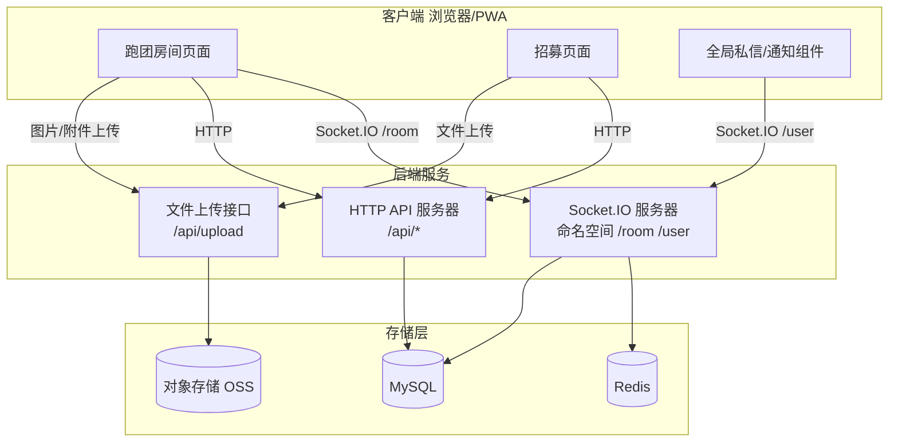

# 附录 A03：技术约定（原附录 C）

## 文档信息
- 版本：V1.6
- 日期：2026-04-25
- 变更：统一 design 目录版本；补充根目录 6 份准则文档优先级；修正规则画布旧依赖口径


【角色立绘捏人系统 - 工程师须知】

1. 功能定位：前端 Canvas 合成头像，后端只存配置 JSON
2. 数据来源：avatar_custom_data 字段（character_sheets 表）
3. 资源交付：美术资源按规范产出 PNG，前端静态资源托管
4. 合成逻辑：前端按固定顺序叠加图层，应用色相滤镜换色
5. 工程师无需关心：具体款式数量、美术描述、绘制技法

接口：获取角色卡时，avatar_custom_data 随完整角色卡返回
      保存角色卡时，前端校验数据格式后整体提交

文件命名规则：{部件}_{ID}[_side_{L|R}]_{line|color}.png
  - 换色层（滤镜目标）：*_color, body_skin_*, pupil
  - 线稿层（原样渲染）：*_line, body_base_*, eye_base, brow, mouth, acc_*
  - 示例：hair_01_back_color.png, cloth_02_inner_line.png

图层合成顺序（从下到上）：
  body_skin → body_base → eye_base → pupil → brow → mouth
  → hair_back_color → hair_back_line → hair_front_color → hair_front_line
  → [女性] hair_side_L_color → hair_side_L_line
  → [女性] hair_side_R_color → hair_side_R_line
  → cloth_inner_color → cloth_inner_line → cloth_outer_color → cloth_outer_line
  → [女性] acc_necklace → acc_glasses

画布规格：1024×1024，PNG透明背景

&gt; **关联文档**：
&gt; - 数据结构定义详见 [附录 D04：数据字典与 Schema 定义](附录 D04：数据字典与 Schema 定义.md) 第2.1节
&gt; - 美术资源生产规范见内部美术文档（非技术文档）

## 0.1 2026-04-25 对齐声明（新增）

本附录遵循 `docs/文档对齐治理.md` 中定义的统一优先级与冲突处理规则。

强制约束：

- 规则定义编辑入口为 Recipe 表单/DSL，不再包含 L3 可视化原子画布编辑。
- 引擎执行层仍消费 `{ atoms, connections }`，但其来源为 Recipe 编译产物。
- 前端样式变量统一使用语义化 `--color-*` / `--surface-*` / `--text-*` / `--space-*` / `--radius-*`，禁止恢复 `--tp-*` 或任意硬编码色值。
- 设计令牌唯一来源锁定为 `packages/client/src/styles/tokens.css`，并与 `docs/附录 B：设计令牌（Design Tokens）.md` 同步维护；禁止回退到历史 Slate 900 主色方案。


## 1. 技术路线简化声明

本项目的规则引擎采用**轻量级节点式架构**，不实现工业级 PLC 模型中的以下特性：
- ❌ FC（函数块）与 FB（功能块）的严格区分
- ❌ 背景数据块（BDB）的生命周期管理（实例隔离、自动销毁）
- ❌ 并发执行时的状态隔离（引擎采用单线程顺序执行）
- ❌ 强类型端口校验（仅做运行时类型检查，不强制编译时校验）

**取而代之的是**：
- ✅ 每个规则包是一个节点图（`atoms` + `connections`）
- ✅ 每个节点是一个纯函数（输入 JSON → 输出 JSON）
- ✅ 节点由引擎预置或由 Recipe 编译器基于配方参数生成
- ✅ 节点图执行采用拓扑排序，无状态、无并发、无 BDB

此简化大幅降低开发复杂度，且足以支持 COC7、DND5e 等主流 TRPG 规则的配置化实现。

---

## 2. 客户端架构

| 平台       | 方案              | 说明                                                 |
| -------- | --------------- | -------------------------------------------------- |
| **PC 端** | **纯 Web + PWA** | 用户通过浏览器访问，可安装 PWA 获得桌面图标和离线缓存。无需维护独立客户端，降低开发和分发成本。 |
| **移动端**  | **PWA 轻量交互端**   | 支持跑团轻量能力（聊天、掷骰、角色卡轻量编辑、探索/招募/讨论浏览）与创作者后台移动端简化能力（按附录 A06），锁屏断线自动重连补记录。 |
```markdown
> **架构说明**：纯 Web + PWA 方案覆盖全平台，PC 端通过浏览器获得完整功能，移动端通过 PWA 获得接近原生应用的体验。
```

---

## 29. 全平台搜索能力边界（防幻觉约束）

> **基础设施约束（见第 1 节关键约束 7）**：本项目使用单库 + Redis，4GB 内存，无分库分表，无 Elasticsearch。  
> 全平台搜索统一使用 **MySQL FULLTEXT 全文索引（InnoDB FULLTEXT，中文字段需配置 `ngram` 解析器，最小词长 2）**。

### 29.1 搜索输入规范

| 参数 | 值 | 说明 |
|------|-----|------|
| 最短关键词长度 | **2 字符** | 过短词无法命中索引；前端提示"请输入至少 2 个字符" |
| 最长关键词长度 | **100 字符** | 超出截断，防止注入超长查询 |
| 非法字符处理 | 过滤 `+`, `-`, `*`, `"`, `~`, `@`, `<`, `>`, `(`, `)` | MySQL FULLTEXT 布尔模式运算符，转义后传入 |
| 关键词消毒 | `DOMPurify.sanitize()` 前端 + 后端 `mysql.escape()` | 防 XSS/SQL 注入 |

### 29.2 各实体搜索范围

| 搜索入口 | 可搜字段 | 索引类型 | 分页上限 | 权限要求 |
|:--------|:--------|:--------|:--------|:--------|
| 模组 (`modules`) | `title`, `description`, `tags` | FULLTEXT | 每页 20 条，最多翻 50 页（1000 条） | 仅搜 `status='public'` |
| 规则包 (`rulesets`) | `title`, `description` | FULLTEXT | 每页 20 条，最多翻 50 页 | 仅搜 `status='published'` |
| 招募帖 (`recruitment_posts`) | `title`, `description`, `game_system` | FULLTEXT | 每页 20 条，最多翻 20 页（400 条） | 仅搜 `status='open'` |
| 用户 (`users`) | `username`, `nickname` | FULLTEXT | 每页 20 条，最多翻 10 页（200 条） | 仅搜公开账号 |
| 角色卡 (`character_cards`) | `name` | FULLTEXT | 每页 20 条，最多翻 5 页（100 条） | 仅搜本人/当前团成员 |
| NPC (`npcs`) | `name`, `description` | FULLTEXT | 每页 20 条，最多翻 10 页 | 仅搜当前模组下，创作者权限 |

### 29.3 明确不支持的搜索能力（V1.0）

- ❌ 拼音/模糊音搜索（如"daol"→"刀了"）
- ❌ 同义词扩展 / 语义相关搜索
- ❌ 跨实体联合搜索（同时搜模组+招募帖）
- ❌ 输入态搜索建议/自动补全（autocomplete）
- ❌ 搜索结果排序自定义（固定按 FULLTEXT 相关性降序）
- ❌ 搜索历史记录持久化到服务端（前端 localStorage 存最近 10 条）

### 29.4 性能约束

| 指标 | 约束 |
|------|------|
| 单次搜索接口超时 | **3s**，超时返回 `SEARCH_TIMEOUT`，不继续等待 |
| 频率限制 | 单用户每分钟不超过 **30 次**搜索请求（Redis 滑动窗口） |
| 未登录用户 | 每 IP 每分钟不超过 **10 次** |

> **Engineers Note**
> - FULLTEXT 索引创建示例（ngram 中文支持）：
>   ```sql
>   ALTER TABLE modules ADD FULLTEXT INDEX ft_modules_search (title, description, tags) WITH PARSER ngram;
>   -- ngram_token_size=2，需在 MySQL 配置文件中设置
>   ```
> - 搜索接口统一走 `/api/v1/search/{entity}?q=xxx&page=1`，不为每个实体单独设计搜索路由。
> - 搜索结果永远不包含软删除（`deleted_at IS NOT NULL`）的记录。

### 29.5 搜索标签推荐（非 AI）

> 本能力属于搜索结果增强层，不是输入态自动补全，不调用 LLM/Agent 服务。

#### 29.5.1 数据边界

1. 仅使用搜索行为事件：搜索词、点击目标、下载/加入行为。
2. 仅使用公开内容的结构化索引字段：标题、标签、简介、规则系统。
3. 不解析用户原创正文，不读取私密内容，不关联 AI 授权开关。

#### 29.5.2 计算与更新

1. 离线计算：基于物品的协同过滤（item-based CF）产出标签共现矩阵。
2. 更新频率：默认 T+24h；热点标签允许 T+1h 增量热加载。
3. 冷启动：新内容先用自身标签与简介关键词作为初始关联，行为样本充分后切换为协同过滤结果。

#### 29.5.3 接口返回

搜索接口在原有 `results` 之外，新增 `suggested_tags` 字段：

```json
{
  "results": [],
  "suggested_tags": [
    { "tag": "1920s", "type": "era", "weight": 0.92 },
    { "tag": "调查员向", "type": "style", "weight": 0.87 }
  ]
}
```

字段约束：

1. `weight` 取值范围 `0~1`，按降序返回。
2. 默认返回前 5 个，最多 10 个。
3. 推荐计算超时或无结果时返回空数组，不影响主搜索结果。

## 2.1 前端路由约定

| 路由 | 对应页面 | 说明 |
|------|---------|------|
| `/` | 首页 | 未登录跳转 `/login` |
| `/login` | 登录/注册 | |
| `/explore` | 探索 | 模组集/规则包/故事录/公示处 |
| `/recruit` | 招募 | 找房间/开团招人 |
| `/recruit/:id` | 招募详情 | 招募帖详情页 |
| `/rooms` | 房间 | 进行中/待开始/已结束 |
| `/discuss/:board` | 讨论分区 | 技巧交流/跑团分享/同好闲谈 |
| `/discuss/thread/:id` | 帖子详情 | 讨论帖详情页 |
| `/assets/modules/:id` | 模组详情 | 模组介绍、规则包信息、招募入口 |
| `/room/:id` | 跑团房间（叙事模式） | 主要游戏界面，三栏聊天布局 |
| `/campaign/:id/gm/:module` | GM 导演模式 | 全屏管理页面；`module` 可为 `now`/`scenes`/`npcs`/`clues`/`timeline`/`settings` |
| `/character/editor/:id?` | 角色卡编辑器 | |
| `/notifications` | 通知中心 | 头像下拉入口 |
| `/messages` | 私信列表 | 头像下拉入口 |
| `/settings` | 设置 | 头像下拉入口 |
| `/creator` | 创作者后台 | 创作者独立入口 |
| `/creator/workshop` | 规则工坊 | 创作者工作台内入口 |
| `/creator/modules/:id/edit` | 模组编辑器 | 创作者工作台内入口 |
| `/journey` | 团途 | 跑团人生叙事主页 |
| `/u/:uid` | 个人主页 | 对外公开 Profile |

> **约定**：
> - GM 导演模式的入口按钮在叙事模式（`/room/:id`）的顶部栏，点击后 `router.push` 到 `/campaign/:id/gm/now`。
> - 导演模式返回叙事的按钮 `router.push` 回 `/room/:id`。
> - `:id` 指 `campaign_id`，全局唯一雪花 ID（字符串类型）。
> - 全平台所有可阅览作品（模组、规则包、故事录等）统一通过「叙阅器」渲染；现有详情路由作为叙阅器入口，不再为各品类单独开发独立阅览界面。
> - 页面是否显示返回按钮、是否提供搜索、以及探索/招募/房间/讨论的子路由与查询参数口径，统一以《附录 A05：页面框架与布局规范》1.5 对照表为准。

---

所有规则包统一使用：
```json
{ "atoms": [], "connections": [] }
```
该格式贯穿规则定义、模组引用、跑团执行全链路。

---

## 3. 业务表扩展字段

所有业务实体表均包含 `extras` JSON 字段，用于未来灵活扩展，避免频繁修改表结构。

---

## 4. API 版本化

所有接口遵循 `/api/` 前缀；如后续引入版本化，应以网关或路由分组统一切换，避免文档与实现双轨并行。

---

## 5. 实时通信消息版本

所有 Socket.IO 消息体包含 `version` 字段，支持协议平滑升级。

---

## 6. 模块分包加载

- 规则工坊、模组编辑器等创作者专用功能通过 `dynamic import` 拆分为独立代码块。
- 普通玩家首次加载时仅下载核心跑团模块。
- 创作者首次访问编辑器时动态下载对应模块。

---

## 7. AI 异步队列

AI 调用统一经 Redis 异步队列分发，避免阻塞主流程。

### 7.1 队列组件约定

1. 队列中间件固定使用 BullMQ。
2. BullMQ 必须使用独立 IORedis 连接，且 `maxRetriesPerRequest` 固定为 `null`。
3. Worker 在服务启动时初始化一次，不允许在请求路径中动态创建。

### 7.2 任务状态与事件约定

1. 任务状态枚举固定为 `queued | success | failed`。
2. 异步任务完成后，服务端通过 Socket.IO 事件 `ai_task_update` 推送到 `user:{user_id}`。
3. 事件载荷结构：`{ task_id, status, result?, error? }`。

### 7.3 重试与失败口径

1. 上游模型调用失败自动重试 2 次，延迟固定 `3s / 9s`。
2. 重试后仍失败，记录 `failed` 并返回统一错误结构，不得静默吞错。

### 7.4 配额统计口径

1. AI 配额按自然月统计。
2. 仅 `ai_usage_log.status='success'` 计入月度配额。
3. `queued` 与 `failed` 均不计入已用次数。

### 7.5 应用层工具调用约定（从参考项目学习）

遵循"规则与叙事分离"设计，确保 LLM 与本地业务逻辑解耦：

1. **工具职责分明**：
   - LLM 工具：文本解析、模式识别、内容摘要（纯叙事）
   - 本地引擎：Schema 校验、数据入库、状态转移、权限检查（纯规则）
   - 不允许 LLM 直接执行修改操作或状态转移

2. **工具输入/输出 Schema**：
   - 所有工具输入必须通过 Zod 或 JSON Schema 校验，无效拒绝
   - 工具输出应包含 `{ result: T, metadata: { confidence, version, timestamp } }`
   - 单条失败不应导致整体失败，而应返回 `partial_success` 或 `skipped` 标记

3. **二次确认原则**：
   - import_module / generate_recipe / check_text 任务必须在客户端预览后由用户确认再提交
   - 系统不应自动应用 LLM 的修改建议，仅作参考
   - 用户拒绝后应允许编辑或完全丢弃

4. **幂等性与缓存**：
   - 相同输入应返回相同输出（便于客户端防重与调试）
   - 建议对相同 module_text + term_whitelist 组合缓存 LLM 结果 24 小时

### 7.6 Agent 请求审计追踪（`x-agent-check`）

所有来自 Agent 的 API 请求，若携带 `x-agent-check` 对象，须原样写入 `api_access_log.request_meta` 字段，供后续安全审计。该字段由代码包B 生成，平台不解析其内容，仅负责落库。

---

## 8. RBAC 权限

用户表预留 `user_type` 字段，支持玩家/GM/创作者/管理员多角色权限控制。

### 8.1 创作者权限闭环（`requireCreator`）

> • 条件：`subscription_type === 'creator'` 或 `user_type` 包含 `'creator'` 或 `'admin'`
> • 后端实现：`packages/server/src/middleware/auth.ts` 中的 `requireCreator` 中间件，接在 `authMiddleware` 之后
> • 受保护接口：rulesets `POST/PUT/publish/versions`； modules `POST/PUT/DELETE/auto-save/submit/withdraw`
> • 前端实现：路由 meta 增加 `requiresCreator: true`；`authStore.isCreator` 存储创作者标识；全局守卫删除非创作者迟转 403 页
> • 非创作者访问 `/creator/**` 路由均被拦截并跳转 `Forbidden`

> **Engineers Note**
> - `requireCreator` 中间件**必须**接在 `authMiddleware` 之后，严禁单独使用。
> - `authStore.isCreator` 应在每次路由变更和 token 刷新后重新求值，不允许持久化过期的 `creator` 状态。
> - 受保护接口的 HTTP 403 响应必须包含结构化错误码 `FORBIDDEN`，前端统一拦截跳转，不得在业务组件内散落 `if(403)` 处理。

### 8.2 管理员权限闭环（`requireAdmin`）

> • 条件：`user_type` 包含 `'admin'`，且请求来源 IP 在 WireGuard 内网白名单内
> • 后端实现：`packages/server/src/middleware/auth.ts` 中的 `requireAdmin` 中间件，接在 `authMiddleware` 之后，内部校验上述两个条件
> • 受保护路由：所有 `/admin/**` 路径
> • 前端实现：管理后台页面在加载时会调用 `/api/admin/verify` 接口确认权限，若不通过则显示 403 页
> • 管理后台的静态资源同样部署在公网，但路由守卫 + API 校验保证未授权用户无法获取任何有效数据

> **Engineers Note**
> - `requireAdmin` 的 IP 校验**不能**只靠前端或 Nginx，必须在应用层作为强制逻辑。WireGuard 内网网段配置应从环境变量读取，不硬编码。
> - 管理员账号的 `uid` 号段识别不应作为权限判断依据，仅作标识。权限判断仅依赖 `user_type` 和网络层。

---

## 9. 安全基线

| 安全项 | 实现方式 | 阶段 |
|--------|----------|------|
| XSS 消毒 | 所有富文本输出经 DOMPurify 过滤 | MVP 强制 |
| 速率限制 | Redis 滑动窗口，支持 IP/用户/接口多维度 | MVP |
| Token 生命周期 | Access/Refresh 双令牌（分级滑动续期） | MVP |
| 供应链安全 | 强制依赖锁文件，禁止浮动版本；高危漏洞阻断构建 | MVP |

### 9.1 登录态与滑动续期策略（修订）

| 令牌 | 有效时长 | 续期规则 | 存储位置 |
| --- | --- | --- | --- |
| Access Token | 1 小时 | 过期后通过 Refresh Token 无感刷新 | 内存/运行时变量（不落盘） |
| Refresh Token | 基准 7 天，最长 30 天 | 滑动续期：用户活跃时自动顺延至当前时间 + 30 天；连续 7 天无活跃则失效 | HttpOnly Cookie |

滑动续期机制：

1. 前端在 Access Token 到期前 10 分钟静默调用刷新接口。
2. 服务端校验 Refresh Token 合法后，签发新 Access Token，并轮换 Refresh Token。
3. 新 Refresh Token 的过期时间重置为 Now + 30d。
4. 旧 Refresh Token 立即吊销；若连续 7 天无活跃刷新，登录态结束并要求重新登录。

前端无感刷新约束：

- 刷新失败时执行指数退避重试（最多 3 次，建议间隔 1s/2s/4s）。
- 关键写操作过程中若 Access Token 过期，必须先挂起请求，刷新成功后自动续发，避免用户数据丢失。

---

## 10. 存储预留

| 预留项 | 说明 |
|--------|------|
| 聊天消息 `metadata` | JSON 字段，扩展表情、音效、特效等 |
| 关键数据表 `version` | 角色卡、模组表预留，支持未来版本控制 |
| 本地备份 | PWA 通过 IndexedDB 实现离线访问 |
| 用户上传资源 | 分阶段开放（图片→音频→视频） |
| 房间日志分层存储 | 热数据（3个月）MySQL，冷数据压缩归档至 OSS |

---

## 11. 移动端角色卡自适应

- **自动分页**：前端读取规则包定义的 `character_card_schema.sections`，将每个 section 渲染为一个独立的 Tab 页。
- **控件自适应**：数字输入框在移动端自动替换为大号 +/- 步进器。

---

## 12. 整体通信架构图



### 核心分层逻辑

| 功能模块 | 协议 | 理由 |
| --- | --- | --- |
| 跑团房间聊天、检定广播、状态同步 | Socket.IO (`/room`) | 核心体验，要求 <200ms 实时性 |
| 私信、系统通知 | Socket.IO (`/user`) | 用户期望即时收到 |
| 评论区、动态流、点赞 | HTTP | 分钟级延迟可接受 |
| 角色卡保存、场景切换、模组编辑 | HTTP | 操作频率低 |
| 文件上传 | HTTP | 大流量，不适合 WebSocket |

---

## 13. 断线重连与消息补发（修订版）

### 13.1 设计目标

- 玩家断线后自动恢复连接，无感知补发消息
- 保证消息的**严格有序性**（服务端雪花ID排序）
- 防止消息丢失、重复和乱序
- 角色卡状态始终以服务端为准
- GM 控制台状态持久化，重连后恢复完整上下文

### 13.2 客户端重连策略

|参数|值|说明|
|---|---|---|
|`reconnection`|`true`|启用自动重连|
|`reconnectionAttempts`|`5`|最多重试 5 次|
|`reconnectionDelay`|`1000`|初始延迟 1 秒|
|`reconnectionDelayMax`|`30000`|最大延迟 30 秒|
|`randomizationFactor`|`0.5`|抖动因子|

### 13.3 消息补发机制（基于服务端环形缓冲区）

服务端为每个房间维护最近消息的环形缓冲区（Redis），客户端重连时携带本地已接收的最大雪花ID（`last_event_id`），服务端推送断线期间的所有消息。

**环形缓冲区数据结构**：

```typescript
interface RoomMessageBuffer {
  campaign_id: string;
  messages: Array<{
    id: string;              // 服务端雪花ID
    timestamp: number;       // 服务端接收时间戳
    type: 'chat' | 'dice' | 'system' | 'state_sync';
    payload: object;
    visible_to: string[];    // 可见角色ID列表
  }>;
  max_size: 500;             // 最大保留消息数
  ttl_seconds: 3600;         // 1小时过期
}
```

**补发流程**：

1. 客户端重连成功后，发送 `join_room` 事件，携带 `last_event_id`。
2. 服务端从该房间的环形缓冲区中筛选出 `id > last_event_id` 且当前角色在 `visible_to` 列表中的消息。
3. 通过 `missed_messages` 事件批量推送给客户端。
4. 客户端收到后，按雪花ID升序合并到本地消息流，并执行去重检查。

> **Engineers Note**
> - 服务端环形缓冲区必须以 `campaign_id` 为维度隔离，严禁跨房间混用。
> - `last_event_id` 由客户端在每次成功接收消息后持久化到 `sessionStorage`；页面刷新后可能丢失，丢失时客户端应传 `null`，服务端只推送最近 `max_size` 条。
> - 消息过滤时，必须同时校验 `visible_to` 字段和角色在场权限，二者取交集。

### 13.4 消息序列号连续性与补拉机制

**场景**：因网络抖动，客户端收到了ID为 `1005` 的消息，但ID `1004` 未收到（丢包或延迟）。

**处理策略**：

- 客户端维护一个**序列号期望值**（`expected_seq = last_received_id + 1`）。
- 当收到的消息ID大于期望值时，暂时不渲染该消息，并将其存入缓冲区。
- 同时向服务端发起补拉请求：`GET /api/messages/missing?campaign_id=xxx&start_id=1004&end_id=1004`。
- 服务端从 `chat_messages` 表（或环形缓冲区）中查询对应ID的消息返回。
- 客户端收到补拉的消息后，按ID顺序依次渲染。

**等待超时**：补拉请求超过 500ms 未响应，则跳过缺失ID，直接渲染已接收的消息，并在该位置显示轻提示：“部分消息可能丢失”。

> **Engineers Note**
> - 补拉请求必须带 `idempotent_key`，防止因网络重试导致重复查询。
> - 客户端缓冲区中的乱序消息最长保留 5 秒，超时后强制按已到达的消息顺序渲染，并上报异常日志。

### 13.5 客户端本地队列与重试

消息发送时，客户端先生成临时本地ID，状态为 `pending`，并存入本地队列。

```typescript
interface LocalPendingMessage {
  local_id: string;           // 客户端生成的UUID
  campaign_id: string;
  scene_id: string;
  content: string;
  message_type: string;
  retry_count: number;
  status: 'pending' | 'sending' | 'failed';
  created_at: number;         // 客户端时间戳
}
```

**重试策略**：采用指数退避，最多重试 3 次（间隔 1s、3s、7s）。3 次失败后标记为 `failed`，用户可手动点击重试。

**发送成功确认**：服务端收到消息后，返回服务端生成的雪花ID，客户端据此将本地消息状态更新为 `sent`，并建立 `local_id -> server_id` 映射。

> **Engineers Note**
> - 所有通过 Socket.IO 发送的消息**必须**携带客户端生成的 `temp_id`，服务端回执中返回该 `temp_id` 与 `server_id` 的映射。
> - 本地队列**统一通过 `useMessageQueue` composable 管理**，严禁在组件内直接调用 `socket.emit` 发送聊天内容。
> - 重试时，`idempotent_key` 保持不变，服务端根据该 key 去重，防止重复写入。

### 13.6 去重机制

- **服务端去重**：基于 `idempotency_key`（由 `user_id + client_send_time + random` 生成）实现。同一幂等键的消息只处理一次。
- **客户端去重**：维护一个 LRU 缓存（最大 500 条），存储已接收消息的雪花ID。收到新消息时，若ID已存在于缓存，则丢弃。

> **Engineers Note**
> - `idempotency_key` 生成规则不允许在业务层自定义，统一由 `generateIdempotentKey()` 工具函数生成。
> - 服务端去重窗口为 1 小时，超时后允许同 key 重新处理（防止长期占用去重表）。

### 13.7 重连时的状态同步

除了补发消息外，服务端还需在 `missed_messages` 事件中携带以下状态快照：

```typescript
interface ReconnectionState {
  your_character: {
    character_id: string;
    current_hp: number;
    max_hp: number;
    current_mp: number;
    max_mp: number;
    current_spatial_scene_id: string | null;
    personal_story_time: StoryTime;
    temporary_effects: EffectInstance[];
  };
  global_story_time: StoryTime;
  scheduled_moves: ScheduledMove[];    // 仅GM
  npc_states: NPCState[];              // 仅GM
}
```

客户端收到后，强制覆盖本地状态，保证与服务端一致。

### 13.8 验收标准

1. **自动重连**：网络波动 30 秒内恢复，用户无感知。
2. **消息补发**：断线期间消息按正确时序回放，无遗漏、无重复。
3. **乱序处理**：先发后至的消息经缓冲区排序后，显示顺序与服务端一致。
4. **状态一致**：重连后角色 HP/位置/时间与服务端完全一致。
5. **GM 恢复**：预约移动列表、暗骰记录、NPC状态完整恢复。
6. **弱网提示**：断线时显示明确的重连提示；消息发送失败时显示红色感叹号，允许手动重试。

> **Engineers Note**
> - 整个重连流程的状态机统一放在 `useReconnection` composable 中，前端各页面只消费其暴露的 `isReconnecting`、`lastError` 等响应式状态。
> - 不允许在业务页面中直接监听 `socket.io` 的 `disconnect` / `reconnect` 事件自行实现提示。

---

## 14. 引擎与规则包的边界

### 14.1 根本原则

**引擎无规则，规则包定义一切。** 引擎只提供原子能力，不内置任何特定 TRPG 规则。

### 14.2 动作调度器的极简设计

| 能力 | 接口 | 说明 |
|:--|:--|:--|
| 排序能力 | `sortInitiative(actors, formula)` | 返回排序后的 ID 数组 |
| 当前指针 | `getCurrentTurn()` / `nextTurn()` / `reset()` | 记录"现在轮到谁" |
| 事件钩子 | `on('turnStart', handler)` | 允许规则包挂载效果链 |

### 14.3 两种运行模式

| 模式 | 实现方式 | 默认状态 |
|:--|:--|:--|
| 自由流程 | 引擎不参与回合管理 | ✅ 默认模式 |
| 回合战术 | 规则包通过调用引擎能力实现 | 需规则包显式激活 |

### 14.4 验收标准

| 检查项 | 标准 |
|:--|:--|
| 引擎代码中无规则名称硬编码 | 代码中无 `if (coc7)` / `if (dnd5e)` 分支 |
| 自由流程默认可用 | 不加载任何规则包时，房间仍可正常跑团 |
| 回合制可完全关闭 | GM 可随时从「回合战术」切换回「自由流程」 |

---

## 15. 状态机定义

### 15.1 招募帖状态

| 当前状态 | 允许转换到 | 触发条件 |
|:---|:---|:---|
| `open`（招募中） | `closed` | GM 手动关闭 |
| `open` | `full` | 人数达到上限（自动） |
| `full` | `open` | 有成员退出 |
| `closed` | — | 不可逆 |

> **Engineers Note**
> - `recruitment_posts.status` 的任何变更**必须**写入 `recruitment_audit_log` 表，字段固定为：`operator_id`、`old_status`、`new_status`、`reason`（枚举值）、`created_at`。
> - “成团”操作涉及招募帖状态变更、`campaign` 创建、成员关联写入，必须在同一个数据库事务内完成，失败全部回滚。
> - 前端不允许直接通过 UI 触发“成团”后立即修改招募帖的其他属性，所有变更必须通过 `/api/recruitment/{post_id}/finalize` 统一入口。

### 15.2 团状态

| 当前状态 | 允许转换到 | 触发条件 |
|:---|:---|:---|
| `preparing` | `running` | GM 点击"开始游戏" |
| `preparing` | `ended` | GM 解散房间 |
| `running` | `paused` | GM 暂停 |
| `paused` | `running` | GM 恢复 |
| `running` / `paused` | `ended` | GM 结束团 |

> **Engineers Note**
> - 团状态变更必须记录审计日志，并写入 `campaigns` 表的 `status_updated_at` 字段。
> - 解散房间（`ended`）时，系统必须自动取消该团所有未执行的预约移动，并释放角色卡激活绑定。

### 15.3 预约移动状态

| 当前状态 | 允许转换到 | 触发条件 |
|:---|:---|:---|
| `pending` | `approved` | GM 批准 |
| `pending` | `cancelled` | GM 拒绝或玩家取消 |
| `approved` | `executed` | 全局时间到达（系统自动） |
| `approved` | `cancelled` | GM 手动取消 |

> **Engineers Note**
> - 所有预约移动的状态变更必须写入 `scheduled_moves_audit_log`，并包含操作者、时间戳、旧状态、新状态。
> - 系统自动执行 `executed` 时，操作者字段统一填充 `"system"`，并在 `metadata` 中记录触发的时间推进事件 ID。
> - 同一角色最多只能有 1 条 `pending` 或 `approved` 状态的预约移动，创建前必须在应用层加锁校验。

### 15.4 模组/规则包审核状态

| 当前状态 | 允许转换到 | 触发条件 |
|:---|:---|:---|
| `draft` | `reviewing` | 创作者提交审核 |
| `reviewing` | `public_notice` | 平台审核通过 |
| `reviewing` | `draft` | 平台驳回 |
| `public_notice` | `published` | 公示期满 7 天，无异议 |
| `public_notice` | `suspended` | 收到有效侵权投诉 |
| `published` | `suspended` | 后续被投诉侵权且核实 |

> **Engineers Note**
> - 状态变更必须记录审核日志，包括操作管理员 ID、时间、驳回/投诉原因（必填）。
> - 公示期倒计时由服务端定时任务计算，客户端仅展示，不得依赖前端定时器触发状态变更。

---

## 16. 错误码完整清单

### 16.1 通用错误

| HTTP 状态码 | 业务错误码 | 说明 |
|:---|:---|:---|
| 400 | `INVALID_REQUEST` | 请求参数格式错误 |
| 401 | `UNAUTHORIZED` | 未登录或 Token 失效 |
| 403 | `FORBIDDEN` | 无权限操作 |
| 404 | `NOT_FOUND` | 资源不存在 |
| 429 | `RATE_LIMITED` | 请求过于频繁 |
| 500 | `INTERNAL_ERROR` | 服务器内部错误 |

### 16.2 用户相关

| 业务错误码 | 说明 |
|:---|:---|
| `PHONE_ALREADY_REGISTERED` | 手机号已注册 |
| `SMS_CODE_INVALID` | 验证码错误或已过期 |
| `NICKNAME_DUPLICATE` | 昵称已被占用 |
| `NICKNAME_SENSITIVE` | 昵称包含敏感词 |

### 16.3 房间相关

| 业务错误码 | 说明 |
|:---|:---|
| `ROOM_CODE_INVALID` | 房间码不存在 |
| `ROOM_FULL` | 房间已满 |
| `CHARACTER_ALREADY_IN_ROOM` | 该角色卡已在其他团激活 |
| `RULESET_MISMATCH` | 角色卡规则包与房间不匹配 |
| `SCENE_NOT_FOUND` | 目标剧情场不存在 |
| `GM_ONLY` | 仅 GM 可操作 |

### 16.4 预约移动相关

| 业务错误码 | 说明 |
|:---|:---|
| `MOVE_TARGET_INVALID` | 目标场无效或非剧情场 |
| `MOVE_TIME_CONFLICT` | 角色已有未执行的预约移动 |
| `MOVE_TIME_NOT_FUTURE` | 到达时间必须晚于当前剧情时间 |
| `CONCURRENT_ADVANCE` | 另一位 GM 正在推进时间 |

### 16.5 规则引擎相关

| 业务错误码 | 说明 |
|:---|:---|
| `RULESET_CYCLE_DETECTED` | 规则包存在循环依赖 |
| `COMMAND_NOT_SUPPORTED` | 当前规则包不支持该指令 |
| `SKILL_NOT_FOUND` | 角色卡中不存在该技能 |
| `DICE_EXPRESSION_INVALID` | 骰子表达式格式错误 |

> **Engineers Note**
> - 所有业务错误响应必须包含 `error_code`（如上表中的英文标识）和 `message`（面向用户的提示文本）。
> - 前端全局拦截器不得将 `4xx` 业务错误码视为“网络异常”，必须根据 `error_code` 分发到对应的 Toast 或内联错误提示。

### 16.6 管理后台 AI 建议接口

#### 接收 AI 建议

**接口**：`POST /api/admin/ai-suggestions`  
**认证**：`Authorization: Bearer {AGENT_SERVICE_API_KEY}`（复用现有 Agent 认证体系）  
**请求体**：

```json
{
  "agent_id": "agent_ab",
  "report_id": "rpt_123",
  "action": "delete_post",
  "confidence": 85,
  "evidence": "用户在第3段使用了侮辱性词汇",
  "rule": "《社区公约》第4条",
  "decision_trace": "详细推理日志..."
}
```

**必填字段**：`agent_id`, `report_id`, `action`, `confidence`

**处理逻辑**：
1. 校验 `report_id` 存在且状态为待处理。
2. 将建议数据关联至对应举报工单，后续查询时合并返回。
3. 若同一工单已存在建议，则覆盖更新（Last-Write-Wins）。

> **Engineers Note**  
> - 该接口仅允许内网服务（代码包B）调用，生产环境务必配置 IP 白名单或 mTLS。  
> - 所有建议的写入操作必须记录到 `ai_suggestion_log` 审计表。

---

## 17. Socket.IO 事件定义

### 17.1 服务端 → 客户端

```typescript
interface ServerToClientEvents {
  new_message: (message: ChatMessage) => void;
  time_advanced: (data: { old_time: StoryTime; new_time: StoryTime; triggered_moves: Array<any> }) => void;
  position_changed: (data: { character_id: string; from_scene_id: string | null; to_scene_id: string; move_type: string }) => void;
  character_state_sync: (data: CharacterStateSnapshot) => void;
  move_approved: (data: { move_id: string; execute_at: StoryTime }) => void;
  move_rejected: (data: { move_id: string; reason?: string }) => void;
  rate_limited: (data: { retry_after: number; message: string }) => void;
  missed_messages: (data: {
  messages: ChatMessage[];           // 断线期间的消息列表
  your_state: {
    character_id: string;
    character_name: string;
    current_hp: number;
    max_hp: number;
    current_mp: number;
    max_mp: number;
    current_scene_id: string | null;
    current_scene_name: string | null;
    personal_story_time: StoryTime;
    temporary_effects: Array<{
      effect_id: string;
      display_name: string;
      remaining_rounds?: number;
    }>;
  };
  global_time: StoryTime;
}) => void;
}
```

### 17.2 客户端 → 服务端

```typescript
interface ClientToServerEvents {
  join_room: (data: { campaign_id: string; character_id: string; last_event_id?: string }) => void;
  leave_room: () => void;
  chat_message: (data: { content: string; temp_id: string }) => void;
  request_move: (data: { target_scene_id: string; travel_method?: string }) => void;
  gm_approve_move: (data: { move_id: string; execute_at?: StoryTime }) => void;
  gm_reject_move: (data: { move_id: string; reason?: string }) => void;
  gm_advance_time: (data: { delta?: { minutes: number }; custom_time?: StoryTime }) => void;
}
```

> **Engineers Note**
> - 所有事件的 payload 必须严格符合上述 TypeScript 接口定义，新增字段需要先更新本接口并评审。
> - Socket.IO 消息体必须包含 `version` 字段（当前为 `"1.0"`），服务端收到不带版本号的事件应拒绝并返回 `VERSION_MISSING` 错误。

---

## 18. 数值边界与限制

| 字段/操作 | 限制值                             | 说明        |
| :---- | :------------------------------ | :-------- |
| 房间名   | 2-32 字符                         | 不可为空      |
| 昵称    | 2-16 字符                         | 禁止纯数字     |
| 骰子表达式 | 最多 100 个骰子，最大 1000 面            | 防止计算过载    |
| 聊天消息  | 最大 2000 字符                      | 超长引导使用富文本 |
| 团内角色数 | 最多 20 人（含 NPC）                  | 超过建议分团    |
| 预约移动  | 每角色最多 1 条未执行                    | 已定义       |
| 文件上传  | 图片 ≤ 5MB（头像类建议≤2MB，地图/模组素材≤5MB） | MVP 仅图片   |
| 消息缓冲区 | 每房间保留最近 500 条                   | 断线重连补发    |

> **Engineers Note**
> - 所有输入校验**必须在服务端再次执行**，不可仅依赖前端表单验证。
> - 超过限制的请求应返回 `INVALID_REQUEST` 并附带具体的字段名和限制说明。

---

## 19. 内容安全边界矩阵

| 内容类型 | 敏感词过滤 | XSS 消毒 | 审核机制 |
|:---|:---|:---|:---|
| 聊天消息 | ❌ 不过滤 | ✅ 消毒 | 举报后审核 |
| 昵称 | ✅ 过滤 | ✅ 消毒 | 修改时实时校验 |
| 模组标题/描述 | ✅ 过滤 | ✅ 消毒 | 上架前人工审核 |
| 角色卡名称/背景 | ⚠️ 仅举报后审核 | ✅ 消毒 | 举报后审核 |
| 招募帖内容 | ✅ 过滤 | ✅ 消毒 | 发布时实时校验 |
| 私信内容 | ❌ 不过滤 | ✅ 消毒 | 举报后审核 |

> **Engineers Note**
> - XSS 消毒统一使用 `DOMPurify.sanitize()`，配置白名单仅允许 `b`, `i`, `em`, `strong`, `a`（禁止 `href` 中的 `javascript:`）。
> - 敏感词过滤使用统一的 `SensitiveWordFilter` 服务，词库由后台可配置，前端不内置词库。

---

## 20. PC/移动端功能差异速查表

| 功能 | PC 端 | 移动端 | 会员要求 |
|:---|:---|:---|:---|
| 跑团聊天、掷骰 | ✅ 完整 | ✅ 完整 | 免费 |
| 角色卡查看/编辑 | ✅ 完整表单 | ✅ 自动分页 | 免费 |
| 规则工坊 Recipe 编辑器 | ✅ 模板/表单/DSL 编辑 | ❌ 只读查看 | 创作者 |
| 模组编辑器 | ✅ 富文本 + Mention 编辑器 | ⚠️ 可编辑元信息+纯文本+标题层级；Mention 对应复杂实体只读；图片/音频仅查看 | 创作者 |
| 网格地图 | ✅ 拖拽 Token | ⚠️ 静态图+坐标列表 | 会员 |
| 轨迹矩阵 | ✅ 表格视图 | ⚠️ 时间轴视图 | 会员 |
| 可视化日志编辑器 | ✅ 拖拽排序 | ❌ 不可用 | 会员 |

> **降级提示文案**：移动端遇到不可用功能时，统一提示"请在电脑上使用此功能"。

> **跨端同步实现约束**：
> - 频道按资源订阅，不按用户广播。
> - 保存接口支持 `op_id` 幂等去重。
> - 移动端使用 IndexedDB 离线队列与指数退避重试。

---

## 21. 网格地图 V1.0 技术边界（防幻觉约束）

> **设计原则**：V1.0 仅提供最基础的 Token 位置可视化，**禁止**实现以下高级功能。

### 21.1 实现范围

| 功能点       | 实现要求                                                                                                         | 禁止实现                         |
| :-------- | :----------------------------------------------------------------------------------------------------------- | :--------------------------- |
| **背景图**   | GGM 可上传 JPG/PNG（≤5MB，推荐压缩至2MB以内以提升加载速度）                                                                      | ❌ 多图层、地图绘制工具、预设素材库           |
| **网格**    | 显示方格覆盖层，网格大小可调（20px-100px，默认 50px）                                                                           | ❌ 六边形网格、无网格模式                |
| **Token** | 显示为圆形头像（从角色卡读取），GM 可拖拽移动                                                                                     | ❌ 玩家拖拽、Token 旋转、状态标记（如血迹、倒地） |
| **可见性**   | 所有玩家实时看到 Token 位置                                                                                            | ❌ 战争迷雾、动态光照、视野计算             |
| **交互**    | GM 拖拽 Token 时，位置实时同步至所有客户端                                                                                   | ❌ 测量工具（距离、角度）、路径绘制           |
| **数据存储**  | Token 位置存 `character_scene_states.position: {x, y}`<br>网格配置存 `scenes.grid_config: {size: 50, enabled: true}` | ❌ 历史轨迹回放                     |

### 21.2 明确不做的功能清单（V1.0）

- ❌ 多图层（仅单层）
- ❌ 战争迷雾 / 探索迷雾
- ❌ 测量工具（距离尺、角度器）
- ❌ 动态光照 / 视野计算
- ❌ 地图绘制工具（画笔、形状）
- ❌ 预设地图素材库
- ❌ Token 旋转、缩放、状态图标
- ❌ 玩家拖拽 Token（仅 GM 可移动）

### 21.3 移动端降级方案

移动端不实现 Canvas 拖拽，改为：
- 静态地图预览
- 点击 Token 后通过下拉列表选择目标格子坐标

详见《附录 A06：移动端适配总则》。

---
## 22. 关键错误场景与用户提示

| 错误场景 | 用户提示 | 后续操作 |
|:---|:---|:---|
| 网络断开 | "网络连接不稳定，正在尝试重连…（1/5）" | 消息进入本地队列 |
| 重连失败 | "网络连接失败，请检查网络后点击刷新" | 显示手动刷新按钮 |
| 技能不存在 | "技能「{技能名}」不存在于当前角色卡" | 提示可用技能列表 |
| 角色卡绑定冲突 | "该角色卡正在参与团「{团名}」，请先退出原团" | 提供"查看原团"按钮 |
| 预约移动时间冲突 | "该角色已有待执行的移动计划" | 显示现有预约详情 |
| 时间推进冲突 | "另一位 GM 正在操作，请稍后再试" | 禁用推进按钮 3 秒 |
| 存储空间不足 | "您的存储空间已满。请删除旧文件或升级会员。" | 提供"清理空间"入口 |
| 房间码无效 | "房间码不存在，请检查后重新输入" | 清空输入框 |
| 验证码错误 | "验证码错误或已过期，请重新获取" | 清空验证码输入框 |

> **Engineers Note**
> - 所有面向用户的提示文案必须从统一的国际化 key 中读取，不得在业务代码中硬编码字符串。
> - “稍后重试”类操作必须触发对应的自动恢复流程，不使用户停留在错误态。

---

## 23. 轨迹矩阵实现方案

```plain
**桌面端（≥1024px）**：
> - 使用 **Element Plus Table 组件** 作为基础表格框架
> - 时间轴（纵轴）通过表格行表示，场景（横轴）通过动态生成的列表示
> - 单元格合并使用 `span-method` 实现
> - 拖拽调整预约移动使用 **Sortable.js** 集成
> - 数据量较大时启用 **Element Plus Table V2（虚拟化表格）**
> - 红色竖线通过绝对定位的伪元素叠加实现
> 
> **移动端（<768px）**：
> - 改用**时间轴视图**（见附录J第4.1节），非简单响应式切换
> - 使用垂直列表替代表格，支持虚拟滚动
> - 长按时间节点触发GM操作菜单
> 
> **只读约束**：GM 不可直接编辑单元格。位置/时间修正必须通过强制移动、时间推进等系统功能完成。
```

- 时间轴（纵轴）通过表格行表示，场景（横轴）通过动态生成的列表示
- 单元格合并使用 `span-method` 实现
- 拖拽调整预约移动使用 **Sortable.js** 集成
- 数据量较大时启用 **Element Plus Table V2（虚拟化表格）**
- 红色竖线通过绝对定位的伪元素叠加实现

> **只读约束**：GM 不可直接编辑单元格。位置/时间修正必须通过强制移动、时间推进等系统功能完成。

---

## 24. 规则引擎轻量架构

### 24.1 核心模型
- **原子节点（Atom）**：最小执行单元，纯函数
- **规则包（Ruleset）**：包含 `atoms`、`connections`、`commands`
- **执行器（Executor）**：加载规则包 → 构建节点图 → 拓扑排序 → 执行

### 24.2 预置节点类型

| 节点类型 | 功能 |
|---------|------|
| `dice_roll` | 掷骰 |
| `threshold_compare` | 阈值比较 |
| `character_skill_reader` | 读取角色卡技能值 |
| `resource_modify` | 修改资源 |
| `multiply` | 数值乘法 |
| `if_else` | 条件分支 |
| `result_collector` | 收集最终输出 |

### 24.3 执行器接口

```typescript
interface ExecuteRequest {
  ruleset_id: string;
  command: string;
  params: Record<string, any>;
  context: { character_id: string; campaign_id: string };
}

interface ExecuteResponse {
  success: boolean;
  output: any;
  logs: NodeExecutionLog[];
}
```
### 24.4 指令系统三层模型

规则包通过三个字段定义完整的指令系统：

```typescript
interface RulesetCommands {
  // 1. 平台预置指令中，本规则包支持哪些
  supported_commands: string[];  // 如 ["ra", "sc", "init"]
  
  // 2. 覆盖平台预置指令的参数
  command_overrides?: Record<string, {
    component?: string;
    dice_expression?: string;
    success_direction?: 'lte' | 'gte';
    difficulty_divisors?: number[];
    description?: string;
    [key: string]: any;
  }>;
  
  // 3. 规则包自定义的全新指令（平台未预置）
  custom_commands?: Array<{
    trigger: string;              // 触发模式：精确字符串、模板或正则
    description: string;
    component: string;              // 入口原子ID
    dice_expression?: string;
    input_mapping: Record<string, string>;
    gm_only?: boolean;
    visible_in_assistant?: boolean;
  }>;
}
```

### 24.5 招募帖动态表单配置

规则包可定义招募帖的专属字段，用于发帖时动态渲染表单：

```typescript
interface RecruitmentField {
  name: string;           // 字段标识，如 "credit_rating_max"
  label: string;          // 显示标签，如 "信誉限制"
  type: 'number' | 'range' | 'text' | 'boolean' | 'select';
  required?: boolean;
  placeholder?: string;
  options?: string[];     // 当 type='select' 时使用
  min?: number;
  max?: number;
  default?: any;
}

// 在规则包中声明
recruitment_fields?: RecruitmentField[];
```

**接口**：`GET /api/rulesets/{ruleset_id}/recruitment-fields`

若规则包未配置 `recruitment_fields`，返回空数组，前端显示通用文本框"车卡要求及其他说明"。

---

## 25. 核心依赖选型

| 模块 | 推荐库 | 许可证 |
|------|--------|--------|
| 骰子计算 | `@randsum/roller` | MIT |
| 沙箱执行 | `isolated-vm` | MIT |
| 公式计算 | `mathjs` | Apache-2.0 |
| JSON 校验 | `zod` | MIT |
| WebSocket | `socket.io` | MIT |
| 富文本与 Mention 编辑器 | `@tiptap/react` | MIT |
| 场景连通/网格可视化 | `@xyflow/react` | MIT |
| PDF 导出 | `puppeteer` | Apache-2.0 |

---

## 26. 废弃或禁止使用的库

| 库名称 | 原因 | 替代方案 |
|--------|------|----------|
| `vm2` | 沙箱逃逸漏洞 | `isolated-vm` |
| `eval` / `new Function` | 代码注入风险 | `mathjs` |
| `Math.random()` | 非加密安全 | `crypto.randomInt()` |
| `react-beautiful-dnd` | 维护停滞 | `@dnd-kit/core` |
| `moment.js` | 体积大 | `dayjs` |

> **Engineers Note**
> - CI 构建脚本中应增加依赖检查步骤，扫描 `package.json` 中是否引入了上述废弃库，若存在则中断构建。

---

## 27. 数据库核心表设计

```sql
-- 用户与账号
CREATE TABLE users (
  id VARCHAR(64) PRIMARY KEY,
  uid INT UNSIGNED NOT NULL UNIQUE,
  phone VARCHAR(20) UNIQUE NOT NULL,
  password_hash VARCHAR(255),
  nickname VARCHAR(64),
  avatar_url VARCHAR(255),
  user_type JSON,
  creator_level TINYINT DEFAULT 1,
  coins BIGINT UNSIGNED DEFAULT 0,
  subscription_type ENUM('free', 'pro', 'creator') DEFAULT 'free',
  created_at TIMESTAMP DEFAULT CURRENT_TIMESTAMP
);

-- 团（Campaign）
CREATE TABLE campaigns (
  id VARCHAR(64) PRIMARY KEY,
  room_code VARCHAR(8) UNIQUE NOT NULL COMMENT '6位大写字母+数字房间码，用户可见',
  name VARCHAR(128) NOT NULL,
  ruleset_id VARCHAR(64) NOT NULL COMMENT '规则包ID，必填',
  module_id VARCHAR(64) COMMENT '模组ID，可选',
  gm_user_id VARCHAR(64) NOT NULL,
  assistant_gm_ids JSON DEFAULT '[]' COMMENT '副GM用户ID列表',
  global_story_time JSON NOT NULL DEFAULT '{"day": 1, "hour": 8, "minute": 0}' COMMENT '全局剧情时间',
  status ENUM('preparing', 'running', 'paused', 'ended') DEFAULT 'preparing',
  allow_ob BOOLEAN DEFAULT FALSE,
  is_listed_publicly BOOLEAN DEFAULT FALSE COMMENT '是否已发布到招募板',
  -- 会员功能开关（开团时设置，不可随意更改）
  enable_trajectory_matrix BOOLEAN DEFAULT FALSE COMMENT '是否启用轨迹矩阵（会员）',
  enable_grid_map BOOLEAN DEFAULT FALSE COMMENT '是否启用网格地图（会员）',
  enable_scene_connections BOOLEAN DEFAULT FALSE COMMENT '是否启用场景连通与自动移动调度（会员）',
  created_at TIMESTAMP DEFAULT CURRENT_TIMESTAMP
);

-- 场（Scene）
CREATE TABLE scenes (
  id VARCHAR(64) PRIMARY KEY,
  campaign_id VARCHAR(64) NOT NULL,
  name VARCHAR(128) NOT NULL,
  type ENUM('spatial', 'virtual', 'lobby') NOT NULL,
  history_visibility ENUM('none', 'recent', 'all') DEFAULT 'none' COMMENT '新成员历史消息可见性',
  visible_history_count INT DEFAULT 50 COMMENT '当 history_visibility=recent 时，可见的最近消息条数',
  created_at TIMESTAMP DEFAULT CURRENT_TIMESTAMP
);

-- 角色卡模板（跨团共享）
CREATE TABLE character_sheets (
  id VARCHAR(64) PRIMARY KEY,
  character_code VARCHAR(8) UNIQUE NOT NULL COMMENT '8位十六进制公开码，用于分享和快速导入，如A3F9C2E1',
  user_id VARCHAR(64) NOT NULL,
  ruleset_id VARCHAR(64) NOT NULL,
  name VARCHAR(64) NOT NULL,
  occupation_id VARCHAR(64),
  avatar_url VARCHAR(255),
  attributes JSON,          -- 基础属性（如 STR:15, CON:12）
  skills JSON,              -- 技能值（含职业点、兴趣点）
  derived_max JSON,         -- 派生最大值（如 max_hp: 12, max_mp: 8）
  equipment JSON,           -- 装备
  background TEXT,          -- 背景故事
  avatar_custom_data JSON NULL COMMENT '拼拼乐捏人配置，格式见附录 D04第2.1节',
  initial_snapshot JSON NULL COMMENT '创建时的初始快照（V1.0 不做重置功能，字段保留供迭代）',
  created_at TIMESTAMP DEFAULT CURRENT_TIMESTAMP,
  updated_at TIMESTAMP DEFAULT CURRENT_TIMESTAMP ON UPDATE CURRENT_TIMESTAMP,
  INDEX idx_user (user_id),
  INDEX idx_ruleset (ruleset_id)
);

-- 角色在场状态
CREATE TABLE character_scene_states (
  id VARCHAR(64) PRIMARY KEY,
  character_id VARCHAR(64) NOT NULL,
  campaign_id VARCHAR(64) NOT NULL,
  current_spatial_scene_id VARCHAR(64),
  personal_story_time JSON NOT NULL,
  UNIQUE KEY uk_char_campaign (character_id, campaign_id)
);

-- 私密场参与历史
CREATE TABLE scene_participations (
  id VARCHAR(64) PRIMARY KEY,
  scene_id VARCHAR(64) NOT NULL,
  character_id VARCHAR(64) NOT NULL,
  joined_at TIMESTAMP NOT NULL DEFAULT CURRENT_TIMESTAMP,
  left_at TIMESTAMP NULL,
  UNIQUE KEY uk_active (scene_id, character_id, left_at)
);

-- 预约移动
CREATE TABLE scheduled_moves (
  id VARCHAR(64) PRIMARY KEY,
  character_id VARCHAR(64) NOT NULL,
  campaign_id VARCHAR(64) NOT NULL,
  to_scene_id VARCHAR(64) NOT NULL,
  execute_at_story JSON NULL,
  status ENUM('pending', 'approved', 'executed', 'cancelled') DEFAULT 'pending',
  created_at TIMESTAMP DEFAULT CURRENT_TIMESTAMP
);

-- 聊天消息表（统一存储所有场的消息）
CREATE TABLE chat_messages (
  id BIGINT UNSIGNED PRIMARY KEY COMMENT '雪花ID，19位数字，全局单调递增，用于排序和分页',
  scene_id VARCHAR(64) NOT NULL,
  campaign_id VARCHAR(64) NOT NULL,
  sender_user_id VARCHAR(64) NOT NULL,
  sender_character_id VARCHAR(64),
  content TEXT NOT NULL,
  message_type ENUM('narrative', 'dice', 'ooc', 'clue_card', 'scene_event', 'time_tag', 'announcement', 'system', 'gm_ledger') NOT NULL,
  story_time JSON NULL COMMENT '{day, hour, minute}，公共场为NULL',
  visible_to JSON NOT NULL COMMENT '可见的角色ID列表（写扩散），如 ["char_001","char_002"]',
  client_timestamp BIGINT COMMENT '客户端发送时的毫秒时间戳',
  created_at TIMESTAMP DEFAULT CURRENT_TIMESTAMP,
  metadata JSON COMMENT '扩展字段：dice_result, clue_id, character_snapshot等',
  INDEX idx_scene_time (scene_id, created_at),
  INDEX idx_scene_id (scene_id)
);

-- 场景连通关系表（高阶功能，会员专享）
CREATE TABLE scene_connections (
  id VARCHAR(64) PRIMARY KEY,
  campaign_id VARCHAR(64) NOT NULL COMMENT '所属团ID',
  from_scene_id VARCHAR(64) NOT NULL COMMENT '起点场景ID',
  to_scene_id VARCHAR(64) NOT NULL COMMENT '终点场景ID',
  walk_duration INT NOT NULL COMMENT '步行耗时（分钟）',
  bike_duration INT NULL COMMENT '骑行耗时（分钟），NULL表示不可骑行',
  drive_duration INT NULL COMMENT '驾车耗时（分钟），NULL表示不可驾车',
  is_bidirectional BOOLEAN DEFAULT TRUE COMMENT '是否双向连通',
  created_by VARCHAR(64) COMMENT '创建者用户ID',
  created_at TIMESTAMP DEFAULT CURRENT_TIMESTAMP,
  UNIQUE KEY uk_connection (from_scene_id, to_scene_id),
  INDEX idx_campaign (campaign_id),
  INDEX idx_from (from_scene_id),
  INDEX idx_to (to_scene_id)
);

-- 招募帖
CREATE TABLE recruitment_posts (
  id VARCHAR(64) PRIMARY KEY,
  poster_id VARCHAR(64) NOT NULL,
  type ENUM('gm_recruit', 'player_seek') NOT NULL,
  title VARCHAR(128) NOT NULL,
  campaign_id VARCHAR(64) NULL,
  ruleset_id VARCHAR(64) NOT NULL,
  module_id VARCHAR(64) NULL COMMENT '关联模组ID，用于模组详情精确筛选招募帖',
  module_name VARCHAR(128) NULL COMMENT '关联模组名称冗余，用于历史兼容与展示',
  player_count_max INT NOT NULL,
  status ENUM('draft', 'open', 'full', 'grouped', 'dissolved', 'closed', 'archived') DEFAULT 'open',
  created_at TIMESTAMP DEFAULT CURRENT_TIMESTAMP,
  INDEX idx_recruitment_module_status_created (module_id, status, created_at),
  INDEX idx_recruitment_module_name (module_name)
);
```

模组直达招募查询约定：

1. 接口：`GET /api/recruitment?module_id={module_id}&status=open&page=1&limit=10`
2. 过滤优先级：`module_id` 精确匹配 > `module_name` 历史兼容模糊匹配。
3. 历史帖子迁移前允许 `module_id` 为空；新发布招募帖要求同时写入 `module_id` 与 `module_name`。

> **Engineers Note**
> - 所有 JSON 字段（`attributes`, `skills`, `visible_to` 等）必须使用 `zod` 进行写入前校验，防止非法数据结构落库。
> - `chat_messages.visible_to` 必须与写入事务同时计算并填充，不得滞后异步更新。

---
## 28. 第三方服务降级策略

### 28.1 对象存储（OSS）不可用时的处理

| 场景 | 策略 | 用户提示 |
| :--- | :--- | :--- |
| OSS 上传失败（超时/服务端错误） | 自动重试 3 次（间隔 1s、2s、4s） | 重试期间显示“上传中（第 X 次尝试）...” |
| 3 次重试后仍失败 | 降级至服务器本地存储（`/uploads/temp/`），后台异步同步至 OSS | “网络不稳定，文件已暂存本地，稍后自动同步” |
| OSS 完全不可用（持续超过 1 小时） | 运维人工介入切换至备用 OSS Bucket 或 CDN | 不向用户暴露技术细节，仅显示“服务暂时不可用” |

> **Engineers Note**
> - 本地临时存储路径 `/uploads/temp/` 必须配置定时任务每日清理超过 7 天的文件，避免磁盘写满。
> - 降级到本地存储时，必须在数据库 `uploads` 表中记录 `storage_type = 'local'`，以备后续同步。

### 28.2 支付回调失败处理

| 场景               | 策略                                                         | 用户提示                      |
| :--------------- | :--------------------------------------------------------- | :------------------------ |
| 回调接口处理失败（业务逻辑错误） | 立即返回 HTTP 5xx，支付渠道会在 **15秒、1分钟、5分钟、30分钟、1小时** 后重试（各渠道标准不同） | 用户无感知                     |
| 重试 5 次后仍失败       | 记录至 `payment_retry_queue` 表，后台脚本每小时扫描一次，主动调用支付渠道查询接口确认支付状态 | 若最终确认支付成功，自动补单并通过站内信通知用户  |
| 主动查询也失败          | 进入人工对账流程，客服介入                                              | 用户可在“我的订单”中点击“支付遇到问题”提交工单 |

> **Engineers Note**
> - 支付回调接口**必须**实现幂等：根据 `transaction_id` 去重，同一笔交易多次回调只处理一次。
> - `payment_retry_queue` 的扫描脚本必须使用分布式锁，防止多实例并发处理同一记录。

---


### 28.3 AI 服务（DeepSeek API）降级

| 触发条件 | 降级行为 | 用户感知 |
|:---|:---|:---|
| 连续 3 次调用失败或响应超时（> 60 s） | 关闭 AI 文本审查/助手问答/角色导入解析，核心功能（跑团、发帖）继续可用 | "AI 服务暂时不可用，核心功能不受影响" |
| 失败率 > 5% 持续 10 min | 同上，同时触发告警 | 同上 |
| 手动降级开关已打开 | 同上 | 同上 |

### 28.4 实名认证服务降级

| 触发条件 | 降级行为 | 用户感知 |
|:---|:---|:---|
| 接口不可用或返回持续 5xx | 暂停新认证申请，已认证用户不受影响 | "认证服务维护中，请稍后重试" |
| 接口恢复后 | 自动解除降级 | 认证入口恢复 |

### 28.5 短信服务降级

| 触发条件 | 降级行为 | 用户感知 |
|:---|:---|:---|
| 发送失败率 > 20% 持续 5 min | 关闭验证码登录，仅保留密码登录 | 登录页提示"短信服务异常，请使用密码登录" |
| 接口恢复后 | 自动解除降级 | 验证码登录恢复 |

### 28.6 降级开关设计

- 管理后台提供**手动降级开关**，可覆盖自动检测，适用于计划维护或测试场景
- 降级状态持久化到 Redis（键：`feature_flag:ai_enabled`、`feature_flag:sms_enabled` 等），多实例共享
- 降级变更记录操作人和时间，保存到 `admin_operation_logs`

---

## C：时间同步与消息可见性技术实现细则

### C.1 移动审批事务伪代码

```typescript
async function approveMove(moveId: string, gmUserId: string, storyArrivalTime?: string) {
  return db.transaction(async (trx) => {
    // 1. 校验预约存在且 status = 'pending'
    const move = await trx('scheduled_moves').where({ id: moveId, status: 'pending' }).first();
    if (!move) throw new BadRequestError('预约不存在或已处理');

    // 2. 校验目标场景 status = 'active'
    const scene = await trx('scenes').where({ id: move.to_scene_id }).first();
    if (!scene || scene.status !== 'active') {
      await trx('scheduled_moves').where({ id: moveId }).update({ status: 'cancelled' });
      throw new BadRequestError('目标场景已关闭');
    }

    // 3. 执行移动
    const fromSceneId = await getCurrentSceneId(move.character_id, move.campaign_id, trx);
    await joinScene(move.character_id, move.campaign_id, move.to_scene_id, 'scheduled', storyArrivalTime, trx);

    // 4. 生成 scene_event 消息（信息隔离）
    if (fromSceneId) {
      await insertSceneEvent(trx, fromSceneId, `${charName} 离开当前场景`, fromSceneUserIds);
    }
    await insertSceneEvent(trx, move.to_scene_id, `${charName} 进入当前场景`, toSceneUserIds);

    // 5. 写入 GM 台账（不进聊天流）
    await writeGmLedger(trx, `${charName} 从 ${fromSceneName} 前往 ${toSceneName}`);

    // 6. 更新预约状态
    await trx('scheduled_moves').where({ id: moveId }).update({ status: 'executed' });
  });
}
```

> **Engineers Note**
> - 审批移动**必须在数据库事务内**完成所有操作（移动、写消息、写台账、更新状态），任何一步失败即回滚。
> - `writeGmLedger` 写入的消息 `message_type` 必须为 `gm_ledger`，不进入普通聊天流。

### C.2 消息可见性计算函数

```typescript
/**
 * 根据场景类型自动计算消息的 visible_to 列表（写扩散）。
 * 在消息创建时调用，结果存入 chat_messages.visible_to 字段。
 */
async function computeVisibleTo(sceneId: string, campaignId: string): Promise<string[] | null> {
  const scene = await db('scenes').where({ id: sceneId }).select('type').first();
  if (!scene) return null;

  switch (scene.type) {
    case 'spatial': {
      // 空间场景：当前在场的角色对应的用户
      const rows = await db('character_scene_states')
        .where({ current_spatial_scene_id: sceneId })
        .select('character_id');
      return characterIdsToUserIds(rows.map(r => r.character_id));
    }
    case 'virtual': {
      // 虚拟场景（私密场）：未退出的参与者
      const rows = await db('scene_participations')
        .where({ scene_id: sceneId }).whereNull('left_at')
        .select('character_id');
      return characterIdsToUserIds(rows.map(r => r.character_id));
    }
    case 'lobby':
    default:
      return null; // 大厅 = 全体可见
  }
}
```

> **Engineers Note**
> - `visible_to` 计算必须与消息插入在同一事务中完成，防止插入后、计算前有角色加入或离开导致的可见性不一致。
> - 查询在场角色时，必须使用 `SELECT ... FOR UPDATE` 锁定相关行，避免并发移动造成竞态条件。

### C.3 预约移动自动触发函数

```typescript
/**
 * 在 announceTime 末尾调用。检查并执行所有到期的预约移动。
 * 规则：分钟级精度，按预约时间从早到晚逐个执行。
 */
async function executeExpiredMoves(
  campaignId: string,
  currentTime: StoryTime,
  gmUserId: string
): Promise<Array<{ character_name: string; to_scene_name: string }>> {
  const pendingMoves = await db('scheduled_moves')
    .where({ campaign_id: campaignId, status: 'approved' })
    .whereNotNull('execute_at_story')
    .orderBy('execute_at_story', 'asc')
    .orderBy('created_at', 'asc');

  const executed = [];
  for (const move of pendingMoves) {
    const executeAt = parseStoryTime(move.execute_at_story);
    if (!executeAt || compareStoryTime(currentTime, executeAt) < 0) continue;

    // 检查目标场景状态
    const scene = await db('scenes').where({ id: move.to_scene_id }).first();
    if (!scene || scene.status !== 'active') {
      await db('scheduled_moves').where({ id: move.id }).update({ status: 'cancelled' });
      // 发送通知："{角色名} 前往 {场景名} 的预约已取消（目标场景已关闭）"
      continue;
    }

    // 检查角色状态
    const charState = await db('character_scene_states')
      .where({ character_id: move.character_id, campaign_id: campaignId }).first();
    if (!charState) {
      await db('scheduled_moves').where({ id: move.id }).update({ status: 'cancelled' });
      continue; // 静默取消
    }

    // 执行移动
    await approveMove(move.id, gmUserId);
    executed.push({ character_name: move.character_name, to_scene_name: scene.name });
  }
  return executed;
}
```

> **Engineers Note**
> - 自动触发函数必须在 GM 推进时间的同一事务或紧接的后续事务中调用，中间不可插入其他用户操作。
> - 若有多个预约同时到期，必须按 `created_at` 顺序依次执行，确保因果链正确。

### C.4 历史消息时序裁剪查询

```typescript
/**
 * 查询带时序裁剪的历史消息（history_visibility = 'none' 时）。
 * 基准时间：真实时间（created_at vs joined_at/left_at）。
 */
async function queryWithTimeFilter(
  sceneId: string, userId: string, characterId: string
): Promise<ChatMessage[]> {
  const participations = await db('scene_participations')
    .where({ scene_id: sceneId, character_id: characterId })
    .select('joined_at', 'left_at');

  return db('chat_messages')
    .where({ scene_id: sceneId })
    .where(function () {
      // 豁免类型：始终返回
      this.whereIn('message_type', ['time_tag', 'announcement', 'system']);
      // 在参与时间窗口内的消息
      this.orWhere(function () {
        for (const p of participations) {
          this.orWhere(function () {
            this.where('created_at', '>=', p.joined_at);
            if (p.left_at) this.where('created_at', '<=', p.left_at);
          });
        }
      });
    })
    .where(function () {
      this.whereNull('visible_to')
        .orWhereRaw(`JSON_CONTAINS(visible_to, '"${userId}"')`);
    })
    .orderBy('id', 'asc');
}
```

> **Engineers Note**
> - 使用时序裁剪查询的接口必须缓存查询结果，避免每次加载历史消息都执行复杂的 `OR` 查询。
> - `message_type` 豁免列表（`time_tag`, `announcement`, `system`）不允许随意扩展，新增豁免类型需要评审。

### C.5 错误码定义

| HTTP状态码 | 业务错误码 | 说明 |
|------------|-----------|------|
| 400 | SCENE_INVALID | 目标场景不存在或非剧情场 |
| 400 | MOVE_TARGET_INVALID | 预约移动目标场无效 |
| 400 | TIME_ROLLBACK_DENIED | 剧情时间不能回退 |
| 400 | SCENE_NOT_ACTIVE | 目标场景已归档或隐藏，不可进入 |
| 400 | SCENE_DELETE_PROTECTED | 场景有历史数据，不可物理删除，请使用归档 |
| 403 | FORBIDDEN | 无权限导出日志（含旁观者、非团成员、越权视角请求） |
| 409 | CONCURRENT_APPROVE | 另一位GM正在审批同一移动请求 |

---

### C.6 Socket.IO 事件清单（新增）

| 方向 | 事件名 | 数据 | 说明 |
|------|--------|------|------|
| Client → Server | `cancel_move` | `{ move_id: string }` | 玩家取消自己的 pending 预约 |
| Server → Client | `move_cancelled` | `{ move_id: string; reason?: string }` | 预约已取消（玩家取消或系统自动取消） |
| Server → Client | `auto_moves_executed` | `{ time_label: string; moves: Array<{ character_name, to_scene_name }> }` | 时间推进后自动执行的预约移动摘要（GM 助理台展示） |
```


---

## 30. 监控与告警体系

> 上线前必须完成基础监控接入；无监控等于盲操作，故障无法感知。

### 30.1 分层监控指标

| 层级 | 指标 | 告警阈值 | 告警方式 | 处置方向 |
|:---|:---|:---|:---|:---|
| 基础设施 | CPU 使用率 | > 80% 持续 5 min | 短信 + 邮件 | 自动扩容或人工介入 |
| 基础设施 | 内存使用率 | > 85% 持续 5 min | 短信 + 邮件 | 排查内存泄漏 |
| 基础设施 | 磁盘使用率 | > 90% | 短信 + 邮件 | 清理日志或扩容 |
| 应用层 | API P99 延迟 | > 2 s | 邮件 | 性能回归排查 |
| 应用层 | HTTP 5xx 错误率 | > 1% 持续 1 min | 短信 + 邮件 | 立即回滚或热修复 |
| 应用层 | 数据库连接池使用率 | > 80% | 邮件 | 查询优化或扩容 |
| 业务层 | 新用户注册量同比昨日 | < 50%（连续 2 日） | 日报标注 | 运营团队排查 |
| AI 层 | DeepSeek API 调用失败率 | > 5% 持续 10 min | 独立邮件 | 检查 DeepSeek API 状态，触发降级 |
| 安全层 | JWT 验证失败次数 | > 200 次/min 单 IP | 自动封禁 + 邮件 | 检查是否为爆破攻击 |

### 30.2 告警分级与值班响应

| 级别 | 定义 | 响应时限 | 升级路径 |
|:---|:---|:---|:---|
| P0 | 服务完全不可用 / 数据泄露 | 15 min 内响应 | 立即电话叫醒值班负责人 |
| P1 | 核心功能异常 / 错误率骤升 | 2 h 内响应 | 消息通知，值班人员处理 |
| P2 | 性能下降 / 非核心功能降级 | 次日工作时间处理 | 记录工单，Sprint 内修复 |

- 值班轮换：每周一人，节假日提前确认覆盖
- 告警收敛：同一事件 15 min 内只发送一次，避免告警风暴

### 30.3 基础设施最低要求（上线 Gate）

- [ ] 服务器 CPU/内存/磁盘监控已接入（Prometheus + Alertmanager 或云厂商监控）
- [ ] HTTP 5xx 错误率告警规则已配置
- [ ] 数据库慢查询日志已开启（阈值 ≥ 1 s）
- [ ] 至少一个告警通知渠道（短信/邮件）已验证可达
- [ ] 值班联系人列表已维护，节假日已排班

