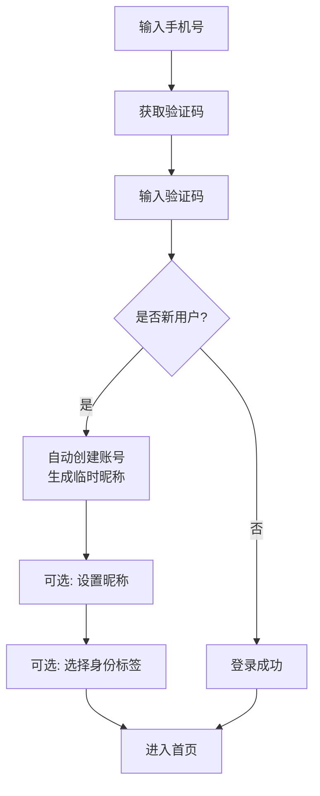

# 附录 I02：账号与基础设施产品设计

> 状态：迁移中（V1.6）
> 迁移来源：产品设计 第 9 章（账号与基础设施）
> 目标：承接账号体系、登录鉴权、部署基础设施与预留成长体系相关产品规则。

## 1. 职责边界

本附录负责：

1. 账号注册、登录、身份标签与登录态管理。
2. 内容安全责任、账号风控与基础表结构口径。
3. 部署与基础设施配置、数据备份和成长体系预留。

本附录不负责：

1. AI 功能能力边界与安全规则（归 I01）。
2. 法律与合规专题条款（归后续第10章附录）。

## 2. 迁移目录（执行清单）

1. 从产品设计迁入：第9章全文。
2. 与 附录 D04（数据字典与 Schema 定义）和后续合规附录建立交叉引用。

## 3. 迁移状态

- [ ] 章节骨架完成
- [ ] 账号体系正文迁入
- [ ] 基础设施正文迁入
- [ ] 与 附录 D04/合规附录交叉引用完成

## 4. 迁移正文（来自产品设计第9章）

## 5. 账号与基础设施

### 5.1 账号与身份系统

### 9.1.1 设计原则

- **极简优先**：手机号 + 验证码一步完成注册/登录，无需密码。
- **渐进式收集**：仅手机号为必填，昵称、身份标签等后续引导，不强制。
- **安全合规**：验证码防滥用、防爆破，符合《个人信息保护法》最小收集原则。

### 9.1.2 注册与登录流程

#### 流程图



#### 步骤说明

| 步骤 | 操作 | 后端行为 | 前端行为 |
|------|------|----------|----------|
| 1 | 输入手机号，点击“获取验证码” | 校验手机号格式；检查频率限制；生成6位数字验证码存入Redis（有效期5分钟）；通过短信发送 | 显示倒计时60秒；手机号不可编辑直到验证码输入 |
| 2 | 输入6位验证码，点击“登录/注册” | 校验验证码是否正确且未过期；查询用户表是否存在该手机号 | 显示loading，按钮禁用 |
| 3（新用户） | 系统自动创建账号 | 生成用户内部ID（UUID）和7位UID；生成临时昵称（格式见9.1.3）；插入users表；签发Access Token和Refresh Token | 收到token，跳转到“完善资料”页（可选） |
| 3（老用户） | 直接登录 | 验证手机号存在；签发新token；更新最后登录时间 | 跳转到首页或之前浏览页面 |

#### 验证码安全策略

| 限制项 | 值 | 说明 |
|--------|-----|------|
| 同一手机号 | 1次/60秒，5次/天 | 防止短信轰炸 |
| 同一IP | 10次/小时，50次/天 | 防止恶意请求 |
| 验证码有效期 | 5分钟 | 一次性使用，验证后立即删除 |
| 错误次数限制 | 连续5次验证码错误 | 该手机号锁定15分钟 |
| 短信内容 | `【TRPG平台】您的验证码是：123456，5分钟内有效。请勿泄露。` | 标准模板 |

### 9.1.3 临时昵称生成规则

新用户无需填写昵称，账号自动生成临时昵称，格式为 **`叙事者_` + 4位数字**（数字范围0001~9999，不足补零）。

**示例**：`叙事者_3721`、`叙事者_0456`

**生成算法**：
- 随机生成4位数字（如 `random.randint(1, 9999)` 并格式化为4位）
- 检查数据库中是否已存在该昵称（唯一索引）
- 若冲突则重新生成，最多重试10次
- 极端情况（10次均冲突）使用毫秒时间戳后4位

**用户修改昵称规则**：
- 允许用户修改为任意自定义昵称（长度2~16字符，不包含敏感词）
- 不允许使用“叙事者_”前缀 + 纯数字的格式（防止冒充临时昵称用户）
- 修改后原临时昵称释放，不可再被其他用户使用

### 9.1.4 身份标签（可选）

用户可在完善资料时选择身份标签（多选），用于个性化推荐和身份标识。

| 标签 | 说明 |
|------|------|
| `player` | 玩家 |
| `gm` | 守秘人/主持人 |
| `creator` | 创作者（模组/规则包作者） |

- 选择“创作者”后，引导用户提交创作者申请（需平台审核，非自动开通）。
- 身份标签仅用于前端展示和推荐算法，不影响功能权限（权限由团内角色决定）。

### 9.1.5 登录态管理（Token）- 修订版

采用 **Access Token + Refresh Token** 双令牌机制，**滑动续期策略**。

|令牌|类型|有效期|存储位置|续期行为|
|---|---|---|---|---|
|Access Token|JWT|1小时|HttpOnly Cookie|过期后使用 Refresh Token 换取新对|
|Refresh Token|随机字符串|7天|HttpOnly Cookie|**每次刷新时同时换新 Refresh Token，重置7天有效期**；旧 Refresh Token 立即失效|

**刷新接口行为**：

```typescript

POST /api/v1/auth/refresh
- 校验旧 Refresh Token（有效性、未吊销、未过期）
- 生成新 Access Token + 新 Refresh Token
- 吊销旧 Refresh Token（数据库标记 revoked）
- 写入新 Refresh Token 记录
- 返回新 Access Token（新 Refresh Token 通过 Set-Cookie 下发）
```

**优点**：若 Refresh Token 泄露，最多在7天内有效，且每次使用后自动更换，降低长期泄露风险。

**数据库表扩展**（refresh_tokens）：

```sql

CREATE TABLE refresh_tokens (
  id VARCHAR(64) PRIMARY KEY,
  user_id VARCHAR(64) NOT NULL,
  token_hash VARCHAR(255) NOT NULL,   -- 存储哈希，防数据库泄露
  expires_at TIMESTAMP NOT NULL,
  revoked BOOLEAN DEFAULT FALSE,
  created_at TIMESTAMP DEFAULT CURRENT_TIMESTAMP,
  INDEX idx_token_hash (token_hash),
  INDEX idx_user_revoked (user_id, revoked)
);
```

### 9.1.5a 管理员账号与权限模型

管理员账号不通过普通的手机号验证码注册流程创建。其账号创建、登录和权限控制遵循以下规则：

#### 创建方式
- 管理员账号由平台运维人员在数据库 `users` 表中直接插入记录。
- 该账号的 `uid` 必须从系统保留号段 `1000000 - 1000099` 中手动指定。
- 该账号的 `user_type` JSON 数组中必须包含 `"admin"` 值。
- 管理员账号必须设置密码（`password_hash` 字段非空），不支持纯验证码登录。

#### 登录与访问控制
- 管理后台（包含但不限于模组审核、举报处理、用户管理）的所有路由前缀 `/admin` 受双层保护：
  1. **业务权限层**：后端中间件校验请求者的 `user_type` 是否包含 `"admin"`。
  2. **网络层**：同时校验请求来源 IP 是否在 WireGuard 内网网段（如 `10.0.0.0/24`）内。
- 任意一层校验失败，返回 `HTTP 403 Forbidden`，不暴露后台页面入口。

#### 与普通账号的关系
- 管理员账号可作为普通玩家使用（如加入房间），但进行管理操作时强制要求通过 WireGuard 内网。
- 普通玩家 UID 无法通过任何方式升级为管理员 UID，反之亦然。

---

### 9.1.6 密码作为可选备用（后续迭代）

支持用户主动设置密码，用于网络不佳或换设备时备用登录。

| 功能 | 说明 |
|------|------|
| 设置密码 | 登录后，在“账号安全”中设置（需先验证手机号） |
| 密码登录 | 登录页增加“密码登录”Tab，输入手机号+密码 |
| 忘记密码 | 通过手机验证码重置密码 |
| 存储方式 | bcrypt哈希（盐强度10） |

**MVP 阶段不实现密码功能**，后续按需添加。

### 9.1.7 内容安全责任

平台作为网络信息内容服务平台，需履行以下法定义务：

| 责任项 | 具体要求 | MVP 落地方式 |
|--------|----------|-------------|
| 实名制管理 | 用户发布信息前需完成手机号认证 | ✅ 手机号验证码注册 |
| 违法信息处置 | 发现涉政、涉黄、涉恐等违法信息必须立即删除 | 提供举报按钮，人工审核后删除，严重者封号 |
| 用户举报机制 | 提供便捷举报入口并及时处理 | ✅ 每条消息旁有“举报”按钮，后台受理 |
| 主动巡查 | 对公开内容定期抽查 | GM负责私团管理；公共房间平台管理员抽查 |
| 配合监管 | 配合监管部门提供特定内容 | 保留完整聊天日志，至少6个月 |
| 未成年人保护 | 不向未成年人提供不适宜内容 | 房间可标注“16+”；注册时弹窗提示 |

**昵称强制过滤**（MVP 实现）：
- 昵称创建/修改时，通过正则+黑名单词库检测敏感词（政治、色情、人身攻击、广告等）。
- 命中则提示“昵称包含敏感词，请重新输入”。
- 黑名单词库参考开源项目（如 `fuckoff`、`chinese-sensitive-words`）。

**聊天内容**（MVP 不自动过滤）：
- 不自动屏蔽或替换敏感词，保留TRPG角色扮演的叙事自由。
- 提供举报按钮，GM可删除违规消息、踢出/禁言玩家。
- 后续迭代可接入内容安全API（阿里云、腾讯云）进行异步或实时审查。

**技术预留**：
- `chat_messages` 表增加 `review_status` 字段（pending/passed/rejected）和 `review_reason`。
- 举报记录表 `content_reports` 设计。
- 敏感词过滤开关可后台动态配置。

### 9.1.8 数据库表设计

```sql
-- 用户表
CREATE TABLE users (
  id VARCHAR(64) PRIMARY KEY,                -- UUID，内部主键
  uid INT UNSIGNED NOT NULL UNIQUE,          -- 7位数字，公开标识
  phone VARCHAR(20) NOT NULL UNIQUE,         -- 手机号
  nickname VARCHAR(64) NOT NULL,             -- 昵称，默认“叙事者_xxxx”
  avatar_url VARCHAR(255),                   -- 头像URL
  identity_tags JSON,                        -- 身份标签 ["player","gm"]
  has_password BOOLEAN DEFAULT FALSE,        -- 是否设置密码
  password_hash VARCHAR(255),                -- bcrypt哈希，可为空
  status ENUM('active', 'banned') DEFAULT 'active',
  last_login_at TIMESTAMP,
  created_at TIMESTAMP DEFAULT CURRENT_TIMESTAMP,
  updated_at TIMESTAMP DEFAULT CURRENT_TIMESTAMP ON UPDATE CURRENT_TIMESTAMP,
  INDEX idx_phone (phone),
  INDEX idx_uid (uid)
);

-- 验证码记录表（可用Redis替代，但需审计时保留）
CREATE TABLE sms_codes (
  id VARCHAR(64) PRIMARY KEY,
  phone VARCHAR(20) NOT NULL,
  code VARCHAR(6) NOT NULL,
  expired_at TIMESTAMP NOT NULL,
  used BOOLEAN DEFAULT FALSE,
  created_at TIMESTAMP DEFAULT CURRENT_TIMESTAMP,
  INDEX idx_phone_expired (phone, expired_at)
);

-- 举报记录表（预留）
CREATE TABLE content_reports (
  id VARCHAR(64) PRIMARY KEY,
  reporter_user_id VARCHAR(64) NOT NULL,
  target_type ENUM('message', 'user', 'campaign') NOT NULL,
  target_id VARCHAR(64) NOT NULL,
  reason VARCHAR(255),
  status ENUM('pending', 'resolved', 'rejected') DEFAULT 'pending',
  created_at TIMESTAMP DEFAULT CURRENT_TIMESTAMP,
  resolved_at TIMESTAMP,
  INDEX idx_target (target_type, target_id)
);
-- 登录日志表（用于安全审计、异常检测）
CREATE TABLE login_logs (
  id VARCHAR(64) PRIMARY KEY,
  user_id VARCHAR(64) NOT NULL,
  ip VARCHAR(45) NOT NULL,            -- 支持IPv6
  user_agent VARCHAR(255),
  device_fingerprint VARCHAR(64),     -- 可选，用于设备识别
  login_result ENUM('success', 'failure') DEFAULT 'success',
  failure_reason VARCHAR(64),         -- 如 "invalid_code"、"expired"
  created_at TIMESTAMP DEFAULT CURRENT_TIMESTAMP,
  INDEX idx_user_time (user_id, created_at)
) ENGINE=InnoDB DEFAULT CHARSET=utf8mb4;
-- 可选：按年分区（根据数据量决定是否启用）
```

### 验证码存储（MVP 简化版）

- **主存储**：Redis，Key = `sms:{phone}`，Value = 验证码，TTL = 300秒。
- **不强制落库**：审计通过短信平台记录和服务器日志实现。
- **后续迭代**：若需对账或防投诉，可异步写入 `sms_codes` 表（设计见原文档，暂不实现）。

### 9.1.9 实施优先级

| 功能 | MVP 必做 | 后续迭代 |
|------|---------|----------|
| 手机号+验证码登录/注册 | ✅ | |
| 临时昵称生成（叙事者_xxxx） | ✅ | |
| Access/Refresh Token（HttpOnly Cookie） | ✅ | |
| 验证码限流 | ✅ | |
| 完善资料页（昵称、头像、身份标签） | ✅ | |
| 昵称敏感词过滤 | ✅ | |
| 聊天举报按钮与受理 | ✅ | |
| 密码设置与密码登录 | | V1.5 |
| 设备管理 | | V2.0 |
| 账号注销 | | V2.0 |
| 聊天内容安全API自动审查 | | V2.0 |


### 5.2 部署与基础设施

**服务器配置**：

表格

|配置项|值|说明|
|:--|:--|:--|
|服务器型号|锐驰型轻量应用服务器|腾讯云|
|CPU|2核|Socket.IO单线程为主，2核够用|
|内存|2GB|支撑100-200并发|
|存储|40GB SSD|系统+应用+数据初期够用|
|带宽|200Mbps峰值|不限流量，≈25MB/s|
|域名|conxu.cn|国内备案|

**Docker 容器化部署**：

- 基础镜像：node:20-alpine 最小镜像
- 构建安全：npm ci --ignore-scripts 强制 + 白名单手动构建
- 运行安全：非 root 用户 (USER node)，只读根文件系统
- 镜像扫描：Trivy 扫描，高危 CVE 阻断

**数据备份**：

- 数据库每日自动备份，保留最近 30 天
- 房间日志分层存储：最近3个月热数据存 MySQL，历史数据压缩归档至 OSS


### 5.3 用户成长体系（预留）

V1.0 仅在 `users` 表中预留以下字段，不实现任何逻辑：

sql
ALTER TABLE users ADD COLUMN exp INT UNSIGNED NOT NULL DEFAULT 0;
ALTER TABLE users ADD COLUMN level TINYINT UNSIGNED NOT NULL DEFAULT 1;


---


### 5.4 个人（个人中心）

**定位**：用户个人资料、社交关系、通知、账号设置的统一管理中心。所有资产相关内容（模组、规则、角色卡）已移至"资产库"，本页面聚焦身份和社交。

**布局**：左侧导航 + 右侧内容区（与资产库保持一致风格）

#### 4.5.1 左侧导航（宽 200px）

- **个人主页编辑**（入口，可预览公开页）
- **通知**
- **私信**
- **关注/粉丝**
- **账号设置**
- **创作者后台**（仅创作者身份可见，点击跳转完整后台页面）

#### 4.5.2 右侧内容区（默认展示"个人主页编辑"）

##### 个人主页编辑

- **头像**：支持上传图片（≤2MB），裁切为 1:1 圆形
- **昵称**：可修改，2~16 字符，不包含敏感词
- **简介**：100 字以内，支持纯文本
- **身份标签**（多选）：
  - 玩家（默认）
  - GM
  - 创作者（需审核通过后自动显示，不可自选）
- **隐私设置**：
  - 谁可以看到我的高光墙：所有人 / 仅关注者 / 仅自己
  - 谁可以给我发私信：所有人 / 仅关注者 / 仅互关
- **预览公开主页**按钮：点击新窗口打开 `/u/{uid}`

##### 通知中心

**Tab**：`全部` / `系统通知` / `交易通知` / `社交通知` / `审核通知`

**通知类型与样式**：

| 类型 | 示例 | 操作按钮 |
|------|------|----------|
| 系统 | "您的房间【常暗之厢】已创建成功" | 无 |
| 交易 | "您购买的模组【死光】已入库" | [查看模组] |
| 社交 | "GM 守秘人小李 邀请你加入团《常暗之厢》" | [接受] [拒绝] |
| 审核 | "您发布的模组【深渊之底】已通过公示期" | [查看模组] |

**邀请通知特殊处理**（对应 4.4.6 节）：
- 卡片形式，包含邀请人、团名、模组名称
- 点击 [接受] 后：
  - 若邀请至现有房间：直接加入，房间出现在"我的团-我的房间"
  - 若邀请至新建房间：系统自动创建房间并加入，双方房间列表更新
- 接受后通知状态变为"已处理"，不可再次操作

**交互**：
- 支持批量标记已读
- 支持按类型筛选
- 支持删除单条通知

##### 私信

**布局**：左侧会话列表 + 右侧聊天区（类似微信）

- **会话列表**：显示最近联系人（头像、昵称、最后一条消息预览、时间）
- **聊天区**：
  - 支持文字、图片（上传至 OSS）
  - 支持引用回复
  - 支持举报消息
- **新私信入口**：点击"新建会话"，搜索按以下顺序执行：UID 精确匹配优先，其次昵称前缀匹配，最后昵称模糊匹配。

##### 关注/粉丝

- **Tab**：`我的关注` / `我的粉丝`
- **列表形式**：每个用户卡片包含头像、昵称、简介、互关标识
- **操作**：关注 / 取消关注 / 移除粉丝
- **跳转**：点击卡片进入对方个人主页

##### 账号设置

**分组表单**：

1. **账号安全**
   - 手机号（已绑定，不可修改，可更换）
   - 密码（可选设置，留空表示仅验证码登录）
   - 登录设备管理（显示最近登录设备，可踢出）

2. **内容偏好**
   - 偏好的规则（多选：COC 7th, D&D 5E, Pathfinder 等）
   - 偏好的题材（多选：恐怖、奇幻、科幻、悬疑等）
   - 推荐算法开关（关闭后推荐只基于热门，不个性化）

3. **主题**
   - 浅色 / 深色 / 跟随系统

4. **数据管理**
   - 导出我的数据（ZIP 包：角色卡、私信、通知、跑团日志摘要）
   - 删除账号（15 天冷静期，期间可撤销）

##### 创作者后台（仅创作者身份可见）

**入口**：左侧导航栏"创作者后台"按钮（非 Tab，点击跳转独立页面）

**独立页面结构**（简化版，完整版在 PC 端新窗口打开）：

- **数据概览卡片**：
  - 本月收入（元）
  - 总销量（模组+规则）
  - 作品总数
  - 创作者等级（Lv1~Lv5）
- **订单管理**：表格展示最近订单（商品名、金额、买家、时间、状态）
- **提现申请**：表单（提现金额、收款账户），需满足最低 100 元
- **评价列表**：展示收到的用户评价（星级+评语）
- **作品管理**：快速跳转至"资产库-我的-我创作的"

> **移动端**：创作者后台移动端规范以《附录 J》1.1 节为准；订单与提现在移动端仅提供只读查看，提交与审批操作引导至 PC 端。

#### 4.5.3 空状态与引导

| 场景 | 显示内容 |
|------|----------|
| 无任何通知 | SVG 占位图 + "暂无通知，去看看招募板" + [去社区] 按钮 |
| 无私信会话 | "暂无私信，给好友发一条吧" + [查找用户] 按钮 |
| 无关注/粉丝 | "还没有关注任何人，去社区发现有趣的玩家" + [去社区] 按钮 |
| 非创作者点击"创作者后台" | 提示"你尚未成为创作者，[去申请]"，跳转创作者申请表单 |

#### 4.5.4 与"资产库"的边界说明

| 功能 | 归属 | 原因 |
|------|------|------|
| 模组/规则/角色卡管理 | 资产库 | 属于"我的数字资产" |
| 我创作的作品编辑 | 资产库-我的-我创作的 | 属于创作工作区 |
| 个人资料、通知、私信、设置 | 我的 | 属于身份和社交 |
| 创作者后台（收入、订单） | 我的 | 属于个人中心的管理功能 |

---


